좋은 코드를 작성하고 싶지만 무엇이 좋은 코드이고 어떻게 하면 되는지 모르는 경우가 많다.
널리 알려진 소스코드를 보면 어딘지 모르게 깔끔하고 읽기가 쉬운데 내가 작성한 코드는 아무리 노력해도 어설프다.
그래서 '리팩토링'을 공부하고 '클린 코드' 같은 책도 읽어보지만 크게 도움이 되지 않는다.

좋은 코드를 향한 노력은 보통 아래의 순서로 진행이 된다.

1. 리팩토링을 학습, 코드가 조금 개선된다.
2. 디자인 패턴을 학습, 코드가 그럴듯해 보인다.
3. 유닛 테스트 작성, 프로젝트가 그럴듯해 보인다.

그리고 얼마 지나지 않아서 새로운 요구사항이 나타나면 아래의 순서로 좌절하게 된다.

1. 클래스를 유연하게 만들었다고 생각했다.\
   `그러나 클래스가 새 요구사항을 수용하지 못해서 크게 변경하게 된다.`
2. 클래스가 변경되면서 꼼꼼하게 작성한 테스트가 동작하지 않는다.\
   `그러나 다시 작성하려니 많은 노력이 필요해서 그냥 삭제하게 된다.`
3. 코드가 크게 변경되면서 리팩토링이 필요해졌다.\
   `그러나 프로젝트의 진행이 늦어져서 다음으로 미룬다.`

많은 프로그래머들이 이런 실패를 반복하면서 좋은 코드에 대한 노력을 포기하고, 좋은 코드를 이상론으로 여기게 되는 경향이 있다.

그러나 현대적인 개발 프레임워크들은 모두 테스트 자동화를 충실히 지원하고 있다. 규모있는 오픈소스 프로젝트들 역시 테스트 코드의 비중이 높은 편이다. 테스트를 언급하는 이유는 테스트가 잘 갖춰져 있으면 대체로 좋은 코드일 확률이 높은데, 좋은 코드가 아니면 테스트를 갖추기가 어렵기 때문이다.

좋은 코드가 실제하고 또 충분히 실용적이라면 우리는 왜 좋은 코드를 작성하는 것이 어려울까? 크게 두 가지가 필요한데 하나는 `객체지향의 이해`이고 다른 하나는 `분석과 설계`다.

## 객체지향의 이해

### 객체지향의 장점

객체지향에 대한 좋은 설명들은 이미 거장들의 책 속에 있어서 여기에서는 단순히 소개만 한다.\
다만, 몇 개의 단어를 '절차식'과 '객체지향'으로 통일했다.

객체지향을 사용해야 하는 이유와 장점은 아래와 같다.

> 경험에 비춰보면 객체지향을 우선 적용하는 것을 선호한다.\
> 이러한 접근 방법이 소프트웨어 시스템의 고유 복잡도를 정리하는 데 더 도옴을 주기 때문이다.\
> 이는 앞서 컴퓨터, 식물, 은하계, 대규모 사회 조직과 같이 다양하고 복잡한 시스템에서 복잡한 구성을 묘사하는 데 객체지향이 도움이 된 것과 마찬가지다.\
> 객체지향은 절차식과 비교해 보면 여러 중요한 장점이 있다.\
> 객체지향은 공통으로 사용하는 **메커니즘을 재사용**함으로써 전체 시스템을 작게 유지하기 때문에 시스템을 더 경제적으로 표현한다.\
> 또한 객체지향은 변화에 더 유연하게 대처할 수 있으며, 안정된 중간 형태를 기반으로 하기 때문에 시스템을 키워 나가기에 더 적합하다.\
> 실제로 객체지향으로 복잡한 소프트웨어 시스템을 구측하면 위험을 줄일 수 있다.\
> 이는 이미 증명된 작은 시스템으로부터 점진적으로 진화하면서 설계했기 때문이다.\
> 더 나아가 객체지향은 소프트웨어 고유의 복잡도에 직접 대응한다.\
> 광범위한 상태의 공간에서 관심을 분리해 사려 깊은 판단을 돕기 때문이다.
>
> Grady Booch, Object Oriented Analysis and Design with Applications, 49p

### 메커니즘의 재사용
위의 인용문에서 언급한 '메커니즘을 재사용'한다는 것은 절차식에서 함수를 공유하는 것과는 다르다.

예를 들어, 입력을 받기 위해서 `interface InputStream`을 정의하고 필요에 따라서 `class BufferInputStream`나 `class FileInputStream`를 개발하는 것과 같다.\
이 때 `InputStream`을 제공하는 `BufferInputStream`이나 `FileInputStream`을 새로 개발할 뿐, `InputStream`을 사용하는 코드는 아무런 변경이 없다.\
이것은 stream을 입력받는 매커니즘을 재사용하는 것이다. **사용하는 코드는 아무런 변경이 없다는 것이 중요하다.**

```plantuml
@startuml
interface InputStream {
  +read(): void
}

class BufferInputStream {
  +read(): void
}

class FileInputStream {
  +read(): void
}

BufferInputStream --|> InputStream
FileInputStream --|> InputStream
@enduml
``` -->

만약 절차식이고 `func InputStream(buffer)`이라는 함수가 있다면, 이것을 변경해서 `func InputStream(buffer, file)`이라는 함수로 만들어야 했을 것이다.\
Buffer와 File외에 Pipe 같은 다른 스트림이 추가되어야 한다면 어떨까?\
절차식 함수라면 전달인자(argument)가 점점 늘어나고 복잡해지거나 `func InputStream()`의 어딘가에 조건문이 들어가는 변경을 피하기가 어려울 것이다.

<!-- ```
절차식일 경우 UML
``` -->

지금은 이 설명을 이해하기 어려워도 괜찮다. 나중에 더 자세히 설명할 기회가 있을 것이다.

### 객체지향과 절차식의 구조

<그림 1-3>과 <그림 1-4>는 절차식과 객체지향의 구조적 차이점을 보여준다.

![절차식 구조](/assets/refs/booch-46-seq.png)
![OOP 구조](/assets/refs/booch-47-oop.png)

<그림 1-3>의 함수로 이루어진 절차식 구조의 관계는 단순해서 흐름을 파악하기 쉽다.\
반면에 <그림 1-4>의 객체지향은 몇 개의 클래스가 서로 연결되어있어서 작업의 흐름을 파악하는 것이 어렵다.\
그러나 객체지향은 몇 개의 큰 덩어리들이 응집성 있게 구성되어 있어서 다른 기능을 구현할 때 재사용하기 쉽다.\
또 그런 특징들 때문에 변화의 영향이 다른 클래스에 미치지 않도록 해준다.

반면에 절차식 구조는 작은 함수 정도만 재활용 가능한데,\
만약에 `Update file`과 같은 큰 함수를 무리해서 재사용 하려고 하면 함수를 호출할 때 인자(argument)가 늘어나고 점점 복잡해지게 될 것이다.\
예컨대 `reformat`함수를 호출하는데 `ext4`나 `ntfs`등을 선택하고 싶다면 어떻게 해야 할까?\
`reformat`까지 이르는 세 개의 함수(`Update file`, `get formatted update`, `reformat`) 모두 `ext4`를 인자로 받아야 한다.\
또한 `reformat`에는 fileSystem을 판별하는 조건문이 추가될 것이다.

### 객체지향 이해의 어려움

객체지향이 이렇게 많은 장점이 있음에도 불구하고 실제로 객체지향을 제대로 이해하는 프로그래머는 많지 않다.\
대부분은 처음 프로그래밍을 학습할 때 1부터 10까지 출력하는 간단한 함수로 시작해서 자연스럽게 절차식 프로그래밍에 익숙해지는데 Grady Booch는 객체지향과 절차식은 근본부터 다르다고 했다.
이것이 절차식에 익숙한 프로그래머들이 객체지향을 이해하기 어려운 이유일 것이다.

> 객체지향은 기존 절차식 설계와는 근본부터 다르다.\
> 분해할 때 사고 방식도 전혀 다르다.\
> 그 결과로 나온 소프트웨어 아키텍처는 구조적 설계 문화 영역과는 멀리 떨어져 있다.
>
> Grady Booch, Object Oriented Analysis and Design with Applications, 57p

어떻게 하면 객체지향을 이해할 수 있을까?\
마틴 파울러는 객체지향 프로젝트에서 얼마간 일해야 한다고 한다.\
그러나 객체지향을 제대로 이해하는 프로그래머가 많지 않아서 객체지향 환경을 찾는 것이 쉽지 않다.\
이것이 이 블로그의 주된 목적인데 이론과 실제 코딩을 통해서 객체지향을 포함하는 좋은 코드를 널리 알리는 것이다.

> 이와 같은 형태는 긴 프로시저에 익숙한 사람들에게는 아주 혼란스러운 것이다.\
> 하지만 이런 변화가 객체 지향으로의 패러다임 전환의 핵심이다.\
> 이것은 가르치기는 매우 어려운 것이다.\
> 제대로 이해하려면 분산 제어를 아주 많이 사용하는 객체 지향 환경에서 얼마간 일하는 수밖에 없는 것 같다.\
> 분산 제어를 이해하는 순간, 갑자기 "아 그렇구나." 라고 느끼게 된다고 많은 사람들이 말한다.\
> 그 순간부터 뇌의 구조가 바뀌어서 분산형 제어가 훨씬 쉽다고 생각하기 시작한다.
>
> UML Distilled, 68p

### 객체지향으로 생각하기

마틴 파울러가 이야기하는 뇌의 구조가 바뀌는 순간이 나에게도 있었다.\
어떻게 하면 아래의 코드를 개선할 수 있을까를 고민하다가 객체지향의 기본을 깨닫게 됐다.

``` js
getHello(lang:Language){
    const hello = ""

    // switch나 if 같은 조건문은 절차식의 특징이다.
    switch (lang) {
    case "korean":
        hello = "안녕"
        break
    case "english":
        hello = "hello"
        break
    default:
        hello = "unknown"
        break
    }

    return hello
}

getHello(lang)
```

<!-- **다이어그램 좀 더 보강해라**


이 코드의 문제는 언어 별로 다르게 동작해야 하는 모든 곳에 이런 조건문이 생긴다는 것이다.\
이런 상황에서 새로운 언어가 추가되면 여러 소스코드를 찾아가면서 하나씩 추가해야 한다.

어떻게 하면 이 문제를 개선할 수 있을까?\
아래의 코드는 '언어'를 클래스로 나타냈다.\
이제 새로운 언어가 추가돼도 그에 해당하는 클래스를 개발하기만 하면 된다.\
클래스를 사용하는 쪽에서는 `Language` interface만 알면 되고 그것이 `Korean`인지 `English`인지는 신경쓰지 않는다.\
조건문을 사용하지 않아도 되는 것이다.

```typescript
interface Language {
  hello(): string;
}

class Korean : Language {
  public hello() {
    return "안녕";
  }
}

class English : Language {
  public hello() {
    return "hello";
  }
}

const language = new Korean();

language.hello();
```

이 즈음의 나는 '디자인 패턴' 책을 읽어도 이해가 되지 않고 답답함을 느끼고 있었다.\
그러나 이 아이디어를 떠올린 그 순간, 고민하고 있던 모든 것들이 하나로 연결되고 이해가 됐다.\
그 순간의 기쁨과 감동은 며칠 동안 계속됐는데 많은 프로그래머들이 나와 같은 경험을 했으면 좋겠다.

### 객체지향과 개발 방법

지금까지 언급한 객체지향의 장점 때문에 현대적인 개발 방법의 근간에는 객체지향이 있다.\
그래서 객체지향을 모르면 다양한 개발 방법을 이해하기 어렵고 규모있는 소프트웨어 개발도 어렵다.

예를 들면,

1. 테스트 자동화의 상당 부분은 의존 주입(Dependency Injection)을 사용한다.
1. 의존 주입은 디자인 패턴의 '전략 패턴'에 해당한다.
1. 디자인 패턴은 객체지향 설계에 기반한다.

그 외에도,

- MSA(Micro Service Architecture)는 디자인 패턴 중 '옵저버'에 해당한다.
- MVC(Model-View-Controller)나 MVVM(Model-View-ViewModel)은 세 개의 큰 객체로 볼 수 있다.
- 애자일 방법론은 짧은 개발주기가 특징인데 변화에 유연하게 대처할 수 있는 객체지향과 잘 맞는다.

이와 같이 객체지향을 잘 이해하면 기본적인 소프트웨어 설계 능력을 갖춘 것이다.\
거기에 더 많은 노력으로 다양한 디자인패턴과 TDD 같은 개발 방법까지 습득했다면 좋은 코드를 작성할 수 있지 않을까?

그러나,

- 많은 프로젝트가 MSA를 도입하고 후회한다.
- 디자인패턴을 적극적으로 적용한 코드가 오히려 변화에 취약한 코드가 된다.
- 작성한 '유닛 테스트(Unit Test)'는 얼마 지나지 않아서 무효화 되고 결국 삭제하게 된다.

이런 문제들을 극복하기 위해서 더 많은 설계와 아키텍처에 관한 책을 읽어보지만 효과를 보기는 어렵다.\
객체지향이 현대적인 개발 방법의 근간임에도 불구하고 그런 개발 방법을 적용하기 힘든 이유는 무엇일까?\
분석과 설계 능력이 부족하기 때문이다.

## 분석과 설계

### 분석의 어려움

분석이 제대로 되지 않으면 분석을 기반으로 한 설계가 잘못되는 것은 당연하다.\
그리고 설계가 잘못되면 그것을 기반으로 한 구현과 테스트도 잘못된다.\
그래서 분석이 무엇보다 중요하지만 기능 구현이 급한 프로그래머 입장에서는 분석까지 관심을 두기가 쉽지 않은 것 같다.

요구사항 분석의 어려움에 대해서는 그래디 부치의 설명으로 대신한다.

> 외부 복잡성은 보통 시스템 사용자와 개발자 사이에 존재하는 '의사소통의 벽'에서 발생한다.\
> 대체로 사용자는 개발자가 알 수 있는 형태로 자신들의 요구 사항을 정확히 표현하지 못한다.\
> 어떤 경우에 사용자는 소프트웨어 시스템에서 필요한 것에 대한 막연한 생각만 하고 있을 뿐이다.\
> 이는 소프트웨어 사용자나 개발자 잘못이 아니다.\
> 각 그룹이 다른 도메인에 대한 전문성이 결여됐기 때문에 발생하는 일이다.\
> 사용자와 개발자는 문제 성격을 바라보는 시각이 다르고 해법에 대해서도 서로 다르게 가정하기 마련이다.\
>
> 사실 사용자가 자신들의 펄요 사항에 대해 완벽한 지식을 가졌다 하더라도, 현재로서 그런 요구 사항을 정확하게 집어낼 도구가 거의 없다.\
> 요구 사항을 표현하는 방법을 보면, 보통 그림으로 설명한 것은 별로 없고 문장으로 서술한 것이 많다.\
> 이런 문서는 이해하기 어렵고 여러 의미로 해석될 우려가 있으며 펄수 요구 사항이라기 보다는 설계 요소를 포함하는 경우가 많다.\
> 더 혼란스러운 것은 소프트웨어 시스템의 요구 사항이 개발 단계에서도 자주 번경된다는 사실이다.
>
> Object Oriented Analysis and Design with Applications, 35p

비록 요구사항 분석이 어렵기는 하지만 시간과 노력으로 어떻게든 극복 할 수 있다.\
문제는 이런 분석을 통해서 알게된 요구사항을 어떻게 해석 하느냐다.

### 요구사항의 해석

사용자에게 '상/하/좌/우'를 선택할 수 있는 방향키를 제공해야 한다고 가정하자.\
4개의 화살표 모양은 동일하고 방향만 다르다.\
이 때 4개의 화살표를 구현하는 방법이 두 가지 있다.


하나는 <그림 2-1>처럼 4개의 화살표 이미지를 사용하는 것이다.

```html
<View src="up.png" />
<View src="down.png" />
<View src="left.png" />
<View src="right.png" />
```

다른 하나는 <그림 2-2>와 같이 1개의 화살표 이미지를 회전시켜서 사용하는 것이다.

```html
<View src="arrow.png" rotate="0" />
<View src="arrow.png" rotate="-90" />
<View src="arrow.png" rotate="90" />
<View src="arrow.png" rotate="180" />
```

어떤 방법이 옳은 것일까?\
<그림 2-1>의 방법은 코드를 읽기 쉽다.\
<그림 2-2>의 방법은 이미지의 크기를 줄일 수 있다.

다양한 생각들이 있겠지만 우선적으로 고려해야 하는 것은 화살표의 의미다.\
만약 화살표가 <그림 2-4>처럼 특정한 물체를 가리키는 용도라면 화살표를 회전시켜서 표현하는 것이 맞다.\
그러나 여기에서는 '상/하/좌/우' 방향을 나타내는 각각 다른 의미의 화살표이며 화살표의 모양이 동일한 것은 그저 우연일 뿐이다.\
그래서 <그림 2-3>처럼 이미지가 달라지면 회전시켜서 구현하는 방법은 맞지 않게 된다.


'상/하/좌/우'는 방향을 나타내는 것이니까 회전시켜서 표현하는 것이 맞다고 생각할지 모른다.\
그러나 처음 '상/하/좌/우' 요구사항을 정의했을 누군가가 제일 먼저 떠올린 것은 키보드 구석에 고정되어 있는 4개의 방향키였을 것이다.\
이것이 해석의 어려운 부분인데 정확한 해석을 하려면 요구사항이 그렇게 정의된 이유와 과정까지 모두 고려해야 한다.\
그러나 사용자도 세세한 부분까지 모두 명확하게 생각해서 요구사항을 정의한 것은 아니기 때문에 많은 경험과 통찰력이 필요하다.

요구사항 해석에 대해서 간단하게 설명했지만 중요한 개념이다.\
요구사항 해석은 분석에서 설계로 넘어가는 애매한 위치에 있어서 그런지 그 개념과 존재가 분명하게 다뤄지지 않는 것 같다.\
해석이 부족하거나 잘못되면 설계 단계에서 그 만큼 더 고민하게 된다.\
그러나 이 때는 설계와 구현까지 신경을 쓰느라 해석에 집중하기가 쉽지 않을 것이다.\
그러니 설계가 구체화 되기 전에 요구사항의 숨겨진 의미가 무엇인지를 통찰하는 해석에 주의를 기울여야 한다.

잘못된 분석을 기반으로 설계를 하면 얼마 안 가서 문제가 드러난다.\
그러나 잘못된 해석을 기반으로 설계를 해도 당장 문제가 되지는 않는다.\
문제가 되지 않는게 문제인데 프로젝트가 한참 진행된 후에 잘못을 인지하고 수정하려면 많은 노력이 필요하기 때문이다.

다음은 요구사항 해석과 관련한 실제로 수행했던 프로젝트 내용이다.

> **아포스티유 & 영사확인 서비스**
>
> 소득증명서와 같은 국내에서 발행되는 문서의 국외 사용을 위한 인증 방식이 두 가지 있는데 아포스티유와 영사확인이다.\
> 프로젝트의 목표는 이 두 문서를 암호화 하고 변조 여부를 확인할 수 있는 시스템을 구축하는 것이었다.
>
> 아포스티유와 영사확인 문서는 항목이나 구조가 유사했기 때문에 기존에 구축된 서비스도 하나의 테이블을 공유하고 있었다.\
> 그러나 영사확인과 아포스티유가 비슷해 보이는 것은 우연일 뿐이며 동일한 문서로 취급하면 안 될 것처럼 보였다.\
> 만약 같은 문서라면 프로젝트 이름이 '아포스티유 & 영사확인'은 아니었을 것이다.\
> 그에 반해서 back-end 담당자는 두 개로 분리할 필요가 없다는 주장을 하고 있었다.\
> 결국 타협점으로 REST API만 두 개로 분리하고 테이블 등은 하나로 구현하기로 했다.
>
> 그러나 프로젝트가 진행되면서 두 문서의 차이가 구체화 되기 시작했다.\
> 아포스티유와 영사확인의 문서번호가 중복될 수 있어서 문서번호 체계가 달라졌다.\
> 금융결제원과 같은 그와 연결되는 다른 서비스들이 나타나면서 두 문서의 인터페이스는 점점 달라졌다.\
> 결국 테이블을 둘로 나누고 내부 구조도 분리하기로 결정했다.
>
> 다행히 외부에 노출되는 API는 두 개로 분리되어 있었기 때문에 내부 구조를 변경하는 것은 비교적 수월했다.\
> 만약 분리하는 것이 부담스러워서 리팩토링을 피하려고 했다면 코드 곳곳에 if-else가 넘쳐나고 지옥으로 가는 문이 열렸을 것이다.

back-end 담당자는 왜 하나의 테이블을 주장했을까?

소프트웨어 개발은 분석 -> 설계 -> 구현 -> 테스트 순서로 진행된다.\
그러나 구현을 하지 못하면 설계를 못하고 설계를 못하면 분석을 못하기 때문에 보통은 구현 -> 설계 -> 분석의 순서로 학습을 하게된다.

또한, 소프트웨어는 눈에 보이지 않는 논리와 개념으로 구성되어 있어서 구체화 하기가 쉽지 않다.\
그래서 프로그래머들은 DB 스키마와 같은 구체화 하기 쉬운 부분을 기반으로 사고하는 것으로 보인다.

아마도 이 두 가지 이유 때문에 소프트웨어 설계가 철저하게 분석에 기반하기 보다는 상당 부분 구현 편의성을 반영하게 되는 것 같다.

## 결론

좋은 코드를 작성하려면, 객체지향에 대한 깊은 이해와 요구사항을 정확하게 해석하는 능력이 필수적이다. 객체지향을 충분히 이해하지 못하면 올바른 설계를 구축하는데 어려움을 겪을 것이며, 요구사항을 제대로 해석하지 못하면 설계가 계속해서 불안정해질 것이다. 이는 큰 규모의 리팩토링을 자주 요구하게 되며, 그로 인해 자동화된 테스트의 유지가 어려워질 수 있고, 코드의 구조도 절차적인 방식으로 단순화되어 결국 if-else가 넘쳐나는 형태가 될 수 있다. 이런 상황에서는 고생해서 배운 디자인 패턴, UML, TDD, DDD 등의 기법을 실제 프로젝트에 적용하는 것이 어려워질 것이다.

구현에 익숙해져 있거나, 효율성을 중요시하는 경향으로 인해 설계를 구현에 맞추는 실수를 범하기 쉽다. 이것은 습관적인 행동이기 때문에, 알고 있다고 해도 피하기 어렵다. 그러나, 분석을 통한 철저한 설계와 구현이 필요하다. 그렇지 않으면, 요구사항과 코드의 의도가 일치하지 않아, 요구사항이 변경될 때 코드가 그것을 수용하기 어렵게 된다.

객체지향은 어렵지만, 충분한 노력과 한 순간의 아이디어로 사고의 전환을 이룰 수 있다. 하지만 요구사항 해석은 사고의 전환 외에도 많은 노력과 경험을 필요로 한다. 이는 그 어려움을 극복하지 못하고 노력을 포기하는 프로그래머들이 많다는 사실에서도 알 수 있다. 그러나 요구사항 해석을 제대로 이해하게 되면, 소프트웨어를 만들 때 느끼는 막연한 고민과 답답함이 사라지면서, 코딩이 재미있게 느껴지게 될 것이다.

코딩을 배우는 이유를 묻는 사람들에게 대부분의 사람들은 '논리적인 사고에 도움이 된다'는 막연한 답변을 한다. 하지만 내 생각에는, 코딩을 통해 얻을 수 있는 것은 문제의 본질을 통찰하고 해결하는 능력이다. 이는 단순히 논리적인 사고를 넘어서는 것으로, 복잡한 문제를 분석하고 이해하며, 그에 따른 해결책을 구현하는 능력을 말한다.


```ts
interface ThirstQuenchable {
  quenchThirst(method: string, amount?: number): void;
}

class Water implements ThirstQuenchable {
  quenchThirst(){
      this.drink()
  }
}

class Ringer implements ThirstQuenchable {
  quenchThirst(){
      this.inject()
  }
}

class Player {
  private thirsty:ThirstQuenchable

  onThirsty(){
    this.quenchThirst()
  }
}


// 예제 사용
const beverage: Beverage = new Beverage(500);
const moisturizer: Moisturizer = new Moisturizer();
const player: Player = new Player("지수");

player.quenchThirstWith(beverage, 'drink', 250); // 음료 250ml를 마셨습니다.
player.quenchThirstWith(moisturizer, 'apply'); // 수분 크림을 바릅니다.
```
