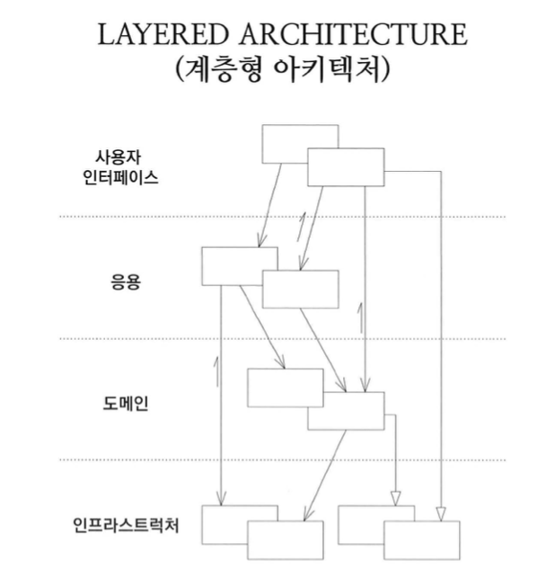

# 좋은 코드

## 시작

대학교 1학년 이산수학 수업에서 [최단거리 알고리즘](shortest.md)을 구현하는 과제가 있었다.
미숙했던 당시의 나는 이 알고리즘을 구현하기 위해서 몇 번씩 알고리즘을 분석하고 고민했다.
그렇게 고민하는 과정에서 문제 해결에 대한 사고의 전환을 할 수 있었다.
처음 알고리즘을 구현하고 결과물을 제출했을 때에는 코드가 정리되지 않은 상태였다
그러나 제출 후에도 코드를 고치고 고쳐서 동기들에게는 조금 더 깨끗한 코드를 보여 줄 수 있었다.
이 일을 언급하는 이유는 좋은 코드에 대한 가장 오래된 기억이기 때문이다.
그 때는 좋은 코드에 대한 필요성을 명확하게 인지하고 있던 것은 아니다.
그저 정리되지 않은 코드를 다듬는 수준이었는데 이런 성향이 프로그래머로 성장하는 데 좋은 발판이 됐다.

## 함수

취업을 하고 얼마 간은 함수 레벨에서 좋은 코드가 무엇인지를 고민했다.

예외를 처리하기 위해서 모든 함수에 `try/catch`를 넣어보기도 하고, 심지어는 당시에도 금기였고 지금은 구경하기도 힘든 `goto`까지 사용했다.

```cpp
STDMETHODIMP CFileUpload::InterfaceSupportsErrorInfo(REFIID riid){
	HRESULT hr = E_FAIL;

	CSE::MapSEtoCE();

	try{
		static const IID* arr[] = { &IID_IBLOBManager };

		for (int i = 0; i < sizeof(arr) / sizeof(arr[0]); i++){
			if (InlineIsEqualGUID(*arr[i],riid)){
				hr = S_OK;
				goto _FUNC_END;
			}
		}

		hr = S_FALSE;
	}
	catch(CSE se){ }

_FUNC_END:
	return hr;
}
```

그러다 모든 함수에서 `catch`를 하는 것이 쓸데없는 일임을 깨닫고 최상위 함수에서만 `catch`를 하고 보통은 `if`로 사전에 오류를 처리하도록 했다.

```cpp
bool CParser::Match(TokenType::Enum _TokenHead){
	if(m_nLookAhead != _TokenHead){
		throw new CParserException(L"경고 : 수식 오류");
	}

	m_LastTokenType = m_nLookAhead ;
	m_nLookAhead = Lexan();

	return true;
}
```

이후 `assert`를 활용하게 되면서 좋은 함수에 대한 고민을 어느 정도 마무리를 지었다.

```cpp
void HttpBuffer::IncreaseWritePos(int size){
    _ASSERT(writePos <= data.size());

    writePos += size;
}
```

## 객체

함수에 대한 고민이 어느 정도 정리가 되면서 자연스럽게 클래스에 대한 고민으로 확장됐다.

네임스페이스는 언제 사용할까? 클래스 이름은 어떻게 해야 하지? 등등
메소드의 이름을 길어도 명확하게 하는 것이 좋은가?
그렇게 고민하던 어느 날 다국어 처리를 위한 코드를 작성하면서 소스파일 여기저기에 비슷한 코드가 나타나는 것을 어떻게 고치면 좋을까 고민했었다.

```javascript
function showWelcome(lang: Language) {
    if ('kor' == lang) {
        print('환영합니다')
    } else if ('en' == lang) {
        print('Welcome')
    }
}
```

그러다 괜찮은 아이디어가 떠올랐는데 왠지 디자인 패턴에 있을 것 같아서 찾아보니 `전략(strategy) 패턴`이었다.

```javascript
const lang = Lang.create('kor')

lang.showWelcome()
```

그 전에도 GoF 디자인패턴을 몇 번인가 읽었지만 제대로 이해할 수 없었는데 우연히 전략패턴을 생각하면서 패턴의 기본을 알게됐다. 정확히는 객체가 무엇인지를 이해하게 된 것이다.
그 동안 봤던 책에서는 사과, 자동차를 클래스로 만든다고 설명했다. 그러나 Language, Packet, NullObject 등등 다양한 것들이 객체로 표현될 수 있었다. 객체를 보는 눈, 코드를 보는 눈이 바뀐 것이다.

좋은 클래스 이름은 무엇인가? 함수 이름은?
추상화는 무엇이고 인터페이스는 왜 존재하는가? 등등 그 동안의 고민들이 순식간에 하나로 꿰어맞춰지면서 찰나의 순간에 깨달음을 얻은 것이다.
의존성과 응집성에 대한 고민을 시작하게 됐다.

한편으로는 걱정도 좀 됐다. 패턴을 깨닫고 이제 무엇을 공부해야 하지? 공부할 게 없을지도 모른다는 불안감이 있었다.
그게 긴 여행의 시작인줄도 모르고 말이다.

## 테스트 자동화

그 다음의 큰 도전은 TDD(테스트 주도 개발)였다.
스스로를 테스트 한다니? 테스트 코드 작성하는 데 드는 비용이 크지 않나? 이게 가능한가?
TDD가 하는 말은 좋아 보이지만 여러 의문들이 해소되지 않았기 때문에 소설책 수준이 아닌가 하는 의심도 잠시 했었다.
안드로이드 앱을 만들면서 처음으로 실무에서 TDD를 적용했다. 그러나 테스트는 계속 무력화 됐는데 상위 api가 계속 변경됐기 때문이다.

## 도메인

그 다음은 도전은 DDD(도메인 주도 개발)이었다.
레이어드 아키텍처를 여기에서 깨달았다. 기능을 종류가 아닌 부분으로 나눌 수 있음을 알게됐다.
좀 더 단계적인 분해? 좀 더 세분화 하는 기준 혹은 분석 방법을 알게 됐다.
DDD를 이해하는 게 어려웠던 이유는 아래의 그림에 있다.



도메인 레이어가 인프라스트럭처 레이어를 접근한다는 것은 책에서 설명한 개념과 맞지 않았다.
그러다 azure 책을 보니 거기에는 아래처럼 설명을 했다. 레이어는 위에서 아래로 흐르는데 인터페이스를 사용한다고 하나 직관적이지는 않다.


이제서야 DDD가 납득이 됐다.

## 소포트웨어 공학(테스트/도메인/아키텍처)

## 현재는...

큰 고민들은 여기까지였다. 그 이후에 msa나 uml 등등을 이해하는 것은 크게 어렵지 않았다.
모두 패턴과 DDD의 범위에 있고 의존성과 응집성에 대한 이야기다.

Win32/C++ 부터 iOS/Android, Node.JS, React 까지 다루면서 native, mobile, web 을 두루두루 경험했다.
백엔드에서 프론트까지 경험하면서 얻게 된 통찰을 공유하려 한다.
그것들은 하나로 이어져있고 그 중 어느 하나로도 빠지면 전체가 이어지지 않기 때문이다.
그리고 그것은 나처럼 바닥부터 굴러보지 않으면 알 수가 없다.
조금만 영감을 준다면 더 잘 더 많이 알 수 있었을 것이다.
