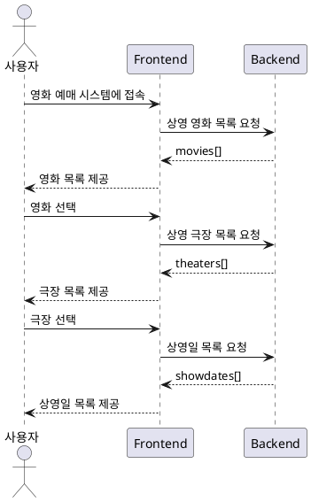
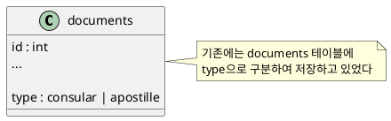
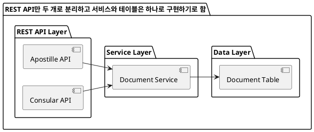
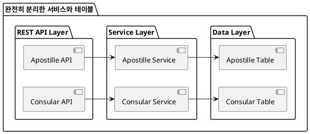
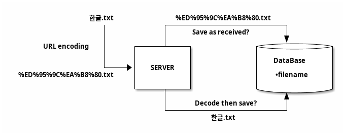

## 1. 소개

리팩토링과 디자인패턴을 공부하고 막상 실제 프로젝트에 적용하려고 하면 쉽지 않은 경험이 있을 것이다. 이 상황에서 어떤 패턴을 적용해야 할까? 어떤 구조가 옳은가? 사소하지만 그렇다고 그냥 넘어가기에는 이유가 명확하지 않은 그런 경험 말이다.

그리고 이런 문제들은 명확한 이유를 설명하지 못하기 때문에 개인의 성향이나 스타일로 치부하게 된다.

그런데 그게 최선일까? 이런 문제들은 정말 스타일에 좌우되어야 하는 걸까? 이것은 좋은 코드에 대해서 오랜시간 고민하면서 끊임없이 나를 괴롭히던 질문이었다. 디자인패턴과 아키텍처, 그리고 방법론에 두루 노력해도 이것은 쉽지 않은 문제였다.

그렇게 여러 종류의 소프트웨어를 개발하다가 문득 EBI에 대해서 깨닫게 됐는데 그 순간 나를 괴롭히던 문제가 해결됨을 느꼈다.

EBI는 내가 만든 용어다. 나는 기존에 왜 이런 개념을 정의하는 용어가 없었는지 의아하다. 혹은 내가 모르는 것인가? 아니면 이것이 너무 당연한 개념이라서 이름까지 붙일 필요가 없었던 것일까?

어떤 경우가 있는지 그리고 어떤 선택을 해야 하는지 살펴보자.

```txt
이게 EBI라는 이름을 붙일 만한 개념인가? 그냥 당연한 이야기를 하는 건 아닌가?

글쓴이의 의도를 짐작해보자면, EBI라는 용어를 도입한 이유는 소프트웨어 개발에서 본질을 파악하고 개념을 충실히 구현하는 것이 매우 중요함에도 불구하고, 간과되는 경우가 많기 때문일 것입니다.
물론 제기하신 것처럼 EBI의 내용 자체는 어떻게 보면 당연한 이야기일 수 있습니다. 요구사항의 본질을 파악하고 도메인을 반영해서 설계하고 구현해야 한다는 것은 소프트웨어 개발의 기본 원칙이기도 합니다.
하지만 실무에서는 이 기본이 지켜지지 않는 경우가 많습니다. 글에서 제시된 방향키, REST API, 문서 관리 시스템의 사례들이 그런 경우입니다. 개발자들은 종종 편의성, 효율성 등을 이유로 요구사항과 도메인의 본질을 간과하곤 합니다.
EBI라는 용어를 도입함으로써 글쓴이는 이런 문제의식을 환기시키고, 본질과 개념에 충실할 것을 강조하고 싶었던 것 같습니다. 비록 새로운 개념은 아닐지라도 용어로 정의하고 강조함으로써 개발 과정에서 놓치지 말아야 할 원칙으로 자리매김하려 한 것으로 보입니다.
따라서 EBI를 하나의 방법론이나 패러다임으로 보기는 어려울 수 있지만, 개발자들에게 본질과 개념의 중요성을 상기시키는 원칙이자 지침으로서는 의미가 있다고 생각합니다. 다만 용어의 생소함으로 인해 독자들이 어렵게 느낄 수 있으므로, 댓글 주신 것처럼 보다 쉽고 친숙한 용어를 사용하거나, 좀 더 자세한 설명을 덧붙이는 것이 좋겠습니다.
```

## 2. 방향키의 구현

사용자에게 ‘상/하/좌/우’를 선택할 수 있는 방향키를 제공해야 한다. 4개 화살표의 모양은 동일하고 방향만 다르다. 이 때 4개의 화살표를 구현하는 방법이 두 가지 있다.

### 2.1. 방법#1 - 한 개의 이미지를 회전시켜서 재사용

`방법#1`은 한 개의 화살표 이미지(arrow.png)를 회전시켜서 구현하는 것이다. 위에서 화살표의 모양은 동일하다고 했기 때문에 구현에 문제는 없다.

이 방법은 저장 공간을 적게 차지하는 장점과 코드 가독성이 상대적으로 떨어진다는 단점이 있다.

```html
<View src="arrow.png" rotate="0" />
<View src="arrow.png" rotate="180" />
<View src="arrow.png" rotate="-90" />
<View src="arrow.png" rotate="90" />
```

 \
*[그림 2-1] 한 개의 이미지를 회전시켜서 구성된 방향키*

### 2.2. 방법#2 - 4개의 이미지를 사용

`방법#2`는 상/하/좌/우에 해당하는 4개의 이미지를 사용하는 것이다.

이 방법은 방향만 다른 화살표 이미지를 관리하는 것이 번거로울 수 있고 공간도 더 많이 차지한다는 단점이 있다. 반면 코드의 가독성은 비교적 좋다.

```html
<View src="up.png" />
<View src="down.png" />
<View src="let.png" />
<View src="right.png" />
```

 \
*[그림 2-2] 상/하/좌/우 4개의 이미지로 구성된 방향키*

### 2.3. 옳은 방법은 무엇일까?

무엇이 옳은 것일까? 혹은 이 선택에 있어서 옳고 그름이 존재하긴 하는 걸까? 그저 개인의 철학에 따른 선택만이 있는 것은 아닐까?

읽기 쉬운 코드를 추구한다면 `방법#1`이지만 효율성을 추구한다면 `방법#2`일 것이다.

읽기 쉬운 코드가 옳은가? 성능 효율적인 코드가 옳은가? 대체로 과거에는 성능 효율을 우선했겠지만 요즘처럼 하드웨어의 성능이 충분한 경우에는 읽기 쉬운 코드를 선호한다. 그런 이유로 읽기 쉬운 코드를 선택해야 할까?

아마도 많은 개발자들이 화살표의 모양이 같다는 것에 주목해서 `방법#1`처럼 이미지를 회전 시켜서 효율을 추구하는 방법을 선택했을 것이다.

다양한 생각들이 있겠지만 우선적으로 고려해야 하는 것은 화살표의 의미다.

만약 화살표가 *[그림 2-3]* 처럼 특정한 물체를 가리키는 용도라면 `방법#1`처럼 화살표를 회전시켜서 구현하는 것이 맞다.

그러나 사용자가 생각한 방향키는 *[그림 2-4]* 와 같이 키보드 구석에 고정되어 있는 4개의 방향키였을 것이다. 그리고 그런 사용자의 생각과 유사한 것은 `방법#2`와 같이 4개의 이미지를 사용하는 것이다.

 \
*[그림 2-3] 무언가를 가리키는 용도의 화살표*

 \
*[그림 2-4] 서로 다른 모양의 화살표를 가지는 방향키*

사용자에게 보여지는 결과물은 같기 때문에 어떤 방법을 선택해도 큰 차이는 없다고 생각할지도 모르겠다.

사용자의 생각을 무시한 채 단순히 구현 편의성만을 추구하면 어떻게 될까?

사용자는 언제든지 화살표의 모양을 쉽게 변경할 수 있다고 생각한다. 왜냐하면 사용자는 당연히 4개의 이미지로 구성된 방향키라고 생각하기 때문이다. 이미지를 회전시켜서 성능을 최적화 하는 것은 지극히 개발자의 입장일 뿐이다.

그리고 어느날 사용자는 방향키의 모양을 *[그림 2-4]* 처럼 변경해 달라고 쉽게 요구할 수 있다. 키의 이미지를 변경하기만 하면 되니까 쉬운 작업이라고 생각할 것이다. 그러나 개발자는 구현 방법을 바꿔야 하는 큰 일이 된다.

화살표의 모양이 동일한 것은 그저 우연일 뿐이다. 이런 우연으로 생긴 상황을 구현에 반영하면 사용자의 생각과 멀어지게 된다. 다시 얘기하자면 사용자의 의도를 무시한 채 구현 편의성만을 추구하면 유지보수가 점점 더 어려워 지게 된다.

### 2.4. 해석의 어려움

여러 방법을 두고 고민하게 되는 이유 중에 하나는 당연한 정보는 누락하기 때문이다.

사용자가 방향키를 요구사항으로 언급했을 때는 키보드의 그 방향키라고 구체적으로 설명하지는 않았을 것이다. 사용자의 입장에서는 방향키라고 하면 당연히 키보드의 그것이라고 생각하기 때문이다.

그러나 개발자 입장에서는 방향키에 대한 추가 정보가 없기 때문에 구현 방법을 선택하는 데 있어서 조금 더 고민하게 되는 것이다.

이것이 해석의 어려운 부분인데 당연하다고 여겨 구체적 정의를 생략한 부분은, 개발 단계에서 개발자가 스스로 채워넣어야 한다. 그리고 개발자가 누락된 부분을 채우려면 요구사항이 그렇게 정의된 이유와 과정까지 모두 고려해야 하기 때문에 많은 경험과 통찰력이 필요하다.

만약 지금 상황에서 사용자의 의도를 정확히 파악할 수 없다면 어떻게 해야 할까? 혹은 어떻게 변경될지 예측할 수 없다면 어떻게 해야 할까?

`<Up /><Down /><Left /><Right />` 클래스로 정의해서 화살표의 요구사항이 어떻게 변경 되더라도 다른 곳에 영향이 없도록 하는 것이다.

> 쇼핑몰을 운영하는 회사에서 일할 때의 일이다. 회의 내용은 '쿠폰'을 어떻게 구현할 것인가에 대한 논의였다.
>
> 당시 개발팀은 결제 금액을 '원'이라는 화폐 단위로만 다루고 있었다. DB에 저장된 금액 단위는 모두 '원'이었고, 코드에서 다루는 금액 단위 역시 '원'이었다. 사용자 관점에서의 '결제금액'이라는 개념은 고려되지 않은 채로 말이다.
>
> 이러한 상황에서 '포인트' 개념을 도입하게 되었다. 다행히 당시에는 1point가 1원이라는 단순한 구조였기에 큰 문제없이 DB에 point 컬럼을 추가하는 것으로 대응할 수 있었다.
>
> 하지만 서비스가 확장되며 할인쿠폰, 등급별 혜택 등의 기능이 추가되면서 사용자가 인지하는 '결제금액'은 단순히 원으로 표현될 수 없는 복잡한 개념이 되어갔다. 기존의 '원' 중심 구현방식으로는 사용자의 결제 flow를 온전히 반영할 수 없게 된 것이다.
>
> 만약 프로젝트 초기에 '결제금액'의 의미를 좀 더 깊이 생각했다면 이후의 많은 변경사항에 매끄럽게 대처할 수 있었을 것이다.
>
> 물론, 이것은 쉽지 않은 일이기는 하다. 기본적으로 객체 지향 프로그래밍에 능숙해야 하는데 이것 부터가 쉽지 않다. 그리고 결제 기능이 언제 어떻게 변경될지 알 수 없기 때문에 아무리 실력있는 개발자라 하더라도 처음부터 '결제금액'을 객체로 만드는 것은 어려울 것이다.
>
> 그러나 이런 어려움에도 불구하고 경험과 실력을 갖춘 개발자라면 새로운 개념을 발견했을 때 적절한 리팩토링을 반복하면서 꾸준히 위기를 관리하고 본질에 다가가게 된다. 여기서 적절한 리팩토링이라는 것은 기술 부채를 쌓지 않고 그렇다고 오버 엔지니어링도 아닌 비용 효율적인 접근을 뜻한다.
>
> 그리고 방향키의 사례에서 봤던 것처럼 요구사항 이면의 본질을 파악하는 습관을 기른다면 본질에 다가가는 과정을 더 단축할 수 있게 된다.

## 3. REST API 디자인

REST API의 라우팅 디자인은 크게 `Shallow Routing`과 `Nested Routing`이 있다. 어느 쪽이 더 좋은 선택일까?

[그림 3-1]은 사용자가 영화 예매 서비스에서 상영 중인 영화/극장/시간을 선택하는 시퀀스 다이어그램이다. 여기에서 REST API의 라우팅을 어떻게 디자인 해야 할까?



*[그림 3-1]*

### 3.1. Shallow Routing

`Shallow Routing` 형식으로 디자인 한다면 아래와 비슷한 형태가 될 것이다.

```sh
# 상영 영화 목록 요청
/movies?status=showing

# 상영 극장 목록 요청
/theaters?movieId={movidId}

# 상영일 목록 요청
/showdates?movieId={movieId}&theaterId={theaterId}
```

`Shallow Routing`은 각 리소스를 독립적으로 관리할 수 있으므로 확장성이 좋다. 그러나 리소스 간의 관계를 명확하게 표현하지 않기 때문에 복잡한 계층 구조의 데이터를 표현하는데 어려움이 있다.

### 3.2. Nested Routing

`Nested Routing` 형식으로 디자인 한다면 아래와 비슷한 형태가 될 것이다.

```sh
# 상영 영화 목록 요청
/showing/movies

# 상영 극장 목록 요청
/showing/movies/{movieId}/theaters

# 상영일 목록 요청
/showing/movies/{movieId}/theaters/{theaterId}/showdates
```

`Nested Routing`은 리소스 간의 관계를 URL에서 명확하게 표현할 수 있으므로, 복잡한 리소스 구조를 표현하는데 적합하다. 그러나 중첩된 리소스 구조가 변경될 경우, URL도 함께 변경되어야 하므로 유연성이 제한된다.

### 3.3. 옳은 방법은 무엇일까?

두 기술의 장단점을 간단하게 살펴봤다. 그렇다면 유연성과 명확함 사이에서 어떤 방법을 선택해야 할까?

두 방식 중에서 무엇을 선택할 것인지는 개념적인 관점에서 영화 예매 프로세스를 더 잘 표현하는 것이 무엇인지를 봐야 한다.

그런 면에서 `Nested Routing`은 티켓 구매 프로세스를 그대로 반영하고 있다.
티켓 구매 프로세스가 영화 선택 후 극장을 선택해야 하듯이, `Nested Routing`도 영화를 지정하지 않으면 극장을 지정할 수 없다.
즉, `Nested Routing`의 REST API가 티켓 구매 프로세스와 유사한 구조를 표현하고 있다.
이 정도면 별도의 문서로 정리하지 않아도 티켓 구매 프로세스를 알 수 있을 것이다.

Shallow Routing과 Nested Routing 중에서 무엇이 좋은가에 대한 논쟁을 종종 보게된다.
그러나 그런 논쟁은 무의미 하다. 중요한 것은 요구사항을 보다 정확히 반영하는 것이 무엇이냐인 것이다.
기술적 관점에서 보면 답이 없는 문제를 가지고 논쟁을 하니 논쟁이 끝나지 않는 것이다.

> 한참 고민해도 답이 보이지 않는다면 답이 거기에 없는 것이다.

## 4. 문서의 통합 vs 분리

외교부의 아포스티유/영사확인 문서 프로젝트를 진행할 때의 일이다.

소득증명서와 같은 국내에서 발행되는 문서의 국외 사용을 위한 인증 방식이 두 가지 있는데 그것이 '아포스티유'와 '영사확인'이다.
영사확인이 일반적인 절차이고 아포스티유는 협약에 따라 영사확인 절차를 보다 보다 간소화 한 것이다.

프로젝트의 목표는 이 두 문서를 암호화 하고 변조 여부를 확인할 수 있는 시스템을 구축하는 것이었다.

아포스티유와 영사확인 문서는 항목이나 구조가 유사했기 때문에 기존에 구축된 서비스도 하나의 테이블을 공유하고 있었다.



### 3.1. 초기 설계

기존 시스템을 분석하는 과정에서 나는 영사확인과 아포스티유가 비슷해 보이는 것은 우연일 뿐이며 동일한 문서로 취급하면 안 될 것처럼 보였다. 만약 같은 문서라면 프로젝트 이름이 '아포스티유 & 영사확인'은 아니었을 것이다.

그에 반해서 back-end 담당자는 두 개로 분리할 필요가 없다는 주장을 하고 있었다.
결국 타협점으로 REST API만 두 개로 분리하고 테이블 등은 하나로 구현하기로 했다.



### 3.2. 설계 변경

그런데 프로젝트가 진행되면서 두 문서의 차이가 구체화 되기 시작했다.
아포스티유와 영사확인의 문서번호가 중복될 수 있어서 문서번호 체계가 달라졌다.
그리고 서비스 기능이 확장 되면서 두 문서의 인터페이스는 점점 달라졌다.

결국 테이블을 둘로 나누고 내부 구조도 분리하기로 결정했다.
다행스럽게도 외부에 노출되는 API는 두 개로 분리되어 있었기 때문에 내부 구조를 변경하는 것은 비교적 수월했다.
만약 분리하는 것이 부담스러워서 리팩토링을 피하려고 했다면 코드 곳곳에 if-else가 넘쳐나고 지옥으로 가는 문이 열렸을 것이다.



### 3.3. 이런 일이 발생한 이유

이 사례에서 두 문서의 형식이 같았던 것은 그저 우연일 뿐이었다. 사용자의 요구에 따라서 얼마든지 달라질 가능성이 있었다. 애초에 다른 문서이기 때문에 다른 이름이 붙은 것이라는 사실을 간과한 것이 문제였다.

프로그래머는 흔히 구현 편의성을 우선해서 설계한다. 그 습관을 버리기가 쉽지 않을 것이다. 그러나 철저하게 도메인의 개념을 따라야 한다.

## 4. DB 저장 방법

사용자가 웹 브라우저로 `한글.txt` 파일을 업로드 하려고 한다.

사용자가 업로드 하는 파일명이 한글이라서 URL encoding을 해서 서버에 전송해야 한다. 마찬가지로 사용자가 파일을 다운로드 받으려면 파일명을 URL encoding 해야 한다.

그렇다면 서버는 DB에 인코딩된 문자열(`%ED%95%9C%EA%B8%80.txt`)을 그대로 저장하는 것이 좋을까? 아니면 이것을 다시 디코딩해서 `한글.txt`로 저장하는 것이 좋을까?

`한글.txt`로 저장하면 사용자에게 파일을 전송할 때 다시 인코딩 해야 한다. 그렇다면 그냥 받은 그대로 `%ED%95%9C%EA%B8%80.txt`으로 저장하는 것이 효율적이지 않을까?

이것도 역시 답을 알기 위해서 사용자의 생각을 살펴봐야 한다.

사용자가 업로드 한 파일명은 `한글.txt`이다. 사용자는 이것이 어떻게 변환되는지 모른다. 그러니까 저장할 때도 사용자의 생각에 맞춰서 `한글.txt`으로 저장하는 것이 옳다.

애초에 URL Encoding을 하는 이유는 ASCII 문자 집합의 일부만 전송 가능하다는 기술적 한계 때문이지 사용자의 요구사항과는 전혀 관련이 없다. 특정 기술의 한계 혹은 특성이 다른 영역에 영향을 주는 것은 좋은 구조가 아니다. 그러니까 HTML의 전송 과정에서 발생하는 기술적인 문제는 그 과정에서 해결해야 하는 것이지 그것을 DB까지 가져오면 두 개의 큰 영역이 서로 강하게 결합되는 안티-패턴이 된다.

사용자의 의도를 더 정확하게 반영하는 것이 우선이고 최적화는 그 다음이다.

다운로드 기능만을 고려한다면 받은 그대로 저장하는 것이 최선의 선택일 것이다. 그러나 기능이 확장되면서 파일 목록을 보여주거나 검색을 허용할 때는 원본 문자열(`한글.txt`)이 필요할 것이다. 왜냐하면 사용자는 파일명을 `한글.txt`으로 생각하기 때문이다. 그런데 저장을 `%ED%95%9C%EA%B8%80.txt`으로 한다면 조회나 검색 기능을 구현할 때 얼마나 번거로울지 생각해 보라.

구현 편의성을 추구하면 이렇게 작은 변화에도 쉽게 흔들리게 되는 것이다.



## 5. 그 외

### 5.1. 영화 예매 서비스의 장바구니 기능

보다 논리적인 레벨에서도 선택의 고민은 계속된다. 영화 예매 서비스를 개발한다고 할 때 여기에 장바구니 기능을 구현해야 할까? 전자상거래 서비스에서는 장바구니가 필수적인 기능이지만, 영화 예매 서비스에서도 꼭 필요할까?

이 질문에 답하기 위해서는 실제 영화 예매 프로세스에서의 사용자 경험을 생각해 봐야 한다. 일반적으로 사용자가 영화를 예매할 때는 다음과 같은 순서로 진행된다.

1. 영화 선택
2. 상영 시간 선택
3. 좌석 선택
4. 결제

이 과정에서 우리는 "장바구니에 담기"와 같은 중간 단계를 발견할 수 없다. 사용자는 영화, 시간, 좌석을 선택하고 바로 결제를 진행한다.

그렇다면 온라인 영화 예매 서비스에 장바구니 기능을 추가하는 것은 사용자의 실제 경험과는 거리가 먼 결정이 될 수 있다. 오히려 불필요한 복잡성을 야기하고, 온라인과 오프라인에서의 경험 간 일관성을 해칠 수 있다.

물론 "나중에 결제하기 위해 선택한 영화를 저장해 두는 기능이 있으면 좋겠다"라는 사용자 요구사항이 있을 수 있다. 하지만 이 경우에도 "장바구니"라는 개념을 그대로 가져오기보다는, 영화 예매 서비스의 맥락에 맞는 개념으로 재해석할 필요가 있다. 예를 들어, "관심 영화 저장" 또는 "예매 내역 저장" 등의 기능으로 제공하는 것이 더 적절할 수 있다.

결론적으로, EBI 관점에서 볼 때 영화 예매 서비스에서 장바구니 기능을 제공하는 것은 적절하지 않을 것이다. 대신 사용자의 실제 예매 프로세스를 최대한 반영하여, 불필요한 단계를 제거하고 온라인과 오프라인에서의 경험을 일관되게 유지하는 것이 더 나은 설계가 될 것이다.

이 예시는 EBI의 핵심인 '사용자의 실제 경험과 기대를 이해하고 반영하는 것'의 중요성을 잘 보여준다. 서비스의 본질적인 가치와 사용자의 실제 사용 패턴을 고려할 때, 불필요한 기능을 제거하고 최적화된 사용자 경험을 제공할 수 있게 된다.

### 5.2. 클래스의 상속과 포함(컴포지션)

클래스의 기능을 재사용하는 방법에는 크게 두 가지가 있다. 하나는 클래스를 상속(Inheritance)하는 것이고, 다른 하나는 클래스를 포함(Composition)하는 것이다.

<!-- 흔히 상속 보다는 포함을 사용하라고 한다. 그것이 기술적으로 여러 장점이 있기 때문이다. 그렇다면 상속은 최대한 피해야 하는 것인가? 언제 상속을 해야 할까?
쉽게 선택할 수 없는 것은 기술적인 측면만을 고려하기 때문이다. -->

상속은 기존 클래스를 확장하여 새로운 클래스를 생성하는 방법이다. 상속을 통해 자식 클래스는 부모 클래스의 속성과 메서드를 물려받아 사용할 수 있다. 이를 통해 코드의 재사용성을 높일 수 있다.

```java
class Animal {
    void eat() { ... }
}

class Dog extends Animal {
    void bark() { ... }
}
```

위의 예시에서 `Dog` 클래스는 `Animal` 클래스를 상속받았다. 따라서 `Dog` 인스턴스는 `bark()` 메서드뿐만 아니라 `Animal`로부터 물려받은 `eat()` 메서드도 사용할 수 있다.

포함은 한 클래스의 인스턴스를 다른 클래스의 필드로 사용하는 방법이다. 이를 통해 클래스 간의 관계를 설정하고, 필요한 기능을 사용할 수 있다.

```java
class Engine {
    void start() { ... }
}

class Car {
    private Engine engine;

    Car(Engine engine) {
        this.engine = engine;
    }

    void start() {
        engine.start();
    }
}
```

위의 예시에서 `Car` 클래스는 `Engine` 클래스의 인스턴스를 필드로 가지고 있다. 이를 통해 `Car` 인스턴스는 `Engine`의 기능을 사용할 수 있다.

### 5.3. 프로젝트 이름

백엔드에 대한 기본적인 지식을 전달하기 위한 프로젝트로 영화 예매 서비스 개발을 시작하려고 한다.
프로젝트의 이름을 무엇이라고 해야 할까? 영화 예매니까 ticket-service이라고 하면 어떨까?

그런데 우리가 하려는 것이 영화 예매 서비스를 개발하는 것일까? 아니다 그것은 그저 수단에 불과하다. 우리가 하려는 것은 backend-fundamentals이다. 수단은 언제든지 변경될 수 있다. 변하지 않는 것은 목표다. 이런 경우처럼 진짜가 무엇인지 통찰하는 과정에서 자칫 오류를 일으킬 수 있다.

## 결론

결과적으로 EBI는 현실의 개념과 구현을 일치시키려는 노력이다. 다만, 현실에서 피상적으로 드러난 특징이 아니라 숨겨진 본질을 통찰해야 한다는 것을 강조하는 것이다.
현실에서 개념은 현재를 기반으로 확장/발전한다. 따라서 구현도 현실과 최대한 유사한 구조를 가져야 확장/발전이 수월하다.

몇 개의 사례를 늘어놨지만 EBI는 거의 매 순간 필요하다.

개발을 하면서 몇 번의 뇌 구조가 바뀌게 되는데 그 중 한 번은 OOP를 깨달았을 때다. EBI는 그 다음 뇌구조가 바뀌는 순간이다.

결론입니다.

EBI이 DDD와 비슷하다고 생각하실지 모르겠습니다.
DDD는 복잡한 도메인 로직을 다른 부분과 분리하는 것이고 설계 단계의 이야기입니다.
EBI은 요구사항 분석과 설계에서 당연하게 누락된 생각을 채우는 것으로 구현 단계의 이야기입니다.

분석 단계에서 사용자의 모든 생각을 문서로 정리할 수 없다.
설계도 마찬가지인데 설계 단계에서 설계자의 모든 생각을 정리할 수 없다.
모든 요구사항과 설계를 정리한 것이 코드이기 때문이다.

어느 정도 빈틈이 있을 수 밖에 없고 그 빈틈은 굳이 말하지 않아도 알 것이라고 생각하는 것들이다.
문제는 당연히 알 것이라고 생각하는 것 중에서 당연하지 않은 것이 있기 때문이다.
다시 말하자면 사용자가 당연하게 생각하는 것들을 개발자는 전혀 다르게 받아들일 수 있다.

이런 사용자와 개발자의 생각의 오차를 줄이려는 노력이 EBI이다.
개발은 요구사항 분석을 바탕으로 설계하고 구현해야 한다.
잘못된 분석을 기반으로 구현을 하면 얼마 안 가서 문제가 드러난다.
그러나 잘못된 해석을 기반으로 구현을 해도 당장 문제가 되지는 않는다.
문제가 되지 않는게 문제인데 프로젝트가 한참 진행된 후에 잘못을 인지하고 수정하려면 많은 노력이 필요하기 때문이다.

EBI에 대해서 간단하게 설명했지만 중요한 개념이다.
보통 소프트웨어 공학 관련 서적이나 자료들은 분석,설계,구현,검증 각각의 단계에 집중해서 설명을 하다보니
요구사항 분석과 구현을 일치시키려는 EBI에 대해서는 그 개념과 존재가 분명하게 다뤄지지 않는 것 같다.

EBI은 분석과 구현의 문제이지만 '해석' 자체는 다양한 단계에서 있을 수 있다.
설계단계에서 '해석'이 필요한 경우도 있을 수 있다. 사용자 조차 제대로 알 수 없는 것들을 고려해야 하는 경우가 있다.
예를 들면 이 프로젝트의 유지보수 기간에 따라서 설계가 달라질 수 있다. 물론 그 외에 개발인력과 개발비용 기간 등등 많은 요소들을 고려하게 된다.
단순히 요구사항 분석을 바탕으로 설계하는 것이 아니라 그 외에 다양한 요소들을 통찰해서 설계에 반영해야 하는 것이다.
이것에 굳이 이름을 붙이자면 '프로젝트 해석'이라고 해도 될지 모르겠다.

### 왜 사용자 관점을 따라야 할까?

우리가 개발하려는 것은 사용자가 사용하려는 것이다. 사용자의 생각이 변경될 때 현실을 기반으로 한다. 사용자가 방향키의 모양을 변경하기를 원한다면 사용자는 4개의 이미지로 이루어진 방향키를 전제로 어떻게 변경할 것인지를 고민할 것이다.

다시 말하자면 사용자의 생각의 변화에 따라 코드를 변경해야 하는 것이라면 처음부터 코드가 사용자의 생각을 그대로 반영한 구조여야 하는 것이다.

무엇을 해야 하느냐에 집중하는 것이 아니라 왜 해야 하는지에 집중해야 한다. 무엇은 언제든지 변할 수 있다. 그러나 그것을 하려는 이유는 변하지 않는다. 이유가 변하면 어떻게 하느냐고? 이유가 변경되거나 사라진다면 프로젝트 전체가 영향을 받는 것은 어쩔 수 없다.
