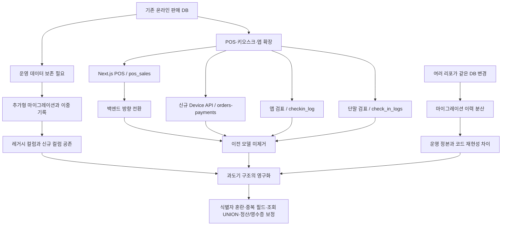

# 운영 DB 스키마 복잡성: 현재 상황과 발생 원인

> 기준일: 2026-07-12
> 목적: 내부 아키텍처 기록 + 유튜브 콘텐츠 제작 원고
> 검증 범위: 운영 DB의 `information_schema`/PostgreSQL 카탈로그 읽기 전용 집계, Git 이력, ADR, 마이그레이션 문서
> 주의: 고객 데이터, 파트너명, 이벤트명, UUID, 프로젝트 식별자, 인증정보는 본 문서에 기록하지 않는다.
> 공개용 표기: 서비스·저장소명과 비공개 근거 문서의 경로는 일반화했다. 아래 경로는 익명화된 참고 표기이며 실제 저장소 주소가 아니다.

```md
# DB 마이그레이션 플랜 — 멀티 단말(키오스크·POS·모바일앱) 대비

> 목표: 온라인 1채널 구조를 **멀티 단말**로 확장하되, **심플하면서 안 꼬이게**.

## 설계 원칙 4가지
1. **추가형(additive)만** — 컬럼·테이블 추가가 기본. 기존 컬럼 삭제는 맨 마지막 단계에서만.
2. **이중기록 + 백필** — 새 컬럼 도입 시 한동안 기존+신규 동시 기록, 과거분 backfill, 검증 후 전환.
3. **한 번에 한 축만** — 권종 → 출처/채널 → 디바이스 → 체크인 → 재고 → 결제 순서. 섞지 않음.
4. **쓰기는 단일 RPC로** — 발권/체크인은 Postgres function 하나로 모아, 채널이 늘어도 로직이 한 곳에.
```

## 0. 한 문장 결론

현재 DB는 기존 온라인 판매 모델을 보존한 채 POS·키오스크·앱·CRM 기능을 추가하고, 교체된 백엔드와 병렬 도메인 모델을 정리하지 못하면서 과도기 구조가 운영 구조로 굳은 상태다.

중복 원장과 식별자 혼란을 만든 핵심 원인은 **추가형 마이그레이션, 백엔드 교체, 다중 저장소의 공유 DB 변경, 최종 정리 단계의 미실행**이다.

---

## 1. 현재 운영 DB 현황

### 1.1 스키마 규모

2026-07-12 운영 DB를 읽기 전용으로 확인한 결과다.

| 지표 | 현재 값 | 해석 |
|---|---:|---|
| `public` 기본 테이블 | 145 | 하나의 스키마에 티켓·POS·CRM·메시징·파트너 운영 기능이 함께 존재 |
| 컬럼 | 1,786 | 테이블당 평균 약 12.3개 |
| 일반 View | 0 | 통합 읽기 모델보다 애플리케이션 코드와 RPC에서 직접 조합 |
| `public` 함수 | 95 | 확장 기능 함수 포함. 대형 업무 RPC도 다수 존재 |
| `SECURITY DEFINER` 함수 | 56 | 권한·검색경로·입력 검증을 지속적으로 감사해야 하는 표면 |
| 외래키 | 238 | 도메인 간 결합이 상당함 |
| 인덱스 | 484 | 테이블당 평균 약 3.3개, 동일 정의로 보이는 중복 후보도 존재 |
| RLS 정책 | 181 | 보안 경계가 넓고 변경 비용이 큼 |
| RLS 활성 테이블 | 143/145 | 거의 모든 테이블이 정책 관리 대상 |
| 통계상 0행 추정 테이블 | 75 | 신규·예정·폐기 후보가 섞여 있으므로 바로 삭제할 수는 없음 |

테이블 수만으로 나쁜 설계라고 판단할 수는 없다. 이 서비스가 티켓 판매뿐 아니라 CRM, 메시징, 도슨트, 외부 데이터, 멤버십, 정산까지 제공하기 때문이다. 문제는 같은 업무 개념을 여러 모델이 동시에 표현한다는 데 있다.

### 1.2 6월 27일 baseline과 비교

6월 27일 운영 DB를 `schema-only pg_dump`로 캡처했을 때와 비교하면 15일 만에 다음처럼 늘었다.

| 지표 | 2026-06-27 | 2026-07-12 | 증가 |
|---|---:|---:|---:|
| 테이블 | 136 | 145 | +9 |
| 컬럼 | 1,676 | 1,786 | +110 |
| 함수 | 86 | 95 | +9 |
| RLS 정책 | 175 | 181 | +6 |

baseline은 복잡성을 만든 파일이 아니다. 이미 복잡해진 운영 스키마를 뒤늦게 버전관리로 캡처한 결과물이다.

### 1.3 주요 데이터 규모

| 영역 | 행 수 | 비고 |
|---|---:|---|
| 주문 `orders` | 23,098 | 키오스크·POS·온라인·초대 발권이 함께 존재 |
| 티켓 `tickets` | 9,647 | 주문과 별도 발권 생명주기 |
| 결제 `payments` | 2,916 | 온라인/오프라인 결제 leg가 혼재 |
| CMS 결제 `cms_payments` | 55 | 도록·굿즈·F&B |
| 멤버십 이벤트 `membership_events` | 30 | 가입·탈퇴·환불 흐름 |

데이터 총량은 아직 아주 크지 않다. 따라서 지금이 구조를 정리하기에 상대적으로 좋은 시점이다.

---

## 2. 무엇이 실제로 일어났는가

### 2.1 시작점: 온라인 판매 중심의 기존 모델

초기 모델은 온라인 판매에 맞춰져 있었다.

- 권종은 `events.pricing_tickets` JSONB와 `orders.ticket_name` 문자열에 의존했다.
- 주문은 `orders`, 결제는 `payments`, 티켓은 `tickets`에 기록됐다.
- `orders`에도 `payment_method`, 승인정보, 거래번호 같은 결제 성격의 필드가 존재했다.
- 채널 개념이 `channel`, `source`, distribution 관련 테이블로 나뉘어 있었다.

이 구조는 단일 온라인 흐름에는 작동했지만, POS·키오스크·외부 채널이 들어오면서 안정적인 권종 ID, 단말 ID, 영업일, 오프라인 승인정보가 추가로 필요해졌다.

### 2.2 5월 26~27일: 멀티 단말을 위한 추가형 마이그레이션

멀티 단말 DB 계획은 안전을 위해 다음 원칙을 채택했다.

1. 기존 컬럼을 바로 삭제하지 않고 새 컬럼·테이블을 추가한다.
2. 일정 기간 기존 값과 신규 값을 이중 기록한다.
3. 과거 데이터를 백필한다.
4. 단말 연동이 안정된 뒤 마지막 Phase에서 레거시 필드를 제거한다.

이 접근은 운영 중인 결제·발권 시스템에서는 합리적이다. 하지만 마지막 정리가 완료되지 않으면 과도기 컬럼과 모델이 영구 구조가 된다.

실제로 다음이 추가됐다.

- `ticket_types`를 권종 SSOT로 승격
- `orders.ticket_type_id`, `tickets.ticket_type_id`
- `orders.source`, `orders.device_id`
- `devices`
- `check_in_logs`
- `issue_tickets` RPC와 재고 원자성
- 오프라인 POS 결제를 위한 `payments` 확장

반면 제거 예정이던 `orders.channel`, `orders.payment_method`, JSONB 권종 등은 남았다. 현재의 42컬럼 `orders`는 이 누적의 결과다.

### 2.3 6월 초: 검표 모델이 두 갈래로 생성

단말 검표와 모바일 스태프 검표가 별도 흐름으로 개발됐다.

| 모델 | 목적 | 주요 식별 | 현재 행 수 |
|---|---|---|---:|
| `check_in_logs` | 장치 API/RPC 기반 검표 | `device_id`, `scanned_at`, `entry_method` | 20 |
| `checkin_log` | 앱/스태프 기반 검표 | `staff_user_id`, `device`, `created_at` | 1 |

둘은 이름만 비슷한 것이 아니라 동일한 “입장 감사 기록”을 서로 다른 인증 모델과 상태 어휘로 기록한다. **서로 다른 기능 팀과 실행 경로가 같은 문제를 각자 모델링한 사례**다.

### 2.4 6월 9~10일: POS 스택과 백엔드 방향 전환

초기 신규 POS 백엔드는 Next.js API와 `pos_sales` 중심으로 설계됐다.

- `pos_sales` 한 행이 POS 거래 헤더 역할
- `items_json`에 라인 스냅샷 저장
- 카드·현금영수증·간편결제 필드를 한 테이블에 포함
- `tickets.pos_sale_id`로 발권 티켓 연결

이후 실제 단말 환경을 반영해 POS 앱 스택이 Android Native로 확정됐다. 백엔드는 기존 `pos_sales`를 계속 쓸지, 레거시 Java/Spring을 쓸지, 신규 Supabase API를 쓸지 다시 검토됐다.

최종적으로 신규 디바이스 API는 티켓 판매를 기존 `orders/payments/tickets` 위에 구축하고, 도록·굿즈는 `cms_payments`, 멤버십은 `membership_events`로 분리했다.

현재 운영 상태는 다음과 같다.

- `pos_sales`: 0행
- `tickets.pos_sale_id IS NOT NULL`: 0행
- 하지만 `pos_sales` 32개 컬럼, 인덱스, FK, RLS는 그대로 존재

즉 `pos_sales`는 **교체된 POS 백엔드 설계의 잔재**다.

### 2.5 6월 19일 이후: 레거시 계약을 보존한 신규 디바이스 API

신규 디바이스 REST API는 기존 `/rest` 계약을 대체하면서 다음 도메인 연산과 필드명을 최대한 보존하도록 설계됐다.

- 발권
- CMS 판매
- 멤버십 가입·탈퇴
- 복합결제
- 취소·환불
- 정산·통계
- `orgAuth`, `orgDate`, `transactionNo`, `paymentId`, `cmsPaymentId` 같은 레거시 개념

이 결정은 단말 전환 비용을 줄였지만, Supabase의 실제 UUID·테이블 관계와 레거시의 식별자 의미를 맞추는 어댑터가 필요해졌다. 최근 영수증 재출력에서 `orderId`, `paymentId`, `cmsPaymentId`, `membershipEventId`를 모두 고려하게 된 이유도 여기에 있다.

### 2.6 6월 19~24일: POS full-scope 모델 추가

POS 전체 기능을 맞추기 위해 다음 테이블과 RPC가 추가됐다.

- `order_items`
- `split_payments`
- `catalog_items`
- `cms_payments`, `cms_payment_items`
- `membership_plans`, `membership_events`
- `partner_settlements`, `settlement_lines`
- `pos_day_locks`
- `pos_daily_stats`, `pos_hourly_stats`
- `pos_outbox`
- `cms_pay`, `membership_join`, `membership_leave`, `pos_void`, `pos_list_payments` 등

기능별로 보면 필요한 요소가 많다. 문제는 공통 판매 헤더와 공통 결제 leg 모델을 먼저 확정하지 않은 채 도메인별 원장을 각각 추가한 것이다.

### 2.7 6월 27일: 복잡한 운영 스키마를 baseline으로 캡처

6월 27일 이전에는 네이티브 마이그레이션이 사실상 없었고, 운영의 약 180개 변경 중 일부만 `infra/supabase-migrations/applied`에 사후 기록돼 있었다.

스테이징은 운영보다 약 100개 마이그레이션과 약 30개 테이블이 뒤처져 있었다. 이를 해결하기 위해 운영 DB를 `schema-only pg_dump`하고, 16,000줄이 넘는 baseline을 만들어 스테이징에 적용했다.

baseline은 이미 존재하던 운영 스키마를 버전관리 가능한 형태로 캡처한 작업이다. baseline에 복잡한 테이블이 많다는 것은 이 파일이 복잡성을 만들었다는 뜻이 아니라, 그 전에 이미 운영 스키마가 복잡했다는 뜻이다.

### 2.8 7월: 여러 원장을 조회 시점에 통합

통합 결제원장은 다섯 판매 소스를 유지한 채 읽기 시점에 합치는 방식을 채택했다.

1. 관람료: `orders`
2. 굿즈·도록: `cms_payments`
3. OTA: `external_orders`
4. 멤버십: `membership_events`
5. 도슨트: `docent_orders`

이 방식은 각 기능을 빠르게 출시하는 데 유리하다. 하지만 쓰기 원장이 통합되지 않으므로 상태, 환불, 영수증, 승인번호, 영업일을 소스별로 계속 맞춰야 한다.

---

## 3. 구조적 원인 분석

### 3.1 기존 구조를 보존한 추가형 확장

운영 중인 발권·결제 구조를 한 번에 바꾸는 것은 위험하다. 그래서 새 필드와 테이블을 옆에 추가하고, 기존 경로가 안정될 때까지 구·신 모델을 함께 유지하는 전략을 사용했다.

문제는 이 전략의 완성 조건인 레거시 제거 단계가 실행되지 않았다는 것이다.

- `events.pricing_tickets`와 `ticket_types`가 함께 남음
- `orders.channel`과 `orders.source`가 함께 남음
- `orders.payment_method`와 `payments.method`가 함께 남음
- 주문 헤더와 결제 테이블에 승인·거래 정보가 반복됨
- 신규 FK가 nullable 상태로 유지되고 fallback 로직이 계속 동작함

안전을 위해 만든 이중 구조가 종료 조건 없이 유지되면서, 신규 기능도 양쪽을 모두 고려하게 됐다.

### 3.2 POS 백엔드 방향 전환

POS는 한 번의 설계로 끝나지 않았다.

1. Next.js API와 `pos_sales` 중심 모델을 구축
2. 실제 하드웨어와 기존 Kotlin 자산을 반영해 Android Native로 앱 방향 전환
3. 신규 Device API가 `orders/payments/tickets`를 티켓 판매 원장으로 채택
4. 비티켓 판매를 위해 `cms_payments`, 멤버십을 위해 `membership_events` 추가
5. 이전 `pos_sales` 모델은 제거되지 않음

새 설계가 이전 설계를 대체했지만 DB에서는 두 설계가 공존했다. 현재 `pos_sales`와 연결 티켓은 0행이지만 테이블, FK, 인덱스, RLS는 남아 있다.

### 3.3 병렬 도메인 모델링

기능별 개발 경로가 각자 필요한 모델을 만들었다.

- 단말 검표와 앱 검표가 서로 다른 체크인 원장을 생성
- 티켓·CMS·멤버십이 각각 판매·결제·취소 상태를 보유
- 파트너 영업일 정산과 외부 채널 정산이 별도 테이블로 존재
- 서비스 단가 예약과 이벤트 가격 단계가 유사한 이름의 별도 테이블로 존재

업무 자체가 다르면 테이블이 나뉘는 것은 정상이다. 하지만 공통 판매 ID, 결제 leg, 환불 원장, 상태 어휘를 먼저 확정하지 않아 도메인마다 공통 개념까지 다시 구현했다.

### 3.4 공유 DB와 분산된 변경 소유권

파트너 콘솔, 어드민 콘솔, API, Edge Function이 같은 Supabase `public` 스키마를 사용한다. DB 변경 이력은 여러 저장소와 폴더에 분산됐다.

- 네이티브 마이그레이션이 콘솔과 API에 각각 존재
- 수동 적용용 wrapped SQL이 루트에 존재
- 과거 Dashboard/MCP 변경은 `applied` 폴더에 사후 기록
- 운영과 스테이징 drift 검사는 컬럼만 비교

결과적으로 한 기능을 완성한 팀이 다른 소비자와 함수, RLS, 인덱스까지 함께 정리하기 어렵다. 운영 DB가 사실상 최종 정본이 되고, Git만으로 동일 상태를 재현하기 어려워졌다.

### 3.5 조회 시점 통합

여러 판매 원장을 공통 쓰기 모델로 모으기보다 목록과 정산에서 합치는 방식이 선택됐다.

- 빠른 출시와 기존 기능 보존에는 유리
- 상품군별 세부 기능을 독립적으로 유지 가능
- 그러나 영수증·환불·통계·정산마다 동일한 조합 로직이 반복
- 새 필드가 생길 때 모든 원장과 응답 shape를 함께 수정해야 함

조회 통합은 사용자에게 하나의 화면을 제공했지만, 데이터 모델의 분리를 제거하지는 않았다.

### 3.6 최종 정리 단계의 미실행

문서에는 레거시 컬럼 제거와 결제수단 통합을 마지막 Phase로 명시했다. 그러나 실제 단말 연동과 기능 보강이 계속되면서 정리 작업은 뒤로 밀렸다.

임시 구조에는 기술적 종료 조건만 있었고 다음 운영 장치가 부족했다.

- 명시적인 담당자
- 실행 날짜와 우선순위
- 구 모델 소비자 0건 검증
- 신·구 금액 대조 기준
- 제거 후 회귀 테스트

“안정화 후 제거”가 실행 가능한 백로그로 전환되지 않으면서 과도기 구조가 영구화됐다.

### 3.7 최종 판정

| 원인 | 영향도 | 판정 |
|---|---|---|
| 추가형 마이그레이션 | 큼 | 기존 필드를 제거하지 않고 신규 모델을 계속 추가 |
| POS 백엔드 교체 | 큼 | `pos_sales`와 `orders/payments` 모델이 공존 |
| 병렬 기능 개발 | 큼 | 검표·정산·결제 모델이 실행 경로별로 분화 |
| 공통 거래 모델의 후순위화 | 큼 | 도메인마다 승인·상태·환불 개념을 반복 구현 |
| 공유 DB와 다중 마이그레이션 소유권 | 매우 큼 | 운영 정본과 재현 가능한 이력의 불일치 |
| 조회 시점 통합 | 중간 | 화면 통합은 달성했지만 원장 분리는 유지 |
| 최종 정리 단계 미실행 | 매우 큼 | 과도기 구조가 운영 구조로 굳음 |

---

## 4. 복잡성이 실제 문제로 드러난 사례

### 4.1 결제 식별자 의미가 소스마다 다름

`GET /payments/:id/receipt`의 `:id`는 상품군에 따라 의미가 달라진다.

- 티켓: `orders.id`
- CMS: `cms_payments.id`
- 멤버십: `membership_events.id` 또는 실제 `payments.id`

모두 UUID라 타입 시스템과 URL만으로는 구분되지 않는다. 서버가 순서대로 여러 테이블을 조회해야 하고, 클라이언트는 `paymentId`, `cmsPaymentId`, `membershipEventId` 중 무엇을 보낼지 알아야 한다.

### 4.2 판매·결제 필드가 여러 테이블에 반복

| 테이블 | 컬럼 수 | 반복되는 주요 개념 |
|---|---:|---|
| `orders` | 42 | 금액, 상태, 결제수단, 승인번호, 원거래번호, 환불, 영업일 |
| `payments` | 25 | 결제수단, 승인번호, PG 응답, 현금영수증, 취소 상태 |
| `cms_payments` | 25 | 금액, 상태, 승인번호, 현금영수증, 영업일 |
| `membership_events` | 23 | 금액, 결제 링크, 상태, 현금영수증, 영업일 |
| `pos_sales` | 32 | 금액, 승인번호, 현금영수증, 품목 JSON, 채널 |

어느 값이 정본인지 규칙을 문서와 코드로 기억해야 한다. 필드 하나를 추가해도 생성 응답, 목록, 상세, 취소, 정산, 재출력을 모두 수정해야 한다.

### 4.3 복합결제 저장 모델의 공백

2026-07-12 기준으로 확인된 상태다.

- `split_payments`: 0행
- 운영 테이블에 `cms_payment_id` 없음
- 운영 `cms_pay` 함수는 CMS 복합결제 합계는 검증하지만 `split_payments` leg를 저장하지 않음
- API는 컬럼 부재를 fallback으로 처리

이는 복잡성이 단순한 미관 문제가 아니라, 도록·굿즈 복합결제의 개별 결제수단 round-trip 같은 계약 공백으로 이어질 수 있음을 보여준다.

### 4.4 이름은 비슷하지만 의미가 다른 테이블

- `pricing_schedule`: 서비스 단가 변경 예약
- `pricing_schedules`: 이벤트별 가격 단계
- `partner_settlements`: 파트너·영업일 정산
- `settlements`: 이벤트·외부 판매채널 정산

무조건 합쳐야 하는 테이블은 아니다. 다만 이름만으로 경계를 알기 어려워 잘못된 재사용과 중복 구현을 유발한다.

### 4.5 마이그레이션 이력의 분산

2026-07-12 로컬 작업공간 기준 SQL 변경 이력은 최소 네 경로에 존재한다.

| 경로 | 파일 수 | 성격 |
|---|---:|---|
| `service-console/supabase/migrations` | 15 | 현재 네이티브 마이그레이션 |
| `service-api/supabase/migrations` | 6 | API·Edge Function 관련 신규 변경 |
| 루트 `migrations` | 9 | 수동 적용용 wrapped SQL |
| `infra/supabase-migrations/applied` | 53 | 과거 수동 적용의 사후 기록 |

운영 `supabase_migrations.schema_migrations`에는 181개가 기록돼 있으나 최신 version은 2026-07-06이다. 반면 7월 9일 변경은 운영 함수와 컬럼에 존재한다. 운영 상태와 마이그레이션 원장의 경계가 다시 벌어진 상태다.

현재 drift CI는 테이블·컬럼명·자료형·nullable 해시만 비교한다. 함수 본문, FK, CHECK, 인덱스, 트리거, RLS 정책이 달라도 통과할 수 있다.

---

## 5. 원인 관계도



핵심은 어느 한 번의 실수가 아니다. 각각은 당시에는 합리적인 단기 결정이었지만, **폐기 조건과 종료 시점이 실행되지 않으면서 서로 곱해졌다.**

---

## 6. 왜 이런 선택을 했는가

복잡성을 만든 결정을 무조건 잘못이라고 평가하면 당시의 운영 제약을 놓친다.

### 합리적이었던 이유

- 실제 발권·결제 데이터가 있어 파괴적 마이그레이션이 위험했다.
- 레거시 단말을 한 번에 교체할 수 없었다.
- 오프라인 VAN 승인·프린터·키오스크는 웹 결제와 요구사항이 달랐다.
- 스테이징이 운영보다 크게 뒤처져 운영 스키마를 먼저 복원해야 했다.
- 상품군별 기능을 빠르게 출시할 필요가 있었다.
- RLS와 RPC를 이용해 원자성과 파트너 격리를 빠르게 확보해야 했다.

### 잘못 굳어진 지점

- 새 모델을 만들 때 기존 모델의 폐기 책임자와 날짜를 정하지 않았다.
- “나중에 Phase 7에서 삭제”가 실제 작업 티켓과 검증 조건으로 연결되지 않았다.
- 통합 조회가 여러 원장의 존재를 가려 주면서 구조 통합이 계속 미뤄졌다.
- DB 변경 소유권이 하나의 리포와 파이프라인으로 모이지 않았다.
- drift 검사가 컬럼만 확인해 함수·정책 차이를 놓쳤다.
- 기능 완료를 API 200 응답으로 판단하고 원장 round-trip 검증은 뒤늦게 수행했다.

---

## 7. 정리 방향

대규모 일괄 재설계는 권장하지 않는다. 금융·발권 원장을 한 번에 바꾸면 현재 복잡성보다 더 큰 사고를 만들 수 있다.

### 1단계: 변경 통제

1. DB 마이그레이션 작성 위치를 하나로 고정한다.
2. Dashboard/MCP 수동 적용도 반드시 같은 migration version으로 기록한다.
3. drift 검사를 함수·제약·인덱스·트리거·RLS까지 확대한다.
4. 신규 테이블 생성 시 도메인 owner, 소비자, 폐기 조건을 필수로 기록한다.

### 2단계: 폐기 후보 확정

1. `pos_sales` 소비자 0건을 다시 확인하고 deprecation 선언
2. `tickets.pos_sale_id` 제거 전 백필·참조 검사
3. `checkin_log`를 `check_in_logs`로 이관하거나 명확히 다른 도메인으로 이름 변경
4. 비어 있는 정산·가격 테이블은 의미를 재확인하고 이름을 구체화
5. 0행 테이블 75개의 생성 목적·코드 참조·운영 계획을 분류

### 3단계: 결제 원장 확정

권장 도착점은 상품군을 무시한 거대한 단일 테이블이 아니다. 공통 거래와 도메인 정보를 분리하는 것이다.

```text
sales                 판매 헤더: partner/event/device/business_date/status/total
sale_items            품목 스냅샷: item_type/ref_id/name/qty/unit_price
payment_legs          결제 leg: method/amount/provider/approval/orgAuth/orgDate
refunds               취소·환불 원장: 원거래 leg, 금액, 사유, 처리시각

tickets               티켓 도메인 수명주기
catalog_items          재고·세금·상품 정보
memberships           회원권 상태와 유효기간
```

기존 `orders`, `cms_payments`, `membership_events`는 즉시 삭제하지 않고 신규 공통 원장과 이중 기록한 뒤 금액·상태·영수증을 대조해 단계적으로 전환한다.

### 4단계: 읽기 계약 고정

- 결제 목록, 영수증, 취소, 정산이 같은 payment leg를 사용하도록 계약 테스트 작성
- 상품군별 식별자를 URL path의 무타입 UUID 하나로 추측하지 않도록 resource type 또는 canonical sale ID 도입
- 통계·정산 materialized table은 원장이 아니라 재생성 가능한 cache로 규정

---

## 8. 유튜브 콘텐츠 패키지

### 8.1 영상의 중심 메시지

> 복잡한 DB는 보통 한 번의 나쁜 설계로 만들어지지 않는다. 운영 데이터를 지키기 위한 합리적인 임시 결정들이 종료 조건 없이 누적될 때 만들어진다.

프로젝트 비난이나 “테이블이 많으면 나쁜 DB”라는 결론보다, **왜 합리적인 결정이 시간이 지나 구조적 부채가 되는가**를 보여주는 것이 영상의 가치다.

### 8.2 제목 후보

1. **테이블 145개, 어떻게 여기까지 왔을까? 운영 DB 복잡성 해부**
2. **같은 결제가 다섯 원장에 기록된 이유**
3. **레거시를 살려 둔 채 새 시스템을 붙이면 생기는 일**
4. **임시 마이그레이션이 영구 아키텍처가 되는 과정**
5. **POS·키오스크·웹을 한 DB에 붙인 뒤 벌어진 일**

외부 공개 시 정확한 수치를 감추고 싶다면 `테이블 145개` 대신 `테이블 140개 이상`을 사용한다.

### 8.3 썸네일 문구 후보

- `테이블 145개, 누가 만들었나?`
- `같은 결제가 5개 원장에`
- `임시 구조가 영구 DB가 됐다`
- `정리되지 않은 과도기`

썸네일 시각은 테이블 이름이 얽힌 ERD 일부를 흐리게 배치하고, 중앙에 `PARALLEL MODELS` 또는 `정리되지 않은 과도기`를 강조한다. 실제 고객·프로젝트 정보가 보이는 Supabase 화면은 사용하지 않는다.

### 8.4 30초 오프닝 내레이션

> 운영 DB를 열어 보니 테이블이 145개였습니다. 컬럼은 1,786개, 함수는 95개였습니다. 그런데 더 중요한 숫자는 따로 있었습니다. 사용하지 않는 POS 거래 테이블은 남아 있고, 검표 원장은 두 개이며, 같은 결제 정보가 여러 테이블에 반복되고 있었습니다. 기존 구조를 살린 채 새 기능을 붙이고, 백엔드 방향을 바꾸고, 마지막 정리 단계를 미룬 결과였습니다. 오늘은 멀쩡한 단기 결정들이 어떻게 복잡한 운영 DB를 만드는지 실제 사례로 보여드리겠습니다.

### 8.5 10~12분 영상 구성

#### 0:00~0:40 훅: 숫자로 시작

화면:

- `145 TABLES`
- `1,786 COLUMNS`
- `95 FUNCTIONS`
- `0 VIEWS`

내레이션 핵심:

> 데이터는 아직 수만 건 규모인데 스키마는 이미 대형 서비스처럼 자라 있었습니다. 테이블 개수 자체가 문제는 아닙니다. 문제는 같은 결제와 검표가 여러 방식으로 기록되고 있었다는 겁니다.

#### 0:40~2:00 기존 모델 위에 새 모델을 추가하다

화면:

```text
기존: events JSONB -> orders -> tickets/payments
추가: ticket_types + devices + check_in_logs + source + business_date
```

내레이션 핵심:

> 운영 중인 발권과 결제를 한 번에 바꿀 수 없어서 기존 컬럼은 남기고 새 모델을 옆에 추가했습니다. 안전한 선택이었지만, 구 모델을 언제 제거할지는 실행 가능한 작업으로 남지 않았습니다.

#### 2:00~3:30 정리되지 않은 과도기

화면:

```text
orders.channel       + orders.source
orders.payment_method + payments.method
events JSONB          + ticket_types
```

내레이션 핵심:

> 이중 기록은 전환 기간에는 필요합니다. 하지만 종료 조건과 담당자, 대조 테스트가 없으면 임시 호환 구조가 다음 기능의 전제가 됩니다. 그렇게 과도기가 운영 구조로 굳었습니다.

#### 3:30~5:00 POS 백엔드 교체

화면:

```text
경로 A: pos_sales -> tickets.pos_sale_id
경로 B: orders -> payments -> tickets
        cms_payments
        membership_events
```

내레이션 핵심:

> 먼저 `pos_sales` 중심 POS가 만들어졌고, 실제 단말 환경 때문에 Android Native와 신규 Device API로 방향이 바뀌었습니다. 새 API는 기존 주문 원장을 재사용했습니다. 새 길은 열렸지만 옛 길은 폐쇄되지 않았습니다.

#### 5:00~6:10 검표 테이블 두 개

화면:

| 단말 검표 | 앱 검표 |
|---|---|
| `check_in_logs` | `checkin_log` |
| device_id | staff_user_id |
| scanned_at | created_at |

내레이션 핵심:

> 이름 하나의 언더스코어 차이지만 서로 다른 인증 모델과 상태값을 갖습니다. 단말 기능과 앱 기능이 같은 문제를 별도로 풀면서 두 원장이 생겼습니다.

#### 6:10~7:40 다섯 개 판매 원장을 조회에서 합치기

화면:

```text
orders + cms_payments + external_orders
       + membership_events + docent_orders
                       -> Payment Ledger UI
```

내레이션 핵심:

> 화면 하나를 빨리 만드는 데는 훌륭한 방식입니다. 하지만 취소, 환불, 영수증, 정산을 만들 때마다 다섯 원장의 차이를 다시 맞춰야 합니다. 통합 화면이 구조적 분리를 잠시 가려 준 셈입니다.

#### 7:40~8:50 baseline에 대한 오해

화면:

- `schema-only pg_dump`
- `136 tables already existed`
- `baseline = snapshot, not origin`

내레이션 핵심:

> 16,000줄짜리 baseline이 보여서 이 파일이 복잡성을 만들었다고 생각하기 쉽습니다. 하지만 baseline은 이미 존재하던 운영 스키마를 촬영한 사진입니다. 복잡성은 그 전에 여러 변경 경로에서 누적됐습니다.

#### 8:50~10:10 진짜 원인 정리

화면:

1. 레거시 호환
2. 추가형 마이그레이션
3. 백엔드 교체
4. 병렬 기능 개발
5. 여러 리포의 공유 DB
6. 미실행된 cleanup phase

내레이션 핵심:

> 각각은 당시에는 합리적이었습니다. 문제는 “언제 누가 무엇을 지우는가”가 실행 가능한 작업으로 남지 않았다는 것입니다.

#### 10:10~11:30 해결 방향

화면:

```text
1. Migration SSOT
2. Deprecated inventory
3. Canonical sale/payment IDs
4. Dual-write + reconciliation
5. Contract tests
6. Gradual removal
```

내레이션 핵심:

> 해결책은 145개 테이블을 한 번에 합치는 것이 아닙니다. 먼저 변경 경로를 하나로 만들고, 사용하지 않는 모델을 표시하고, 결제 leg의 정본을 정한 뒤, 이중 기록과 대조를 거쳐 천천히 제거해야 합니다.

### 8.6 엔딩 내레이션

> 이번 사례에서 가장 큰 교훈은 “임시 구조를 만들지 말라”가 아닙니다. 운영 시스템에서는 임시 호환 구조가 필요합니다. 대신 모든 임시 구조에는 종료 조건, 담당자, 검증 방법이 있어야 합니다. 그렇지 않으면 데이터 마이그레이션은 끝나도 아키텍처 마이그레이션은 끝나지 않습니다.

### 8.7 60초 쇼츠 버전

> 운영 DB를 확인했더니 테이블 145개, 컬럼 1,786개였습니다. 기존 주문을 유지한 채 새 컬럼을 추가했고, POS 백엔드를 바꾸면서 이전 `pos_sales`를 남겼고, 단말 검표와 앱 검표가 각각 다른 테이블을 만들었습니다. 결제도 티켓, 굿즈, 멤버십, 외부 주문, 도슨트 원장이 따로였습니다. 각각의 결정은 당시엔 합리적이었지만 마지막 정리 단계가 실행되지 않았습니다. 복잡한 DB는 한 번의 나쁜 설계보다, 종료 조건 없는 좋은 임시 결정들이 쌓여 만들어집니다.

---

## 9. 영상용 화면 자료 제안

### 반드시 새로 그릴 자료

1. 6월 27일과 7월 12일 스키마 성장 막대그래프
2. 기존 온라인 모델에서 멀티 단말 모델로 확장되는 타임라인
3. `pos_sales` 경로와 `orders/payments` 경로 비교도
4. 두 체크인 테이블의 컬럼 비교표
5. 다섯 판매 원장이 하나의 결제 목록으로 합쳐지는 도식
6. 원인 관계도 Mermaid를 영상용 모션그래픽으로 재제작
7. 단계적 정리 로드맵

### 사용하지 말아야 할 자료

- Supabase Dashboard 실제 화면 전체
- 프로젝트 ref, API URL, DB host
- 파트너명·이벤트명·고객 연락처
- 주문·결제 UUID
- 승인번호, 거래번호, 결제 응답 JSON
- `.env`, README의 토큰, Git 이력 속 인증정보
- 실제 매출액이나 파트너별 거래량

### 공개용 수치 완화안

| 내부 정확 수치 | 공개용 표현 |
|---:|---|
| 테이블 145개 | 140개 이상 |
| 컬럼 1,786개 | 약 1,800개 |
| 함수 95개 | 약 100개 |
| 주문 23,098건 | 2만 건 이상 |

사업 규모 공개에 문제가 없다면 정확 수치를 사용해도 되지만, 영상의 논지는 정확한 건수보다 구조적 원인에 있으므로 완화 표현이 안전하다.

---

## 10. 사실과 해석의 구분

| 문장 | 구분 | 근거 |
|---|---|---|
| 현재 `public` 테이블은 145개다 | 검증된 사실 | 2026-07-12 `information_schema.tables` |
| 6월 27일 baseline은 schema-only dump다 | 검증된 사실 | 스테이징·운영 baseline ADR 및 baseline 생성 이력 |
| `pos_sales`와 연결 티켓은 현재 0행이다 | 검증된 사실 | 운영 DB exact count |
| `check_in_logs`와 `checkin_log`가 모두 존재하고 행이 있다 | 검증된 사실 | 운영 DB exact count |
| 과도기 구조가 영구화됐다 | 분석적 결론 | Phase 7 미완료, 구·신 모델 동시 존재 |
| 당장 모든 원장을 하나로 합쳐야 한다 | 기각된 처방 | 금융·발권 데이터의 일괄 이관 위험이 큼 |

---

## 11. 근거 문서와 코드

비공개 근거 문서의 역할과 익명화된 위치를 남긴 목록이다. 원래 저장소명과 문서 식별자는 생략했으며, 공개 파일로 연결되는 링크가 아니다.

- 멀티 단말 DB 마이그레이션 플랜: `service-console/docs/db-migration-plan.md`
- 신규 디바이스 API와 레거시 관계: `service-api/docs/device-api.md`
- POS 앱 스택 전환 ADR: `service-console/docs/adr/pos-app-stack.md`
- E2E 스테이징 및 운영 baseline ADR: `service-console/docs/adr/staging-baseline.md`
- 통합 결제원장 의도 문서: `service-console/docs/intent/payment-ledger.md`
- POS 전체 기능 스키마: `migrations/pos-schema.sql`
- 운영 baseline: `service-console/supabase/migrations/<baseline>_schema.sql`
- 운영·스테이징 drift 검사: `service-console/.github/workflows/schema-drift-check.yml`
- 영수증·결제 목록 서비스 구현: `service-api/src/device/device.service.ts`

---

## 12. 제작 전 체크리스트

- [ ] 영상·이미지에도 문서와 같은 익명화 기준 적용
- [ ] 식별 정보의 잔존 여부와 정확한 DB 규모 공개 범위 확인
- [ ] Supabase 개인 액세스 토큰 revoke 완료 확인
- [ ] 영상 캡처에 인증정보·프로젝트 식별자·고객 데이터가 없는지 프레임 단위 검수
- [ ] `split_payments` 계약 공백을 공개 사례로 사용할지 내부 이슈로만 둘지 결정
- [ ] 현재 정리 계획이 확정되기 전 “이미 해결했다”는 표현 사용 금지
- [ ] 수치는 촬영 직전 다시 읽기 전용으로 확인
