# AI 코딩을 대하는 개발자의 자세

## 목차

들어가며

1. 개발팀에 합류하다

   - 합류 당시의 상황
   - 실행하자 드러난 기본 기능의 오류
   - 개발팀장과의 첫 대화
   - AI로 기존 시스템을 분석하다
   - 출시할 기능과 다시 만들 부분을 정하다

2. AI가 개발 방식을 바꾸다

   - 백오피스를 다시 만들다
   - 백엔드 개발자에게 백오피스까지 맡기다
   - 동작하는 앱을 보며 요구사항을 정하다

3. 나도 AI의 완료 보고를 믿기 시작했다

   - 잘할수록 더 큰 일을 맡기게 됐다
   - 잠을 줄이며 AI에게 일을 시키다
   - 직접 확인한 기능의 오류

4. AI와 함께 1인 개발로 전환하다

   - 기존 서비스의 출시와 작업 관리
   - 한 사람에게 네 개의 앱을 맡기다
   - AI에게 맡기고 검토하지 않은 개발자
   - 범위를 줄이고 개발 환경을 정리하다
   - 코드에만 집중할 수 있었던 이유

5. 대표가 AI로 시작한 프로젝트의 개발을 주도하다

   - 새 프로젝트를 마무리해 달라는 요구
   - 기술 선택을 둘러싼 갈등
   - 당장 쓰지 않을 기능을 계속 추가하다
   - 결제와 단말을 연결하다
   - 정리되지 않은 DB 전환
   - 대표의 자신감과 AI에 대한 신뢰
   - 리팩터링 뒤에도 줄지 않은 복잡도
   - 문장마다 전송 버튼을 누르는 동시번역

6. 새 프로젝트의 검토 결과

   - 프로젝트 전체를 검토하다
   - 권한·결제·배포에서 발견한 문제
   - 코드를 망가뜨려도 통과하는 테스트
   - 완성도를 판단하는 기준

맺으며

## 들어가며

AI 코딩에 관한 이야기를 최근 8개월 동안의 프로젝트 경험으로 시작하려 한다. 레거시를 수습하고 AI 코딩을 도입하면서 기술 문제와 협업 문제를 다양하게 겪었기 때문이다.

개발자와 비개발자가 함께 일했고, 팀장과 팀원은 서로 다른 입장에서 프로젝트를 바라봤다. AI를 얼마나 믿고 어떻게 활용할지, 누가 무엇을 맡을지를 두고도 생각이 달랐다.

1편에서는 나를 포함한 참여자들이 어떤 입장에서 일했고 AI로 개발하는 과정에서 무엇을 겪었는지 돌아본다. [2편](./ai_coding_part2_notes.md)에서는 그때 드러난 문제들의 해결 방법을 모색한다.

## 1. 개발팀에 합류하다

### 합류 당시의 상황

나는 전시·행사용 티켓 서비스를 개발하는 팀에 합류했다. 기존 개발팀장이 합류하기 전에도 대표는 개발을 외주로 맡기기도 하고 프리랜서와 계약해 일임하기도 했다. 하지만 어느 쪽도 출시로 이어지지 못했고, 8년 동안 비용을 쓰고도 서비스를 내놓지 못한 상태였다.

당시 미술관 납품과 정식 운영까지 남은 기간은 4주였다. 이미 몇 차례 납품을 미룬 터라, 이번에도 기한을 지키지 못하면 계약을 잃을 위기였다.

대표를 처음 만난 날부터 그가 큰 압박에 시달리고 있다는 것을 느꼈다. 기존 개발팀장뿐 아니라 개발자 전반에 대한 불신도 깊었다.

### 실행하자 드러난 기본 기능의 오류

대표는 거의 다 됐다고 했다.

나는 “거의 완성됐다”는 말을 들으면 왠지 모를 좌절감을 느낀다. 거의 다 됐다면서 회의에서는 무엇이 됐고 무엇이 안 됐는지부터 파악하고 있었다.

진행 상황을 파악하기 위해 제품을 직접 실행해 봤다. 역시나 인증 같은 기본적인 기능에서조차 바로 오류를 발견할 수 있었다.

내가 보기에는 하긴 했지만 제대로 하지는 않은 상태였다. 마치 준공을 앞두고도 집에 비가 새고 문이 열리지 않아 입주 허가가 나지 않을 것 같은 부실공사 현장을 보는 기분이었다.

기존 개발팀은 팀장 한 명과 팀원 두 명으로 구성돼 있었고, 다음 제품을 동시에 개발하고 있었다.

```mermaid
flowchart LR
    subgraph Devices["앱과 전용 단말"]
        UserApps["사용자 앱 2개<br/>(iOS / Android 네이티브)"]
        EntranceKiosk["입장 키오스크<br/>(iOS 네이티브)"]
        Pos["POS<br/>(Android 네이티브)"]
        TicketKiosk["발권 키오스크<br/>(Android 앱)"]
    end

    subgraph Servers["서버 애플리케이션"]
        Backend["서비스 백엔드<br/>(Java)"]
        TicketServer["발권 화면 서버<br/>(JSP)"]
        Backoffice["백오피스<br/>(JSP)"]
    end

    Database[("공유 DB")]

    UserApps -->|REST API| Backend
    EntranceKiosk -->|REST API| Backend
    Pos -->|REST API| Backend
    TicketKiosk -->|웹 화면 표시| TicketServer

    Backend --> Database
    TicketServer -->|직접 접근| Database
    Backoffice -->|직접 접근| Database
```

팀 규모와 출시 일정을 고려하면 기술이 지나치게 분산돼 있었다. 사용자 앱의 같은 기능을 iOS와 Android에서 각각 구현해야 했고, 전용 단말도 두 플랫폼으로 나뉘어 있었다. 서비스 백엔드와 발권 화면 서버, 백오피스는 하나의 데이터베이스에 각각 직접 접근했다. 한 기능을 변경해도 여러 애플리케이션과 데이터 흐름을 함께 확인해야 했다. 세 명이 여러 기술로 만든 제품을 동시에 완성하고 운영해야 했다.

인수인계와 출시도 동시에 진행해야 했다. 기존 팀장은 퇴사를 앞두고 있었고, 남은 두 개발자는 백엔드와 여러 모바일 앱, 키오스크를 나눠 맡고 있었다.

프로젝트에는 이미 많은 화면과 API가 있었다. 개별 기능은 동작했지만, 사용자가 서비스를 처음부터 끝까지 이용할 수 있도록 연결돼 있지는 않았다. 키오스크와 POS도 실제 운영을 위한 완성품보다는 시제품에 가까웠다.

대표는 프로젝트가 마무리 단계에 있다고 생각했다. 내가 보기에는 여러 시제품이 한곳에 모여 있고, 이제부터 하나의 서비스로 연결해야 하는 상태에 가까웠다. 이미 만든 것을 모두 버리고 다시 시작할 수도 없었고, 남은 4주 동안 기존 구조의 모든 문제를 고칠 수도 없었다.

### 개발팀장과의 첫 대화

대표는 팀장이 AI를 사용하지 않는 것도 불만이라고 했다. 팀장이 AI가 만든 코드를 믿을 수 없고 그런 방식은 제대로 된 개발도 아니라고 여긴다는 설명이었다. AI가 만든 코드를 그대로 믿기 어렵다는 우려는 나도 이해할 수 있었다.

그런데 처음 회사에 와서 개발팀장에게 프로젝트 소개를 부탁하자, 개발자는 그런 일을 하는 사람이 아니라는 답이 돌아왔다. 나는 함께 일할 사람에게 자신이 만드는 것을 설명하는 일도 개발자의 일이라고 생각했다.

그 말을 듣고 나도 상냥한 태도를 버렸다. 상대를 무시하는 눈빛으로 바라봤고 말투도 냉랭해졌다. 몇 차례 다른 설명을 요청했을 때도 그런 것은 대표에게 물어보라는 답이 돌아왔다. 더는 대화하기 어렵겠다고 생각해 대화를 접었다.

잠시 자리를 비웠던 대표는 돌아와서 우리가 아무 말 없이 각자 책상에 앉아 있는 모습을 보고 의아해했다. 팀장은 대표가 들어오자마자 함께 회의실로 갔다. 얼마 뒤 팀장이 자리로 돌아왔고, 이번에는 대표가 나를 회의실로 불렀다.

대표는 팀장이 나를 굉장히 안 좋게 이야기했다고 전했다. Java도 모르는 개발자이니 잘 생각해야 한다고 했다는 것이었다. 그러면서 정말 문제가 없는지, Java를 할 수 있는지 물었다.

대답하고 싶지도 않았다. 내 경력은 이력서에 있는데, 특정 기술에 적응할 수 있는지 다시 설명해야 했다. 조금 전까지 팀장을 안 좋게 이야기하던 대표가 이번에는 그 말을 듣고 내 역량을 의심하는 것도 답답했다. 누구도 쉽게 믿지 못하면서 누구를 믿어야 할지 판단할 기준도 없어 보였다.

나는 사람이 의심스러우면 쓰지 말고, 쓰려면 의심하지 말라고 했다. 말 한마디에 이렇게 흔들리면 앞으로 어떻게 함께 일하겠느냐고도 말했다. 그래도 대표는 불안해하며 Java를 할 수 있느냐고 다시 물었다. 나는 지금 익숙하지 않은 기술이라도 금방 적응할 수 있고, 그동안 어떤 기술과 일을 해 왔는지는 이력서에 나와 있지 않느냐고 답했다.

돌이켜보면 시작부터 잘못된 만남이었다. 겉으로 드러난 팀장의 태도는 전형적인 오만한 개발자의 모습으로 보였다. 그런 개발자를 보면 내가 다 죄를 짓는 기분이다. 비개발자의 눈에는 우리 모두 같은 개발자이기 때문이다. 하지만 나도 그 자리에서 상대를 무시하는 태도로 돌아섰다.

내가 합류하기 전에 대표와 팀장 사이에 무슨 일이 있었는지는 알지 못한다. 그 사정을 모르는 채 누구의 잘못으로 시작된 일인지 섣불리 판단할 수는 없다. 내가 겪은 첫 만남에서는 서로를 이해할 대화부터 끊어지고 있었다.

대표는 팀장을 추천받아 채용했다고 했다. 다른 환경에서는 준수한 성과를 내고 좋은 평가를 받았던 사람일 수도 있다. 내가 본 태도와 결과만으로 기존 프로젝트가 그 상태에 이른 책임을 온전히 팀장 한 사람에게 돌리기는 어렵다고 생각한다.

그럼에도 함께 프로젝트를 수습하려면 신뢰를 쌓아야 했다. 출근 첫날부터 일부러 롱패딩을 깔고 사무실에서 자는 모습을 보여 준 데에는 그런 뜻이 있었다. 동시에 구성원 모두에게 프로젝트가 그만큼 비상 상황이라는 것을 알릴 필요도 있었다.

### AI로 기존 시스템을 분석하다

프로젝트에 합류한 날 밤부터 AI 에이전트로 기존 시스템을 조사했다. 여기서 사용한 AI 에이전트는 프로젝트 저장소를 탐색하고 파일을 수정하며 빌드와 테스트까지 실행하는 도구다. 새 코드를 작성하게 하기 전에 지금 무엇이 만들어져 있는지부터 알아야 했다.

먼저 구현된 REST API를 목록으로 만들고 기능별로 분류하게 했다. 각 API의 역할을 분석하게 하고, 이해하기 어려운 요청 인자는 관련 코드를 따라가며 용도를 확인하게 했다. 데이터베이스 테이블과 API, 이를 호출하는 애플리케이션을 연결해 보면서 서비스에 구현된 기능과 빠진 흐름을 정리했다.

서비스의 전반적인 기능을 파악하는 데 하루가 걸렸다. 내가 파일을 하나씩 열어 같은 작업을 했다면 일주일가량 걸렸을 것이라고 생각한다. AI는 많은 코드를 짧은 시간에 읽고 조사 결과를 정리하는 데 특히 유용했다.

물론 분석이 모두 정확하지는 않았다. 이후 개발하면서 다시 확인하니, 구현돼 있다고 정리한 API 가운데 개발하다 중단된 것도 있었고 이름을 보고 추정한 용도가 실제 동작과 다른 경우도 있었다. 그래도 어디부터 살펴봐야 할지 빠르게 파악하는 데는 큰 도움이 됐다.

조사 결과 백엔드에는 많은 기능이 구현돼 있었다. 다만 DB 스키마와 API는 이름만 보고 역할과 연결 관계를 파악하기 어려웠고, 비슷한 데이터도 API마다 다르게 처리됐다. 일부 요청에는 별도의 암호화·복호화 과정이 있었지만 적용 기준이 일정하지 않았다. 개별 API가 동작하더라도 다른 애플리케이션과 연결하거나 오류의 원인을 추적하기 어려운 구조였다.

### 출시할 기능과 다시 만들 부분을 정하다

기존 시스템을 분석한 뒤 대표와 최소 요구사항을 정리했다. 고객과 운영 환경에 대해서는 대표가 가진 정보에 의존할 수밖에 없었다. 기존 시스템에서 마무리할 부분과 별도로 만들어야 할 부분을 나눴다.

대화를 시작하면 당장 필요한 기능과 언젠가 필요할 기능이 섞여 나왔다. 당시에는 개인 간 티켓 거래와 사용자 앱도 중요하게 논의됐다. 하지만 모든 기능을 4주 안에 완성할 수는 없었으므로 무엇을 먼저 만들지 정해야 했다.

별도의 개발이 필요한 이유를 설명할 때는 AI가 정리한 분석 자료를 활용했다. 몇 가지 기능을 보완하는 것만으로는 기한 안에 운영 준비를 마칠 수 없다고 설명했고, 대표도 동의했다.

기존 팀은 첫 출시를 준비하고, 나는 전체 일정과 범위를 관리하면서 기존 시스템을 대체할 백엔드와 백오피스, 사용자 앱을 별도로 준비하기로 했다.

## 2. AI가 개발 방식을 바꾸다

### 백오피스를 다시 만들다

가장 먼저 손댄 것은 백오피스였다. 전체 구성 요소 가운데 완성도가 가장 낮았고, 화면과 서버 로직이 뒤섞인 JSP 코드에 기능을 계속 추가하기도 부담스러웠다. 서비스 백엔드와 백오피스가 같은 DB를 각각 직접 다루는 구조도 정리할 필요가 있었다. 더 많은 기능이 쌓이기 전에 Next.js로 다시 만들기로 했다.

내가 마지막으로 백오피스를 직접 개발한 것은 2년 전이었다. 그때도 Next.js를 사용했다. 개발 시간을 줄이려고 React UI 라이브러리인 MUI 기반의 유료 템플릿을 구입했고, 템플릿의 구조를 익힌 뒤 필요한 화면에 맞게 고쳐 썼다. 당시에는 그렇게 하는 것이 꽤 효율적이었다.

이번에는 AI에게 필요한 메뉴를 알려주고 REST API의 요청과 응답을 정리한 문서를 제공했다. AI는 그 자료를 바탕으로 백오피스의 기본 구조와 주요 화면을 빠르게 만들었다. 급박한 일정이라 화면의 시각적 완성도까지 신경 쓸 여유는 없었는데, 결과물은 별도의 유료 템플릿이 필요 없을 만큼 번듯했다.

이전에는 화면을 빠르게 만들기 위해 템플릿을 찾고, 구입하고, 사용법을 익히는 데 시간을 썼다. 이제는 필요한 기능을 설명하면 곧바로 내 요구사항에 맞는 화면이 나왔다. 과거에 시간을 아껴 줬던 준비 과정조차 번거롭게 느껴졌다.

기존 프로젝트를 분석할 때도 AI의 도움을 크게 받았지만, 직접 무언가를 만들기 시작하자 변화가 훨씬 선명하게 느껴졌다. 혼자서도 꽤 많은 일을 할 수 있겠다는 기대가 생겼다.

### 백엔드 개발자에게 백오피스까지 맡기다

백오피스 개발은 순조로웠다. 백엔드 API를 연동하기 전까지는.

백엔드를 맡은 개발자는 경력 3년 차였다. 그동안 전달한 요구사항을 곧잘 구현했기 때문에 백오피스에 필요한 API도 무리 없이 만들 것이라고 생각했다. 그러나 구현됐다는 API를 호출하면 동작하지 않았고, 수정했다는 말을 듣고 다시 확인하면 다른 오류나 누락이 나왔다. 하나의 API를 연동하는 과정에서 같은 일이 세 차례 반복됐다.

이때 AI가 만든 코드를 직접 검토했는지 물었다. 구현 결과뿐 아니라 AI가 설계한 API도 확인하지 않았다고 했다. 내가 전달한 요구사항을 AI에게 입력하고, AI가 완료했다고 하면 그 말을 나에게 전달하고 있었다.

백오피스의 기능은 대부분 API에서 가져온 데이터를 운영자가 확인하고 수정하는 것이었다. API와 화면을 따로 개발한 뒤 연결하면서 요구사항을 다시 설명하고, 수정 결과를 기다리고, 다시 확인하는 데 시간이 계속 들었다. 서로 밀접하게 연결된 일을 나눠 맡는 것이 이 상황에서는 비효율적으로 느껴졌다.

그래서 백엔드 개발자에게 백오피스까지 함께 맡겼다. 그는 처음에는 프론트엔드를 하고 싶지 않다고 했다. 백엔드 전문 개발자가 되고 싶다는 것이었다. 나도 그 마음은 이해했다. 어설프게 여러 기술을 아는 것보다 하나라도 제대로 아는 편이 낫다고 생각해 왔기 때문이다.

불과 1년 전이었다면 나 역시 경력 3년 차 개발자에게 백엔드와 백오피스를 함께 맡기지 않았을 것이다. 백엔드만으로도 배울 것과 처리할 일이 많았고, 프론트엔드까지 직접 익혀 구현하려면 부담이 컸을 것이다. 그러나 이번 백오피스를 AI로 만들어 보니 그 부담을 이전과 똑같이 계산할 수는 없었다.

API를 만드는 사람이 그 데이터를 사용하는 화면까지 다루면 연동 과정에서 오가는 설명과 재확인을 줄일 수 있다고 봤다. 이 백오피스에는 복잡한 화면 기술보다 API와 업무 흐름을 이해하는 것이 더 중요했다. 그도 두 애플리케이션을 함께 맡는 편이 효율적이라는 데는 동의했고, 백오피스 개발을 넘겨받았다.

### 동작하는 앱을 보며 요구사항을 정하다

백오피스를 넘기면서 나는 별도로 만들던 NestJS 백엔드와 사용자 앱을 개발할 시간을 확보했다. 기존 팀이 첫 출시를 준비하는 동안, 이후 기존 시스템을 대체할 제품을 만드는 일이었다.

사용자 앱은 Flutter로 만들기로 했다. React Native를 사용한 경험은 있었지만 Flutter는 처음이었다. 일정이 급했지만 낯선 기술을 선택하는 부담은 크지 않았다. 백오피스를 만들어 본 경험으로는 Flutter 개발도 AI에게 상당 부분 맡길 수 있을 것 같았다.

디자이너가 만든 Figma 파일을 AI에게 주고 그대로 구현하게 했는데, 결과가 디자인과 일치하지도 않았고 제대로 동작하지도 않았다. PDF나 SVG로 바꿔 전달해 봐도 크게 다르지 않았다.

나도 Figma를 능숙하게 다루지는 못했다. 기존 시안에는 고쳐야 할 부분이 많았는데, 수정하려면 먼저 도구부터 익혀야 했다. 시간도 없는데 지금 Figma를 공부하는 것이 맞는지 고민스러웠다.

몇 시간을 이것저것 시도하다가 문득 생각이 바뀌었다. 앱에 필요한 기능을 설명해서 동작하는 초안을 만들게 하면 어떨까? 직접 구현하는 데 시간이 오래 걸릴 때는 디자인을 먼저 정교하게 다듬는 편이 효율적이었다. 그러나 AI가 초안을 빠르게 만들 수 있다면 그 결과를 보면서 고쳐 나갈 수도 있을 것 같았다.

실제로 필요한 기능을 몇 문장으로 설명하자 기대 이상의 초안이 나왔다. 화면이 번듯한 데다 실제로 동작하기까지 했다. 대표에게 보여주고 무엇을 고치면 좋을지 이야기한 뒤, 그 자리에서 AI에게 수정을 맡겨 바뀐 화면을 다시 확인할 수 있었다.

이전에는 대표가 생각을 설명하면 디자이너가 시안을 만들고, 개발자가 구현하다가 버튼이 없거나 동작이 모호한 부분을 발견하면 다시 대표에게 물어야 했다. 기획과 디자인이 바뀌면 구현도 고쳤다. 이제는 대표와 내가 같은 앱을 직접 사용해 보며 이야기할 수 있었다. 몇 문장으로 시작한 결과물이 다음 요구사항을 구체적으로 이야기할 재료가 됐다.

## 3. 나도 AI의 완료 보고를 믿기 시작했다

### 잘할수록 더 큰 일을 맡기게 됐다

사용자 앱과 함께 만들던 새 백엔드의 시작도 순조로웠다. 백엔드는 이전에 만들어 둔 NestJS 기반의 시드 프로젝트에서 시작했다. 사용자와 인증 같은 기본 서비스뿐 아니라 통합 테스트와 일부 단위 테스트도 갖춰져 있었다. AI는 기존 서비스를 새 프로젝트에 맞게 바꾸고 테스트도 함께 수정했다.

처음 AI 코딩을 해보면 개떡같이 말해도 찰떡같이 알아듣는 AI가 그렇게 신기하고 기특할 수 없다. 별 기대가 없을 때는 “설마 이것까지 하겠어?” 하는 심정으로 조심스럽게 일을 맡긴다. 그런데 곧잘 해내면 “이게 되네?” 하면서 욕심이 생긴다. 나도 점점 더 추상적이고 큰 목표를 던지기 시작했다.

일정은 촉박했고, AI는 지금까지 기대 이상으로 일해 줬다. 큰 작업을 두세 개 연속으로 맡기는 동안 결과를 자세히 확인하는 일을 미뤘다. 일단 동작하는 데다 이전 작업도 잘해 왔으니, 검토하느라 AI의 작업을 멈추는 것이 오히려 비효율적으로 느껴졌다.

### 잠을 줄이며 AI에게 일을 시키다

당시에는 잠을 자다가 두세 시간마다 깨서 다음 작업을 지시하기도 했다. AI가 쉬지 않고 일할 수 있다는 장점을 최대한 활용하고 싶었다. 완료 보고를 확인하고 다음 일을 맡긴 뒤 다시 잠드는 식이었다.

AI가 작업을 끝내고 기다리는 시간이 아까워 다음 일을 계속 맡겼다. 그러는 동안 내가 앞선 결과를 직접 확인하는 일은 뒤로 밀렸다.

### 직접 확인한 기능의 오류

그렇게 밤새 일을 시키고 멀쩡한 정신으로 찬찬히 살펴보면 문제가 보였다. 내가 요청하지 않은 기능이 추가돼 있었고 정작 있어야 할 기능은 빠져 있었다. 보안 관련 방어 로직과 제약을 과도하게 넣어 작은 변화에도 기능 전체가 중단되는 경우도 있었다.

한 번은 카드번호를 검색에 사용할 방법은 남겨두지 않은 채 모두 마스킹해서 저장하고, 카드번호로 결제 기록을 검색하는 UI는 번듯하게 만들어 놓았다. 화면만 보면 완성된 기능처럼 보였다. 그러나 저장된 값으로는 애초에 검색할 수 없는 구조였다.

그런데 AI에게 전체 기능을 테스트하라고 해도 몇 번이고 정상이라고 보고했다. 내가 요청한 기능이 실제로 동작하는지 확인하는 일까지 그 보고로 대신하고 있었다.

문제를 해결하는 과정에서도 비슷한 일이 있었다. 정상적인 방법으로 해결되지 않으면 꼼수를 쓰거나 문제를 과도하게 우회한 뒤 해결했다고 보고하기도 했다. AI는 잘못된 방향으로도 놀라울 만큼 열정적으로 삽질했다.

구현이 빠르다는 이유로 확인을 미뤘고, 그동안 요구와 다른 결과도 쌓였다.

## 4. AI와 함께 1인 개발로 전환하다

### 기존 서비스의 출시와 작업 관리

기존 서비스를 가까스로 출시했을 때는 합류 당시 들었던 4주라는 일정이 이미 지난 뒤였다. 현장 운영은 기존 시스템으로 시작했고, 별도로 만들던 새 백엔드와 사용자 앱은 아직 개발 중이었다.

그동안 새 시스템 개발에만 집중할 수도 없었다. 기존 프로젝트에서는 대표가 요구한 내용을 팀원들이 각자 해석해 구현하고, 대표가 결과를 보고 원하던 것과 다르다고 말하는 일이 반복됐다. 대표와 개발팀이 서로 다른 지역에 있어 수시로 함께 화면을 보며 협의하기도 어려웠다.

요구사항과 작업 결과를 한곳에 모으려고 GitHub Projects를 사용해 보기도 했다. 대표가 할 일을 등록하고, 개발자는 해당 작업을 진행한 뒤 결과와 공유할 내용을 댓글로 남기도록 했다. 그렇게 하면 적어도 누구의 어떤 요청으로 무엇을 만들고 있는지는 함께 확인할 수 있을 것 같았다.

하지만 제대로 돌아간 것은 하루 정도였다. 대표는 이전처럼 여러 채널로 요구사항을 전달했고, 개발자들은 작업 결과를 작업 항목에 남기지 않았다. 도구를 마련했다고 일하는 방식까지 저절로 바뀌지는 않았다. 결국 내가 작업 하나하나에 관여하며 요구사항과 결과를 이어 줘야 했고, 새 백엔드를 개발할 시간은 점점 줄었다.

AI 덕분에 내가 직접 만드는 속도는 빨라졌다. 그런데 팀 전체가 같은 것을 만들고 있는지 확인하는 일에는 여전히 많은 시간이 들었다. 첫 출시는 넘겼지만, 개발팀이 일하는 방식까지 안정된 것은 아니었다.

### 한 사람에게 네 개의 앱을 맡기다

서비스를 출시할 무렵 iOS 개발자의 계약도 끝났다. 그가 맡던 iOS 키오스크와 사용자 앱을 새로 채용한 Android 개발자에게 맡기려고 했다. 이미 담당하던 Android 키오스크와 사용자 앱을 포함하면 네 개의 애플리케이션이었다.

처음 이야기를 꺼냈을 때 그는 강하게 거부했다. 두 개도 해야 하는데 네 개를 어떻게 맡느냐는 것이었다. 예상했던 반응이었다. 플랫폼별 기술을 익히고 코드를 직접 작성하는 방식으로 계산하면 결코 가벼운 요구가 아니었다.

그러나 내가 백오피스와 Flutter 앱을 만들며 경험한 업무량은 이전과 달랐다. iOS와 Android라는 플랫폼의 차이는 있었지만 구현할 기능은 상당 부분 같았다. 공통 요구사항을 정리한 뒤 플랫폼별 구현을 AI에게 맡기면, 사람이 모든 구현을 처음부터 반복해야 하는 부담은 줄일 수 있다고 봤다.

물론 빌드와 배포, 권한 처리, 하드웨어 연동까지 같아지는 것은 아니었다. 각 플랫폼에서 결과를 확인하는 일도 남았다. 내가 설명하려던 것은 네 앱이 한 앱과 똑같이 쉽다는 뜻이 아니라, 앱의 개수만으로 예전과 같은 업무량을 계산하기 어려워졌다는 점이었다.

그 차이를 설명하자 그도 내 판단을 받아들였고 업무를 맡았다. 그 밖에도 AI를 활용하는 방식에 적응하도록 몇 차례 요구했다. 지금은 그때 나눴던 구체적인 이야기가 모두 기억나지는 않는다. 다만 새로운 도구 하나를 배우는 정도의 변화는 아니었고, 기존의 판단 기준을 바꾸는 데 시간이 필요하다는 것은 당시에도 알고 있었다.

이미 여러 차례 시행착오를 겪은 작은 스타트업에는 그 시간을 충분히 기다릴 여유가 없었다. 그는 수습 평가를 앞두고 퇴사 의사를 밝혔다.

### AI에게 맡기고 검토하지 않은 개발자

백엔드와 백오피스에서도 앞서 겪었던 문제가 계속됐다. 구현됐다는 기능을 확인하면 오류가 나왔고, 고친 기능을 다시 확인하는 일이 반복됐다.

백엔드 개발자가 AI의 결과를 검토하지 않는다는 사실은 앞서 백오피스의 API를 연동할 때 확인했다. 요구사항을 AI에게 입력하고 완료 보고를 그대로 전달하는 방식이었다.

기존 기능이 반복해서 깨지고 매출 통계가 계속 맞지 않아 더 살펴보니, 하나의 애플리케이션에 AI 에이전트를 서너 개씩 동시에 투입하고 있었다. 작업 범위를 분리하고 변경 결과를 검토해 통합하는 방식은 없었다. 여러 에이전트가 같은 애플리케이션을 바꾸는 동안, 이미 되던 기능이 여전히 되는지 확인하는 일도 빠져 있었다.

나는 요구사항의 배경과 의도, 구현 방향과 주의사항을 설명하는 데 시간을 썼다. 하지만 그 설명이 개발자의 판단과 검증으로 이어지지 않았다. 잘못된 결과를 다른 개발자가 연동하다가 발견하면 다시 설명하고 수정해야 했다. AI가 코드를 작성하는 시간보다 사람이 같은 일을 되풀이하는 시간이 더 아까웠다.

이후 키오스크와 연동하는 과정에서도 같은 API를 여러 차례 다시 만드는 일이 있었다. 일정이 급박해 매번 깊이 개입하지는 못했다. 그러다 그가 한 말이 결정적이었다.

> “큰 회사에서도 기획자들이 몇 명이 붙어서 검증해도 완벽하기 어려운데, 이 작은 회사에서 어떻게 팀장님 기준에 맞출 수 있겠어요?”

내가 요구한 것은 버그가 하나도 없는 프로그램이 아니었다. 구현을 완료했다고 보고하기 전에 요구사항을 다시 확인하고, API가 실제로 동작하는지 테스트하라는 것이었다. 오류가 발생할 수 있다는 사실과 확인하지 않은 결과를 완료했다고 전달하는 것은 다른 문제였다.

경험이 부족하면 무엇을 확인해야 할지 놓칠 수 있다. 나 역시 AI의 완료 보고를 믿고 검증을 뒤로 미뤘다가 실패했다. 그래서 이 문제를 단순히 경력이 짧아서 생긴 일이라고 보지는 않았다. 내가 받아들이기 어려웠던 것은 오류 자체보다 자신이 완료했다고 보고한 결과를 검증하는 일까지 과도한 요구로 여기는 태도였다.

그와는 일을 계속하기 어렵다고 판단했다. 그 말을 들은 다음 날 해고를 통보했다. 기존 서비스를 출시한 지 한 달쯤 됐을 때였다.

### 범위를 줄이고 개발 환경을 정리하다

Android 개발자가 퇴사하겠다고 했을 때, 솔직히 차라리 잘됐다는 생각도 들었다. 사람에게 업무의 맥락과 의도를 설명하고, 진행 상황을 조율하고, 어긋난 결과를 다시 수정하는 비용이 당시에는 너무 컸다. 조언과 피드백에 쓰는 시간까지 생각하면 내가 직접 AI에게 일을 맡기고 결과를 확인하는 편이 더 효율적일 것 같았다.

나는 대표에게 퇴사자의 공백을 채우지 않고 1인 개발 체제로 운영하자고 제안했다. 그때는 몰랐지만 대표는 개발팀이 무너져 사업을 접어야 하는 것은 아닌지 고민했다고 나중에 말했다. 나는 생각이 달랐다. 우수한 팀장인 나와 성실한 팀원인 AI 에이전트들이 있으니 개발팀은 아직 건재하다고 생각했다.

넘겨받은 저장소는 백엔드와 백오피스, JSP 화면 서버, 네이티브 사용자 앱과 키오스크, POS까지 여덟 개 정도였다. 여기에 별도로 진행하던 이벤트 프로젝트와 Flutter 사용자 앱도 있었다.

실무를 시작한 지 25년이 지났지만 Java 백엔드를 개발한 경험은 없었다. 예전에 JSP 업로드 컴포넌트를 만든 적은 있었지만 그것을 백엔드 개발 경험이라고 하기는 어려웠다. iOS에는 익숙했지만 Android 프로젝트 경험은 한 번뿐이었다. 새로운 기술 하나에 적응하는 일과 익숙하지 않은 기술 여러 개를 동시에 맡는 일은 부담이 달랐다.

그런데 이번에는 예전에 낯선 기술 하나를 배워야 했을 때보다 마음이 가벼웠다. Next.js 백오피스와 처음 쓰는 Flutter로 앱을 만들면서 AI가 구현을 얼마나 도와줄 수 있는지 경험했기 때문이다. 모든 문법과 프레임워크 사용법을 먼저 익혀야만 일을 시작할 수 있는 것은 아니었다.

가장 먼저 개발 환경을 정리했다. 넘겨받은 저장소들을 웹과 Android 작업을 중심으로 두 개의 모노레포로 묶었다. 관련 코드를 한곳에 모아 두니 AI에게 일을 맡기기가 수월했다.

한곳에 모두 넣고 싶은 마음도 있었지만, 당시 웹 작업은 VS Code를 중심으로 진행했고 Android 앱은 Android Studio를 사용해 빌드하고 확인했다. 작업 환경의 차이를 고려해 두 묶음으로 나눴다. 내가 계속 진행하던 별도 프로젝트와 Flutter 앱은 그대로 뒀다.

일주일 정도 지나 새 환경에 익숙해지자, 적어도 당시 범위에서는 혼자 개발하는 편이 더 생산적이라고 느꼈다. 요구사항을 이해한 내가 AI에게 바로 작업을 맡기고 결과를 확인할 수 있었다. 사람 사이를 오가며 같은 배경을 설명하고 수정 결과를 기다리는 일이 줄었다.

다만 AI를 쓰는 한 사람이 기존 팀의 모든 일을 그대로 대신한 것은 아니었다. iOS와 Android 네이티브로 만들던 사용자 앱은 개발을 중단했다. 현장에 꼭 필요한 POS, 발권 키오스크, 입장 키오스크, 백오피스, 백엔드의 다섯 영역으로 범위를 줄였고, 그 범위에서 기존 서비스를 안정화할 수 있었다. 처음 합류했을 때 떠안았던 레거시를 수습한 것이었다.

AI의 도움은 컸다. 동시에 개발 환경을 정리했고, 당장 하지 않을 일을 덜어냈으며, 요구사항을 판단하고 구현 결과를 확인하는 경로도 짧아졌다. 이런 변화가 함께 있었기에 1인 개발로 전환할 수 있었다.

대표는 AI 에이전트를 ‘클 이사’와 ‘코 부장’이라고 불렀다. 당분간 개발자를 추가로 채용하지 않아도 되겠다는 것이 나와 대표의 판단이었다.

### 코드에만 집중할 수 있었던 이유

혼자 레거시를 수습할 때는 하루에 18시간씩 일했던 것 같다. 세 시간 자고 일어나 여덟 시간쯤 일하면 더는 머리가 돌아가지 않았다. 좀 쉬어야겠다고 누우면 기절하듯 잠들었다. 다시 세 시간쯤 자고 일어나면 머리가 조금 맑아졌고, 또 여덟 시간쯤 일하다가 기절하듯 잠드는 생활을 한 달 동안 반복했다.

그렇게 집중할 수 있었던 것은 코드만 신경 쓰면 됐기 때문이다. 무엇을 마무리해야 하는지가 명확했고, 사람들과 커뮤니케이션할 일도 거의 없었다.

내가 안정화한 것은 기존 시스템으로 운영하던 현장 서비스였다. 그동안 대표도 AI로 또 다른 프로젝트를 시작하고 있었다.

## 5. 대표가 AI로 시작한 프로젝트의 개발을 주도하다

### 새 프로젝트를 마무리해 달라는 요구

레거시를 안정화하고 드디어 품질 개선에 힘을 쏟을 여유가 생겼다고 기뻐하려던 때였다. 대표가 부드럽게 웃으며 말을 몇 번 돌렸다.

싸늘했다. 가슴에 비수가 꽂히는 것 같았다. 분명 아쉬운 부탁을 꺼내려는 분위기였다.

대표는 AI로 별도의 서비스를 만들고 있었다. 내가 기존 개발팀의 일을 넘겨받고 레거시를 정리하는 동안, 대표도 한 달가량 개발을 진행한 것이다. AI가 추천한 기술을 따라 Supabase를 백엔드로 사용하고, Next.js로 백오피스를 만들어 Vercel에 배포했다.

이 서비스는 내가 별도로 준비하던 NestJS 백엔드와 Flutter 앱과는 다른 프로젝트였다.

대표는 그 서비스에 키오스크를 붙이고 백엔드와 백오피스까지 마무리해 달라고 했다. 초기 기술 선택부터 함께 협의한 프로젝트가 아니었다. 대표가 AI와 정한 방향을 내가 이어받아 완성해야 했다.

개발 경험이 없던 사람이 한 달가량 만에 이만큼의 화면과 기능을 직접 구현했다는 점은 분명 놀라웠다. 앞서 대표와 내가 동작하는 앱을 보면서 요구사항을 정했던 것에서 한 걸음 더 나아간 셈이었다. 이제 대표는 개발자에게 설명하고 결과를 기다리지 않아도 자기 생각을 구현해 볼 수 있었다.

나 역시 사람을 더 채용하기보다 AI와 직접 개발하는 편이 낫겠다고 생각한 참이었다.

그러나 대표가 다 됐다고 한 프로젝트를 처음 실행하자 처음 합류했을 때가 떠올랐다. 여러 기능이 있었지만 실제로 운영할 만큼 완성된 상태로 보기는 어려웠다. 내가 본 완성도는 처음 맡았던 프로젝트와 비슷했다. 물론 대표는 인정하지 않겠지만 말이다.

### 기술 선택을 둘러싼 갈등

대표는 키오스크와 사용자 앱을 React Native로 만들려고 했다. 중요하게 여긴 조건 중 하나는 자유롭게 배포하고 싶다는 것이었다.

나는 사용자 앱과 키오스크를 같은 기준으로 선택하기 어렵다고 봤다. 사용자 앱은 iOS와 Android를 모두 지원해야 했지만, 새로 만들려던 키오스크는 Android 단일 기기에서만 동작했다. 제한된 메모리와 저가의 CPU를 사용하면서 프린터와 스캐너 같은 하드웨어에 연결되고, 현장에서 오랫동안 실행돼야 하는 장치였다.

내 판단으로는 이 키오스크를 Android 네이티브로 만드는 편이 구조와 하드웨어 연동을 단순하게 가져가기 좋았다. 두 플랫폼을 지원할 필요도 없는데 중간 계층을 추가해 얻는 이점이 무엇인지부터 따져 보고 싶었다.

자유롭게 배포한다는 말도 더 구체적으로 확인해야 했다. 어떤 변경을 어떤 방식으로 배포하려는지, 화면뿐 아니라 하드웨어 연동 부분을 바꿀 때도 기대한 방식이 가능한지 살펴봐야 했다. 프레임워크 이름 하나를 정했다고 그런 조건이 모두 해결되는 것은 아니었다.

나는 이런 이유를 설명했다. 하지만 대표는 내 판단보다 AI의 제안을 더 신뢰했다.

처음 이야기가 나온 날에는 그 요구를 받아들일 수 없었다. 대표는 포기하지 않았고 다음 주에 다시 같은 문제를 꺼냈다. 나는 퇴사까지 생각했다. 지금 다시 떠올려도 울컥하는 장면이다.

나는 요구사항과 제약을 이해하고, 기술적 방향을 정하며, 결과를 확인하는 역할을 맡으려고 했다. 하지만 이 상황에서는 개발 경험이 없는 대표가 AI와 정한 기술과 작업 방향을 내가 따라야 했다. 그 상황에 강한 거부감이 들었다.

그 뒤 나는 그 프로젝트의 개발을 주도하게 됐다. 대표도 AI로 기능을 만드는 일을 계속했다. 대표가 미친 듯이 기능을 구현하면 나는 그 보조를 맞춰야 했다. 레거시를 수습할 때처럼 할 일이 명확한 상태에서 코드에만 집중하기가 어려워졌고, 일의 효율과 의욕이 급격히 떨어졌다.

### 당장 쓰지 않을 기능을 계속 추가하다

내가 보기에 대표가 직접 개발하면서 저지른 가장 큰 잘못은 당장 사용하지도 않을 기능까지 실제 시스템에 마구 붙인 것이었다. 필요한 기능을 하나씩 충분히 검증하고 붙여 가야 했지만, 대표는 대충 된다 싶으면 됐다고 생각하고 다음 기능으로 넘어갔다.

물론 대표에게도 이유는 있었다. 몇 개 없는 기능으로는 세일즈를 할 수 없다는 것이었다. 세일즈에 얼마나 많은 기능이 필요한지는 내가 잘 모르는 영역이었다. 대표의 판단을 그대로 받아들인다고 해도, 그 요구를 기술적으로 풀어 갈 방법은 있었다.

세일즈에 보여 줄 기능은 백엔드나 DB와 연결하지 않은 목업으로 먼저 만들 수도 있었다. 예시 데이터로 화면과 사용 흐름을 보여 주고, 실제 운영에 쓸 기능부터 구현하고 검증하는 것이다. 그렇게 했더라면 미완성 기능이 운영할 기능의 데이터와 구조에 얽히는 문제를 줄일 수 있었을 것이다.

대표 역시 프로젝트 경험이 많지 않아, 대충 동작하는 기능을 만든 뒤에 남는 작업의 긴 꼬리가 얼마나 길어질 수 있는지 충분히 예상하지 못했다. 예외 상황을 처리하고 다른 기능과 연결하며 실제 운영 조건을 맞추는 일이 그 뒤에 남는다. 큐브의 마지막 한 조각을 맞추려다 이미 맞춘 부분까지 다시 움직여야 하는 것처럼, 하나를 완성하려다 다른 부분까지 손봐야 할 수도 있다.

기능이 하나 추가될 때마다 기존 기능과의 연결도 확인해야 했다. 그런데 이미 만든 기능을 충분히 확인하기 전에 다음 기능을 붙이니, 미완성인 부분과 검증해야 할 범위가 함께 늘어났다.

### 결제와 단말을 연결하다

대표가 만든 서비스에 결제와 단말을 연결하면서는, 개별 기능만 볼 때 드러나지 않던 문제가 나타났다.

결제 연동에서는 카드 승인이 성공한 뒤 서버에서 생성된 주문이 앱의 어느 요청에서 나온 결과인지 확인해야 했다. 그런데 성공 응답에 요청을 식별할 `clientRequestId`가 빠져 있었다. AI는 그 빈자리를 승인 정보와 금액, 카드 표시 정보와 거래번호를 비교하는 코드로 메웠다.

여러 값을 꼼꼼하게 확인하는 방어 코드처럼 보였지만, 그중에는 표시 형식이 바뀔 수 있는 값도 있었다. 같은 결제 결과라도 표시 방식이 다르면 앱은 검증 실패로 판단하고 이미 승인된 결제를 취소할 수 있었다. 필요한 것은 비교 조건을 더 늘리는 일이 아니라 요청과 결과의 연결 관계를 API에 명확히 표현하는 일이었다. 양쪽 코드가 있어도 그 사이의 약속이 빠져 있었다.

실제 키오스크에서는 또 다른 한계를 겪었다. AI가 사용할 수 있는 환경에는 에뮬레이터만 있었다. 코드를 수정하고 기본 동작을 확인할 수는 있었지만, 실제 단말기의 하드웨어가 제대로 동작하는지는 직접 볼 수 없었다.

수정본이 나올 때마다 내가 빌드 결과물을 단말기로 옮겨 설치하고 실행했다. 문제가 있으면 다시 AI에게 설명했다. AI가 수정하면 또 옮기고 설치하고 실행했다. 결국 이틀 동안 작업하고도 끝내지 못했다. 코드를 빨리 고치는 능력만으로는 실제 기기에서 확인하고 피드백을 돌려주는 시간을 줄일 수 없었다.

### 정리되지 않은 DB 전환

데이터베이스에서는 문제가 조금씩 쌓였다. 온라인 판매 중심의 구조를 POS와 키오스크 등 여러 단말을 지원하도록 확장했다. AI가 제안한 계획은 기존 컬럼을 바로 지우지 않고 새 컬럼과 테이블을 추가한 뒤, 한동안 기존 값과 새 값을 함께 기록하고 마지막에 이전 구조를 정리하는 것이었다.

운영 중인 데이터를 바꾸는 일이었으므로 처음에는 합리적인 계획이었다. 그러나 새 모델을 추가한 뒤에도 예전 표현이 남았다. POS 백엔드의 방향이 바뀐 뒤에는 실제로 사용하지 않게 된 판매 모델까지 스키마에 남아 있었다.

나중에는 여러 판매 기록을 조회할 때 합쳐 하나의 결제 목록으로 보여주고 있었다. 화면은 하나였지만 그 아래의 모델은 여러 개였다. 영수증을 다시 출력하거나 환불과 정산을 처리할 때마다 각 기록의 식별자와 상태를 구분해야 했다. 여러 애플리케이션이 같은 DB를 사용하면서 변경 이력도 여러 저장소와 폴더에 흩어졌다.

계획에는 단말 연동이 안정되면 기존 구조를 제거한다고 적혀 있었다. 그러나 [DB 검토 기록](./DB_SCHEMA_COMPLEXITY.md)에서는 담당자와 실행 날짜, 신·구 데이터 대조 기준과 제거 후 테스트가 부족했다고 지적했다. 단말 연동과 기능 보강이 계속되면서 정리는 뒤로 밀렸고, 이전 구조가 남았다.

### 대표의 자신감과 AI에 대한 신뢰

기능과 구조의 문제를 다루는 동안에도 대표가 AI와 직접 구현한 결과는 계속 쌓였다. 내가 만들면 이틀쯤 걸릴 기능을 대표는 하루도 안 돼 추가했다. 대표는 묻지도 따지지도 않고 기능을 붙였고, 나는 면밀하게 검토하면서 추가했다.

대표에게는 말만 하면 기능이 뚝딱 만들어지는 경험이었을 것이다. 개발에 관해 나보다 자신의 판단을 더 믿게 된 데에는 이런 속도 차이도 영향을 줬을지 모른다. 내 일정에는 검토에 필요한 시간도 포함돼 있었지만, 대표에게는 일부러 일을 느슨하게 하려고 기간을 늘려 잡는 것처럼 보였을지도 모른다.

내가 기술적인 의견을 말하면 대표는 AI에게 물어봤고, 그 답변을 그대로 복사해서 나에게 던져 줬다.

AI의 답변은 대체로 길고 장황했다. 그 안에는 개발자인 내가 보기에는 말도 안 되는 주장도 있었다. 하지만 말이 안 된다고 생각하는 것과 상대가 납득하도록 설명하는 것은 다른 일이었다. 나는 그 긴 글을 읽고, 무엇이 왜 틀렸는지 하나씩 반박해야 했다.

기술적인 문제를 이야기하다가 AI의 답변을 반박하고 있으면, 내가 지금 뭘 하고 있는 건가 싶었다. 대표는 그런 개발자의 심정을 이해하지 못하는 것 같았다.

대표가 AI로 만들어 낸 성과는 인정할 만했다. 그러면서도 기술적인 선택과 완성도를 검토할 필요는 있었다. 하지만 그 검토를 위해 내 의견부터 설명하고 설득하는 데 많은 시간이 들었다.

### 리팩터링 뒤에도 줄지 않은 복잡도

당시 대표는 여러 에이전트를 돌리며 빠르게 기능을 확장하는 데 주력하고 있었다. 나는 DB 스키마부터 시스템 아키텍처와 API까지 여러 부분에 문제를 제기했다. 기존 구조 전체를 리팩터링하기보다는 필수 기능을 하나씩 검토하며 새 구조로 옮기는 편이 낫다고 이야기했다.

이 프로젝트를 함께 진행하던 중, 행사를 마치고 내가 일주일 쉬는 동안 대표는 내 말에서 “리팩터링이 필요하다”는 부분만 AI에게 전달했다. 그리고 AI가 수립한 리팩터링 전략을 그대로 실행하고 있었다. 적어도 세 개의 에이전트를 동시에 돌렸고, 한 저장소에 하루에도 100개가량의 커밋이 올라올 정도였다.

대표는 AI의 완료 보고를 믿고 구조가 정리됐다고 생각하는 듯했다.

그러나 내가 에이전트에게 검토를 맡긴 결과는 달랐다. Supabase의 DB 함수에 있던 로직을 백엔드로 옮기고 일부 코드를 정리했지만, 아키텍처와 인터페이스의 근본적인 개선은 미미하다는 평가였다. 흩어진 기능을 한곳으로 모으는 수준의 리팩터링이었고, 시스템의 복잡도는 줄지 않았다. DB 테이블도 60개 늘어 있었다.

기능을 한곳에 모으는 리팩터링이 잘못된 것은 아니다. 다만 당시 프로젝트에는 그 정도의 정리로 부족했다. 도메인과 API의 경계를 다시 정하고 모듈 간 의존성을 줄이는 전략이 필요했다고 본다. 기능을 추가하는 속도가 빨라진 만큼 구조를 검토하고 정리하는 일도 그 속도를 따라가야 했다.

검토를 맡긴 에이전트도 개선이 미미하다고 평가했지만, 더 근본적인 개선 방안을 제시하지는 못했다. 문제를 지적하는 데서 구조를 어떻게 바꿔야 할지에 대한 전략으로 이어지지 못한 것이다. 적어도 이 작업에서는 AI에게 계획 수립과 사후 검토를 맡기는 것만으로 필요한 구조 개선에 도달하지 못했다.

일주일 동안 3주치 토큰을 썼지만 내가 문제를 제기했던 구조는 충분히 정리되지 않았다. 무엇을 어느 규모로 고칠지 나와 협의하는 과정도 없었다. 이 단계에 이르러서는 대표에게 어떤 조언을 해도 무의미하겠다는 생각이 들었다. 내 조언에서 “리팩터링이 필요하다”는 말만 떼어 듣고 AI만 있으면 잘할 수 있을 거라고 믿는 모습이 어처구니없었고 짜증스러웠다.

### 문장마다 전송 버튼을 누르는 동시번역

대표는 한 행사를 대비해 동시번역 기능을 추가했다. A가 한 문장을 말한 뒤 전송 버튼을 누르면 그 내용이 B에게 전달되고, B 쪽에서 번역하는 구조였다. 말을 한 문장씩 끊고 전송 버튼을 눌러야 다음 단계로 넘어갈 수 있었다.

그런데 최근에는 [오디오 스트림을 받아 실시간으로 번역하는 API](https://learn.microsoft.com/en-us/azure/ai-services/speech-service/speech-translation)도 있다. 발언이 끝난 뒤 전송 버튼을 누르는 방식에서는 그때까지 전송과 번역이 시작되지 않는다. 발언 중에도 오디오 스트림을 계속 전달하면 말을 하는 동안 전송과 번역 처리를 진행할 수 있다. 동시통역이라는 목적에 맞게, 구현에 앞서 정해야 할 동작 설계의 차이다.

하지만 AI는 그런 대안을 제안하지 않았다. 문장을 말하고 버튼을 눌러 보내는, 내가 보기에는 구현하기 쉬운 구조를 제시했고 대표는 그대로 받아들였다.

발언 중에도 오디오를 전달하고 번역하는 방식을 요구사항에 넣어 검토할 수 있었을 것이다.

나는 대표에게 동시번역을 어떻게 할 생각인지 물었다. 내가 없는 동안 많이 진행된 것 같은데, 내가 신경 써야 하는 일인지도 확인했다. 대표는 신경 쓸 필요 없다고 했다.

굳이 동시번역 이야기를 꺼내는 것은 원만한 관계를 형성하지 못하면 눈에 보이지 않는 손해가 생긴다는 점을 보여주기 위해서다. 관계가 좋았다면 더 나은 동작 방식을 편하게 제안하고 함께 검토할 수 있었을 것이다. 신뢰가 무너지면 서로의 지식과 경험이 개선으로 이어질 기회도 줄어든다. 그렇게 놓친 개선의 가능성은 현재의 결과물에는 드러나지 않는다.

## 6. 새 프로젝트의 검토 결과

### 프로젝트 전체를 검토하다

처음 결과물을 본 지 약 4개월, 대표가 개발을 시작한 지는 약 5개월이 지났을 때였다. 그동안 기능을 계속 더하고 수정해 온 프로젝트 전체를 검토했다.

[프로젝트 전체 검토 기록](./PROJECT_REVIEW_2026-09-04.md)에서는 코드와 데이터베이스 스키마, 테스트와 배포 설정을 함께 살펴봤다. 이제 API와 파트너·관리자 콘솔, 예매 화면과 운영 기능까지 갖춰져 있었다. 기본 단위 테스트만 1,300개 넘게 통과했고, 발권과 재고 잠금, 환불 요청 원장, 정산 승인 같은 안전장치도 있었다.

아무런 검증 없이 기능만 붙인 프로젝트라고 하면 부정확하다. 계산과 집계, 페이지네이션처럼 실제 동작을 확인하는 좋은 테스트도 있었다. 반대로 모든 검사가 통과한 것은 아니었다. 자동 실행에서 빠진 테스트 파일이 있었고, 실패해도 예외로 허용되는 검사도 있었다.

검토는 기존 데이터와 분리된 DB와 로컬 환경에서 진행했다. DB에서는 SQL을 실행하고, 로컬에서는 외부 통신이나 DB 응답을 대체해 서비스 코드의 동작을 확인했다. 코드와 설정만 살펴본 항목도 있었다. 운영 서버나 실제 결제 API에는 접근하지 않았다. 아래 내용은 이 과정에서 확인한 결함과 위험이며, 실제 고객 피해가 발생했다는 뜻은 아니다.

그 범위의 검토만으로도, 기능과 테스트가 늘어나는 동안 미처 연결하지 못한 부분들이 드러났다.

### 권한·결제·배포에서 발견한 문제

권한 검사부터 그랬다. API에는 접근을 막는 장치가 있었고 테이블에도 접근 정책이 있었다. 그런데 직접 호출할 수 있는 일부 DB 함수에는 호출자가 해당 파트너 소속인지 확인하는 조건이 빠져 있었다.

분리된 테스트 DB에서는 일반 로그인 사용자 권한으로 다른 파트너의 테스트 매출을 조회하고 영업 마감 잠금을 생성할 수 있었다. 한쪽 진입점의 권한 검사가 다른 진입점까지 지켜 주지는 못했다. 권한 검사가 있다는 사실과 모든 경로에서 권한이 지켜진다는 사실은 달랐다.

결제에는 실패했을 때 취소를 요청하는 코드도 있었다. 그러나 앱의 일부 발권 경로에서는 카드 승인 뒤 발권이 실패하면 취소 요청을 보내 놓고, 그 취소가 실제로 성공했는지는 확인하지 않았다. 취소가 실패해도 주문 기록을 삭제하고 환불됐다는 응답을 보낼 수 있는 구조였다.

별도의 환불 재조정 원장은 있었지만 이 실패를 그곳에 기록하지 않았다. 취소 함수와 환불 원장이 각각 존재해도, 문제가 생긴 결제를 끝까지 추적하고 복구하는 흐름은 연결되지 않았다. 이 부분은 실제 결제를 취소해 본 결과가 아니라 코드와 호출 경로를 확인한 결과였다.

배포에서도 비슷한 문제가 나왔다. 일부 서비스를 선택해 배포하는 경로에는 기동 실패 시 이전 버전으로 돌아가는 처리가 있었다. 기존 롤백 테스트도 아홉 개가 모두 통과했다. 그런데 전체 배포의 기동 실패 경로를 로컬에서 재현하니 복구 함수가 호출되지 않은 채 종료했다.

권한 검사와 취소 처리, 복구 함수가 있어도 일부 실행 경로에서는 제대로 적용되지 않았다.

### 코드를 망가뜨려도 통과하는 테스트

더 당황스러웠던 것은 이런 문제를 기존 테스트가 어디까지 발견할 수 있는지 확인한 결과였다.

관리자 매출 조회의 권한 검사 호출을 주석으로 바꾼 임시 복사본에서도 관련 테스트 21개가 모두 통과했다. 권한 없는 사용자의 요청이 거절되는지를 확인하는 테스트가 아니었다. 소스 코드에 권한 검사 함수의 이름이 있는지를 찾았고, 주석에 남아 있는 이름도 실제 호출로 인정했다.

제품 코드의 전화번호 검증을 비활성화해도 관련 테스트가 통과하는 경우도 있었다. 테스트가 제품의 함수를 실행하지 않고, 테스트 파일 안에 복사해 둔 검증 규칙만 검사하고 있었기 때문이다. 실제 기능을 망가뜨려도 테스트 안의 복사본은 그대로 정상 동작했다.

이런 검사는 코드에 특정 구조가 남아 있는지 확인하는 데는 도움이 될 수 있었다. 하지만 권한 없는 요청이 실제로 거절되는지, 잘못된 입력이 실제 기능에서 차단되는지를 대신 증명하지는 못했다.

테스트 수가 많다는 사실만으로 이 차이를 알아보기는 어려웠다. 파일 이름에 권한이나 결제라고 적혀 있고 실행 결과도 통과라면, 그 기능을 확인했다고 생각하기 쉬웠다. 그러나 무엇을 일부러 망가뜨렸을 때 실패하는지를 보자 테스트가 놓치는 범위가 드러났다.

앞서 카드번호 검색 화면을 만들어 놓고도 실제로는 검색할 수 없었던 일과 비슷했다. 그때도 AI는 몇 번이나 정상이라고 보고했다. 이번에는 테스트까지 갖춰져 있었지만, 그 결과를 믿으려면 테스트가 실제로 무엇을 확인하는지부터 살펴봐야 했다.

### 완성도를 판단하는 기준

대표의 프로젝트를 처음 실행했을 때, 합류 당시 맡았던 프로젝트와 비슷한 완성도라고 느꼈다. 이후 기능과 테스트, 운영 도구가 늘었지만 전체 검토에서도 권한과 결제, 복구에 문제가 남아 있었다. 기능이나 테스트가 있다는 사실만으로 운영 준비가 끝났다고 판단할 수는 없었다.

대표는 열심히 개발했고, 나도 그 프로젝트의 개발을 주도했다. 그런데도 전체 검토에서는 기능 사이의 연결과 검증이 빠진 부분이 확인됐다.

돌이켜보면 기존 개발팀장도 자신의 개발 방향이 맞고 프로젝트가 잘 진행된다고 생각했을지 모른다.

대표는 예전에 개발자들에게, 버그가 있거나 필요한 기능이 빠져 있는데 다 됐다고 보고하면 안 된다고 말했다. 그 보고를 믿고 현장에 갔는데 제대로 동작하지 않아 얼마나 난처했는지도 이야기했다.

그런 대표가 직접 개발하는 입장이 되자 같은 잘못을 반복하고 있었다. 자신이 선택한 방향을 믿고, AI의 완료 보고를 받아들이면서 결과물의 완성도를 충분히 확인하지 않았다. 다른 개발자에게 요구했던 기준을 자신의 결과물에는 적용하지 못하고 있었다.

나 역시 AI의 완료 보고를 믿고 검토를 미뤘던 사람이었다.

## 맺으며

8개월 동안 레거시를 수습하고, AI와 혼자 개발하고, 대표가 AI로 시작한 프로젝트도 맡았다. AI로 구현이 빨라지면서 한 사람이 맡는 업무와 팀 안의 역할도 빠르게 바뀌었다.

각자 만든 결과를 하나의 서비스로 완성하는 일은 여전히 어려웠다. 혼자 레거시를 수습할 때는 할 일이 명확해 코드에 집중할 수 있었지만, 대표의 새 프로젝트를 맡은 뒤에는 계속 추가되는 기능에 보조를 맞추면서 효율과 의욕이 떨어졌다. 협업하는 방식이 프로젝트의 진행에 큰 영향을 줬다.

이 프로젝트에서 가장 중요하고 필요했던 것은 인간관계였다. 기존 팀장과 대표 사이에서도, 대표와 나 사이에서도 상호 신뢰를 구축하는 데 실패했다. 각자가 자기 판단에 따라 진행한 작업이 하나의 프로젝트를 완성하는 방향으로 충분히 연결되지 못했다.

나는 출근 전부터 신뢰가 중요하다고 생각했고 첫날부터 그 뜻을 행동으로 보여주려 했다. 레거시를 수습하며 성과도 보여 줬다고 생각했다. 그럼에도 대표는 끝까지 나보다 AI를 신뢰했다. 내게는 전문가보다 AI를 더 믿어서 생긴 일로 느껴졌다. 혹은 사람을 신뢰하지 못하기 때문에 벌어진 일인지도 모르겠다.

나 역시 첫날부터 팀장에게 냉랭하게 대했다. 나중에는 대표와의 협의에서 몇 차례 배제되면서 더 나은 방법을 제안하려는 의욕이 줄었다. 공감과 커뮤니케이션이 중요하다는 것을 알고도 함께 논의할 수 있는 관계를 만들지 못했다.

대표는 개발자의 오만함을 이야기했지만, 개발자도 대표의 야박함 때문에 마음을 닫을 수 있다는 점은 잘 보지 못하는 것 같았다. 처음 만난 팀장의 태도도 그런 맥락에서 돌아보게 된다. 그에게 어떤 사정이 있었는지는 모르지만, 나도 관계에 따라 일하는 태도가 달라졌기 때문이다.

상대방이 하는 일이 부족해 보여도, 막상 내가 그 입장에서 해 보면 별반 다르지 않을 수 있다. 대표가 다른 개발자에게 요구했던 기준을 자신의 결과물에 적용하지 못했듯, 나도 처음부터 강조했던 신뢰를 함께 일하는 동안 쌓지 못했다.

결국 나도 해고됐다.

나는 이 회사에서 열심히 일했다고 생각한다. 그래도 누군가에게는 나쁜 개발자가 되어 있을지도 모른다.

[2편](./ai_coding_part2_notes.md)에서는 이 경험에서 드러난 문제를 어떻게 풀어야 했는지 정리하려고 한다.
