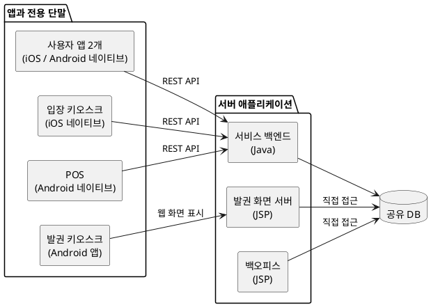

# AI 코딩을 대하는 개발자의 자세

## 들어가며

C를 본격적으로 공부하기 시작한 것은 1995년 무렵이었다. 당시에는 “프로그래밍을 제대로 알려면 어셈블리어를 알아야 한다”는 말을 종종 들었다. 실제로 C 코드 사이에 어셈블리어가 섞여 있는 소스도 심심찮게 볼 수 있었다.

그래서 어셈블리어를 잔뜩 설명해 놓은 책에도 도전했다. 당시 고등학생이었던 나는 GW-BASIC 정도밖에 몰랐다. 어셈블리어가 어려워서 이해하지 못했다기보다, 더하기 같은 단순한 연산 하나에도 값을 레지스터로 옮기고 결과를 다시 저장하는 여러 동작을 일일이 지시해야 한다는 방식이 불합리하게 느껴졌다. 결국 책을 끝까지 읽지 못했다. 그때 도전했던 책은 30년이 지난 지금도 구석 어딘가에 잠들어 있다.

어셈블리어를 알았다면 하드웨어의 동작과 C 코드가 기계에서 실행되는 방식을 더 깊이 이해할 수 있었을 것이다. 성능이 중요하거나 하드웨어를 세밀하게 제어해야 하는 상황에도 도움이 됐을 것이다.

하지만 어셈블리어로 범용 애플리케이션을 개발하기에는 생산성이 너무 낮았고 이식성과 유지보수에도 불리했다. C와 컴파일러가 발전하면서 개발자는 모든 명령을 직접 작성하지 않고도 더 많은 일을 빠르게 구현할 수 있게 됐다. 어셈블리어는 사라지지 않았지만, 대부분의 개발자가 매일 직접 다루는 작업에서는 한 단계 아래로 내려갔다.

그 뒤에도 컴파일러가 만든 코드를 믿지 못하거나 제대로 된 프로그램은 어셈블리어로 직접 작성해야 한다고 생각하는 개발자들이 있었다. 특정 영역에서는 타당한 태도였지만, 모든 애플리케이션을 그렇게 개발하기에는 생산성 차이가 너무 컸다.

30여 년이 지난 지금, AI 코딩을 둘러싼 반응에서 비슷한 기시감을 느낀다. AI가 작성한 코드는 믿기 어렵고 직접 작성해야만 제대로 이해할 수 있다는 이유로 AI 도입을 주저하거나 제한적으로 사용하는 개발자들이 있다. 이런 우려에는 근거가 있다. AI는 그럴듯하지만 잘못된 코드를 만들 수 있다.

물론 컴파일러와 AI는 전혀 다르게 동작한다. 컴파일러는 형식 언어로 작성된 소스를 정해진 규칙에 따라 변환하지만, AI는 자연어 요구와 프로젝트 맥락을 바탕으로 결과를 생성한다. 그 결과가 개발자의 의도를 보존한다는 보장은 없으므로 별도의 검증이 필요하다. 테스트가 통과했다는 이유만으로 요구사항을 충족했다고 단정해서도 안 된다.

둘이 닮은 점은 작동 방식이나 신뢰성이 아니다. 개발자가 모든 구현 세부를 직접 작성하지 않고도 더 넓은 문제를 다룰 수 있게 한다는 점이다.

여기서 말하는 AI 에이전트는 채팅창에서 코드 조각만 답해 주는 도구가 아니다. 프로젝트 저장소를 탐색하고 파일을 수정하며, 명령을 실행해 빌드와 테스트 결과까지 확인한다. 새로운 기술을 조사하고 요구사항을 정리하며, 설계안과 코드, 테스트, 문서까지 작성한다.

나 역시 2025년 말까지는 코딩을 직접 주도하고 AI에는 검토와 보완을 주로 맡겼다. AI가 작성한 코드를 내가 직접 작성한 코드만큼 신뢰하기 어려웠기 때문이다. 그러나 2026년 초부터 AI 에이전트를 실제 프로젝트에 본격적으로 적용하면서 생각이 달라졌다. AI에게 구현의 상당 부분을 맡기고 내가 요구사항과 방향을 정한 뒤 결과를 검증하는 방식으로도 개발을 진행할 수 있었다. 무엇보다 직접 모든 코드를 작성할 때보다 동시에 다룰 수 있는 문제의 범위가 크게 넓어졌다.

AI에는 여전히 분명한 한계가 있다. 잘못된 전제를 바탕으로 멀쩡해 보이는 코드를 만들거나 프로젝트 전체의 맥락을 놓칠 수 있고, 결과를 검증하는 데도 비용이 든다. 그럼에도 실제 프로젝트에서 체감한 생산성 향상은 이런 한계와 검증 비용을 감수할 가치가 있을 만큼 컸다. AI 코딩은 이제 취향만으로 받아들이거나 거부할 수 있는 선택지가 아니다. 생산성 때문에 외면하기 어려운 흐름이 됐다.

그렇다면 개발자는 AI와 어떻게 일해야 할까? 무엇을 맡기고 무엇을 직접 판단해야 할까? AI가 만든 결과를 어떻게 검증하고, 그 결과에 대해서는 누가 책임져야 할까?

이 글에서는 2026년 1월부터 7개월 동안 AI 에이전트와 프로젝트를 진행하며 겪은 일을 시간순으로 살펴본다. 다음 글에서는 그 경험을 바탕으로 AI의 특성과 개발자의 역할, 위임과 검증 방법, 앞으로의 성장 방향을 정리한다.

## 출시 4주 전, 거의 완성됐다는 프로젝트

2026년 1월, 나는 미술관에서 사용할 이벤트·티켓 서비스를 개발하던 팀에 합류했다. 정식 운영까지 남은 기간은 처음에는 4주였고, 대표는 거의 다 됐다고 했다.

나는 “거의 완성됐다”는 말을 들으면 왠지 모를 좌절감을 느낀다. 프로젝트가 제대로 진행되고 있다면 “결제 기능이 남았다”거나 “회원 관리 기능을 구현 중이다”처럼 현재 상태와 남은 일을 구체적으로 말하기 마련이다. 구체적인 설명 없이 “거의 다 됐다”는 말만 돌아온다면, 내 경험으로는 아무것도 제대로 끝나지 않았다는 뜻에 가깝다.

주니어와 시니어의 큰 차이 중 하나는 완성도를 판단하는 기준이다. 몇 차례 서비스를 출시하고 운영해 보면 정상적인 흐름이 한 번 동작하는 것과 실제로 운영할 수 있는 것은 다르다는 사실을 알게 된다. 생각할 수 있는 모든 상황을 면밀하게 검토하고 구현해도 출시 후 한동안은 실제 환경에서 드러난 문제를 고치느라 바쁘다. “되긴 된다”는 수준은 완성에 가까운 상태가 아니라 겨우 시연할 수 있는 상태다. 그 상태로 출시하면 그날 바로 서비스를 내려야 할 수도 있다.

대표가 말한 “거의 다 된” 상태가 어느 정도인지 확인하기 위해 조마조마한 마음으로 제품을 하나씩 실행해 봤다.

그러자 “이건 아직 안 되고”, “저건 더 해야 하고”, “그건 문제가 있다”는 설명이 계속 이어졌다. 된다는 말보다 아직 안 된다는 말을 더 많이 들었다.

기존 개발팀은 팀장 한 명과 팀원 두 명으로 구성돼 있었고, 그 인원으로 다음 제품을 동시에 개발하고 있었다.

제품마다 다른 기술을 사용한 것 자체가 문제는 아니었다. 문제는 세 명뿐인 팀이 이 모든 기술과 제품을 동시에 완성하고 곧 운영해야 한다는 점이었다. 사용자 앱의 같은 기능을 iOS와 Android에서 각각 구현해야 했고, 전용 단말도 두 플랫폼으로 나뉘어 있었다. 서비스 백엔드와 발권 화면 서버, 백오피스는 하나의 데이터베이스에 각각 직접 접근했다. 한 기능을 변경해도 여러 애플리케이션과 데이터 흐름을 함께 확인해야 했다.

인수인계와 출시도 동시에 진행해야 했다. 기존 팀장은 퇴사를 앞두고 있었고, 남은 두 개발자는 백엔드와 여러 모바일 앱, 키오스크를 나눠 맡고 있었다. 각자 구현해야 할 기능만으로도 여유가 없었기 때문에 전체 사용자 흐름을 연결하고 실제 운영 조건을 점검하는 일은 뒤로 밀려 있었다.

프로젝트에는 이미 많은 화면과 API가 있었다. 그러나 기능이 많다는 것과 서비스가 완성됐다는 것은 달랐다. 회원 가입부터 티켓 구매와 발권, 현장 입장, 매출 확인까지 사용자가 실제로 거치는 흐름을 따라가 보면 중간중간 연결되지 않는 부분이 나타났다. 키오스크와 POS도 개별 기능은 동작했지만 현장에 그대로 설치해 계속 운영할 수 있는 상태는 아니었다.

대표는 프로젝트가 마무리 단계에 있다고 생각했다. 내가 보기에는 여러 시제품이 한곳에 모여 있고, 이제부터 하나의 서비스로 연결해야 하는 상태에 가까웠다. 이미 만든 것을 모두 버리고 다시 시작할 수도 없었고, 남은 4주 동안 기존 구조의 모든 문제를 고칠 수도 없었다.

기존 팀은 예정된 출시를 준비하고, 나는 전체 일정과 범위를 관리하면서 이후 기존 시스템을 대체할 백엔드와 백오피스, 사용자 앱을 별도로 준비하기로 했다. 같은 서비스를 두 갈래로 개발하는 선택에는 비용이 들었지만, 당장 현장을 열기 위한 작업과 이후에도 운영할 구조를 만드는 작업을 분리할 필요가 있었다.

## AI로 분석을 시작하다

프로젝트에 합류한 날 밤부터 AI 에이전트로 기존 시스템을 조사했다. 새 코드를 작성하게 하기 전에 지금 무엇이 만들어져 있는지부터 알아야 했다.

먼저 구현된 REST API를 목록으로 만들고 기능별로 분류하게 했다. 각 API가 어떤 역할을 하는지 설명하게 하고, 이름만으로 이해하기 어려운 요청 인자가 나오면 관련 코드를 따라가며 실제 용도를 확인하게 했다. 데이터베이스 테이블과 API, 이를 호출하는 애플리케이션을 연결해 보면서 서비스에 구현된 기능과 빠진 흐름을 정리했다.

그렇게 하루 동안 프로젝트의 큰 지도를 만들었다. 내가 파일을 하나씩 열어 같은 작업을 했다면 적어도 일주일은 걸렸을 것이라고 생각한다. AI는 많은 코드를 짧은 시간에 읽고 반복되는 조사 결과를 일정한 형식으로 정리하는 데 특히 유용했다.

조사 결과 백엔드에는 예상보다 많은 기능이 구현돼 있었다. 다만 데이터베이스와 API의 이름만으로는 역할과 연결 관계를 이해하기 어려웠고, 비슷한 데이터도 API마다 다르게 처리됐다. 일부 요청에는 별도의 암호화·복호화 과정이 있었지만 적용 기준이 일정하지 않았다. 개별 API가 동작하더라도 다른 애플리케이션과 연결하거나 오류의 원인을 추적하기 어려운 구조였다.

AI가 보여 준 것은 현재 시스템의 지도였다. 그 지도만으로 무엇을 남기고 무엇을 다시 만들지는 결정할 수 없었다. 코드에는 현장의 운영 방식과 출시 일정, 앞으로 바뀔 사업의 우선순위가 모두 들어 있지 않았기 때문이다.

분석 결과를 바탕으로 대표와 출시 범위를 다시 정리했다. 대화를 시작하면 당장 필요한 기능과 언젠가 필요할 기능이 자연스럽게 섞였다. 당시에는 개인 간 티켓 거래와 사용자 앱도 중요하게 논의됐지만, 모든 기능을 4주 안에 완성할 수는 없었다. 우선 현장에서 티켓을 판매하고 발권하며 입장을 처리하고 매출을 확인하는 흐름부터 끝까지 연결하기로 했다.

AI는 요구사항을 목록으로 만들고 빠진 질문을 찾으며 범위별 계획을 비교하는 데도 도움을 줬다. 그러나 어떤 기능을 포기할지는 AI가 정할 수 있는 문제가 아니었다. 우리는 불완전하더라도 출시할 기능과 이후로 미룰 기능을 직접 선택했다. 그렇게 기존 시스템의 첫 출시를 준비하는 동시에, 이후 운영을 맡을 새 시스템의 범위도 정해졌다.
