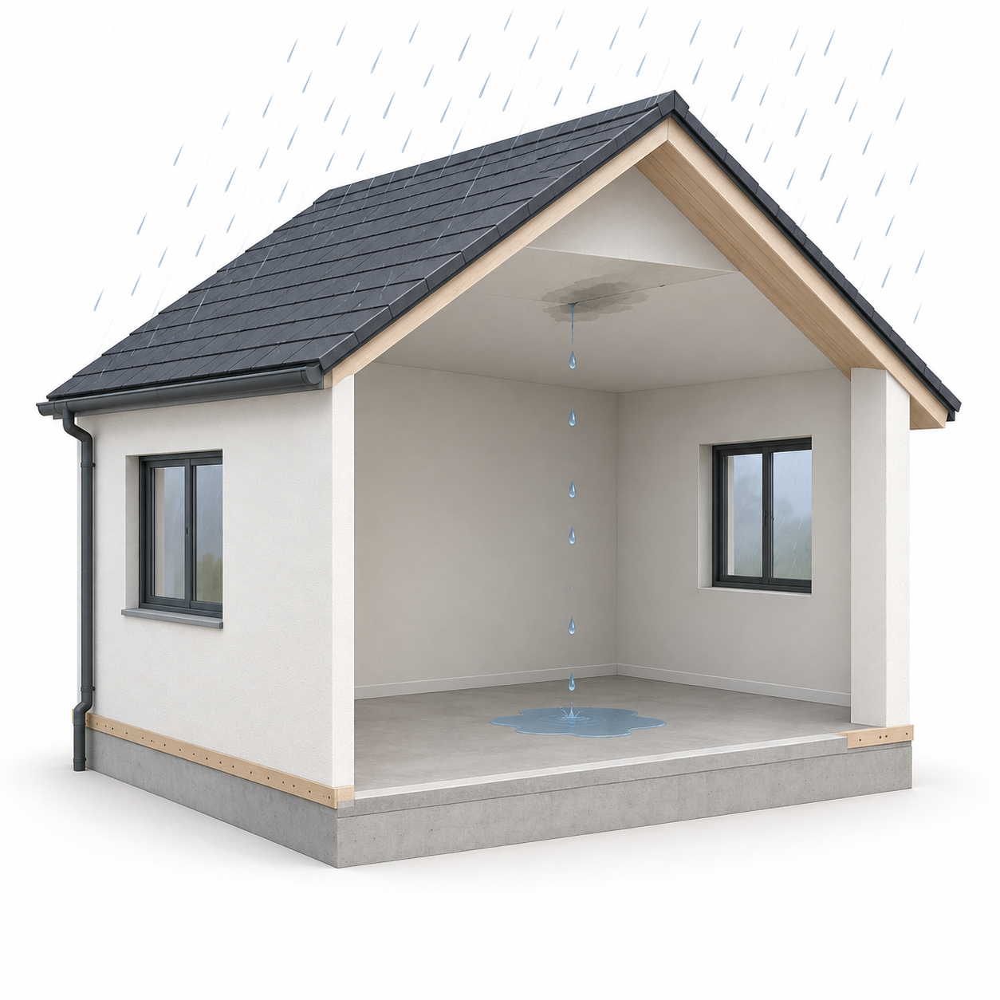
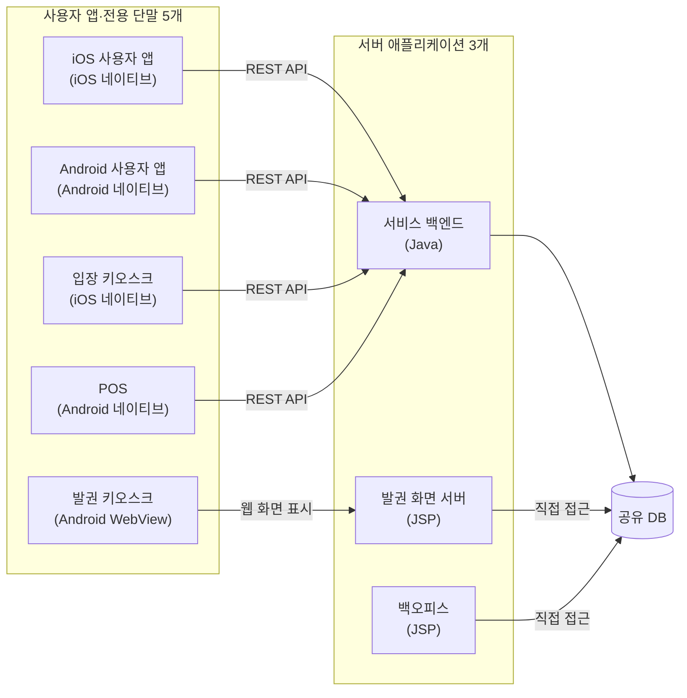
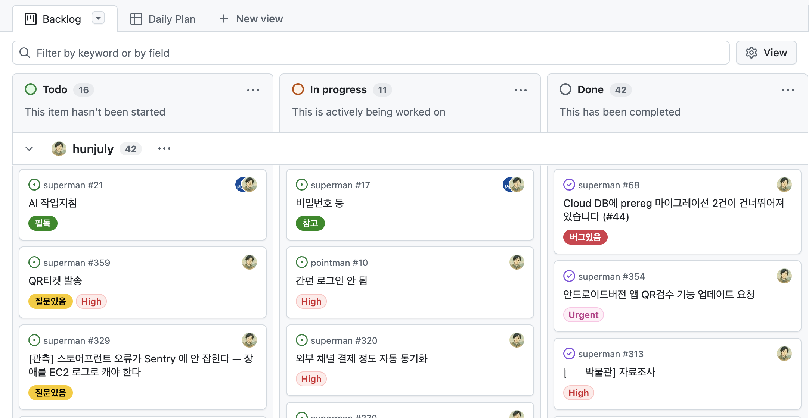

# AI가 바꾼 개발 환경: 8개월의 경험담

## 들어가며

AI 코딩에 관한 이야기를 최근 8개월 동안의 프로젝트 경험으로 시작하려 한다. 레거시를 수습하고, AI 코딩으로 혼자 여러 애플리케이션을 개발하고, 나중에는 대표가 AI로 개발을 주도하는 프로젝트에서 일했다. 그 과정에서 업무를 나누는 방식과 의사결정 과정, 개발자인 내 역할도 여러 번 바뀌었다.

이 글에서는 코딩 방식을 다음과 같이 구분한다.

- **직접 코딩**: 개발자가 코드를 직접 작성·수정하면서 구현하는 방식
- **AI 코딩**: 개발자가 요구사항을 설명하고 AI에게 코드 작성·수정을 맡긴 뒤 결과를 검토하는 방식

1편에서는 나를 포함한 참여자들이 어떤 입장에서 일했고 AI 코딩을 하면서 무엇을 겪었는지 돌아본다. [2편](./ai_coding_part2_notes.md)에서는 구체적인 기술 사례를 살펴보고 문제의 원인과 해결 방법을 모색한다.

## 1. 개발팀에 합류하다

### 합류 당시의 상황

나는 전시·행사용 티켓 서비스를 개발하는 팀에 합류했다. 대표는 개발팀장을 채용하기 전에도 외주 업체와 프리랜서에게 개발을 맡겼지만, 어느 쪽도 출시로 이어지지 못했다. 8년 동안 비용을 쓰고도 서비스를 내놓지 못한 상태였다.

당시 미술관 납품과 정식 운영까지 남은 기간은 4주였다. 이미 몇 차례 납품을 미룬 터라, 이번에도 기한을 지키지 못하면 중요한 계약을 잃을 위기였다.

대표를 처음 만난 날부터 그가 큰 압박에 시달리고 있다는 것을 느꼈다. 개발팀장뿐 아니라 개발자 전반에 대한 불신도 깊었다.

### 실행하자 드러난 기본 기능의 오류

대표는 개발이 거의 다 됐다고 했다.

나는 “거의 다 됐다”는 말을 들으면 왠지 모를 좌절감을 느낀다. 거의 다 됐다면서 회의에서는 무엇이 됐고 무엇이 안 됐는지부터 파악하고 있었다.

진행 상황을 파악하기 위해 기존 시스템(`legacy`)을 직접 실행해 봤다. 역시나 인증 같은 기본 기능에서도 곧바로 오류가 났다.

내가 보기에는 하긴 했지만 제대로 하지는 않은 상태였다. 완공을 앞두고도 천장에서 물이 새는 집 같았다.

팀장 한 명과 팀원 두 명이 아래의 앱·서버 8개를 모두 개발하고 있었다.

처음 분석할 당시 레거시는 모노레포 구조가 아니었고, DB까지 포함해서 저장소만 9개였다.

팀 규모와 출시 일정을 고려하면 기술이 지나치게 분산돼 있었다. 사용자 앱의 같은 기능을 iOS와 Android에서 각각 구현해야 했고, 전용 단말도 두 플랫폼으로 나뉘어 있었다. 서비스 백엔드와 발권 화면 서버, 백오피스는 하나의 데이터베이스에 각각 직접 접근했다. 한 기능을 변경해도 여러 애플리케이션과 데이터 흐름을 함께 확인해야 했다. 세 명이 여러 기술로 만든 제품을 동시에 완성하고 운영해야 했다.

출시 준비와 인수인계도 함께 진행해야 했다. 팀장은 퇴사를 앞두고 있었고, 두 팀원은 백엔드와 여러 모바일 앱, 키오스크를 나눠 맡고 있었다.

기존 시스템에는 이미 많은 화면과 API가 있었다. 동작하는 기능은 있었지만, 사용자가 서비스를 처음부터 끝까지 이용할 수 있도록 연결돼 있지는 않았다. 키오스크와 POS도 실제 운영을 위한 완성품보다는 시제품에 가까웠다.

대표는 프로젝트가 마무리 단계에 있다고 생각했다. 내가 보기에는 여러 시제품을 하나의 서비스로 연결하는 작업이 남아 있었다. 이미 만든 것을 모두 버리고 다시 시작할 수도 없었고, 남은 4주 동안 기존 구조의 모든 문제를 고칠 수도 없었다.

### 개발팀장과의 첫 대화

대표는 팀장이 AI 코딩을 하지 않는 것도 불만이라고 했다. 팀장이 AI가 만든 코드를 믿을 수 없고 그런 방식은 제대로 된 개발도 아니라고 여긴다는 설명이었다. 당시에는 Opus 4.5가 막 출시됐을 때라, AI 코딩에 대한 우려는 나도 이해할 수 있었다.

출근 첫날 개발팀장에게 프로젝트 소개를 부탁하자, 개발자는 그런 일을 하는 사람이 아니라는 답이 돌아왔다.

그러면 프로젝트 소개는 누가 해야 한단 말인가?

팀장의 태도를 보니 프로젝트가 왜 그런 상태인지 짐작이 갔다. 몇 차례 다른 설명을 요청했을 때도 그런 것은 대표에게 물어보라는 답이 돌아왔다. 더는 대화하기 어렵겠다고 생각해 대화를 접었다.

잠시 자리를 비웠던 대표는 돌아와서 우리가 아무 말 없이 각자 책상에 앉아 있는 모습을 보고 의아해했다. 팀장은 대표가 들어오자마자 함께 회의실로 갔다. 얼마 뒤 팀장이 자리로 돌아왔고, 이번에는 대표가 나를 회의실로 불렀다.

대표는 팀장이 나를 굉장히 안 좋게 이야기했다고 전했다. Java도 모르는 개발자이니 잘 생각해야 한다는 것이었다. 대표는 내게 정말 문제가 없는지, Java를 할 수 있는지 물었다.

대답하고 싶지는 않았다. 조금 전까지 팀장을 안 좋게 이야기하던 대표가 이번에는 그 말을 듣고 내 역량을 의심하는 것도 답답했다. 누구도 쉽게 믿지 못하면서 누구를 믿어야 할지 판단할 기준도 없어 보였다.

나는 의인불용 용인불의(疑人不用 用人不疑)를 읊으며 사람이 의심스러우면 쓰지 말고, 쓰려면 의심하지 말라고 했다. 말 한마디에 이렇게 흔들리면 앞으로 어떻게 함께 일하겠느냐고도 말했다.

그래도 대표는 불안해하며 Java를 할 수 있느냐고 다시 물었다. 나는 지금 익숙하지 않은 기술이라도 금방 적응할 수 있고, 그동안 어떤 기술로 무슨 일을 해 왔는지는 이력서에 나와 있지 않느냐고 답했다.

프로젝트를 수습하려면 무엇보다 신뢰 관계를 쌓는 게 중요해 보였다.

## 2. AI가 개발 방식을 바꾸다

### AI로 기존 시스템을 분석하다

프로젝트에 합류한 날 밤부터 AI 에이전트로 기존 시스템(`legacy`)을 조사했다. 여기서 사용한 AI 에이전트는 프로젝트 저장소를 탐색하고 파일을 수정하며 빌드와 테스트까지 실행하는 도구다. 새 코드를 작성하게 하기 전에 지금 무엇이 만들어져 있는지부터 알아야 했다.

먼저 구현된 REST API를 목록으로 만들고 기능별로 분류하게 했다. 각 API의 역할을 분석하게 하고, 이해하기 어려운 요청 인자는 관련 코드를 따라가며 용도를 확인하게 했다. 데이터베이스 테이블과 API, 이를 호출하는 애플리케이션을 연결해 보면서 시스템에 구현된 기능과 빠진 흐름을 정리했다.

시스템의 전반적인 기능을 파악하는 데 하루가 걸렸다. 내가 파일을 하나씩 열어 같은 작업을 했다면 꼬박 일주일가량 걸렸을 것이다.

물론 분석이 모두 정확하지는 않았다. 이후 개발하면서 다시 확인하니, 구현돼 있다고 정리한 API 가운데 실제로는 개발이 중단된 것도 있었다. AI가 API 이름을 보고 용도를 잘못 파악한 경우도 있었다.

조사 결과 백엔드에는 많은 기능이 구현돼 있었다. 다만 DB 스키마와 API의 이름만으로는 역할과 연결 관계를 파악하기 어려웠고, 비슷한 데이터도 API마다 다르게 처리됐다. 일부 요청에는 별도의 암호화·복호화 과정이 있었지만 적용 기준이 일정하지 않았다. 개별 API가 동작하더라도 다른 애플리케이션과 연결하거나 오류의 원인을 추적하기 어려운 구조였다.

시스템 분석을 일단락하고 최소 요구사항을 정의하기 시작했다.

대표에게 꼭 필요한 기능을 물으면 당장 필요한 기능과 언젠가 필요할 기능이 뒤섞여 나왔다. 예를 들어 개인 간 티켓 거래는 필수 기능이라고 했지만, 8개월이 지난 지금은 흔적조차 찾을 수 없다.

시간은 한정돼 있었다. 필수라고 정의한 기능들을 쳐내고 쳐내서 4주 안에 겨우 구현할 수 있는 수준으로 요구사항을 정리했다.

### 백오피스를 다시 만들다

가장 먼저 손댄 것은 기존 시스템의 백오피스였다. JSP로 만들고 있었지만 기능 구현도 끝나지 않은 상태였다. UI는 내가 Next.js로 다시 만들고, 백엔드 API는 팀원이 새로 만들기로 했다.

내가 직접 코딩으로 백오피스를 만든 것은 2년 전이 마지막이었다. 그때도 Next.js를 사용했다. 개발 시간을 줄이려고 React UI 라이브러리인 MUI 기반의 유료 템플릿을 구입했고, 템플릿의 구조를 익힌 뒤 필요한 화면에 맞게 고쳐 썼다. 당시에는 그렇게 하는 것이 꽤 효율적이었다.

이번에는 AI에게 필요한 메뉴를 알려주고 REST API의 요청과 응답을 정리한 문서를 제공했다. AI는 그 자료를 바탕으로 백오피스의 기본 구조와 주요 화면을 빠르게 만들었다.

급박한 일정이라 화면의 시각적 완성도까지 신경 쓸 여유는 없었는데, 결과물은 별도의 유료 템플릿이 필요 없을 만큼 번듯했다.

요구사항만 명확히 정의할 수 있다면 AI는 순식간에 코드로 구현했다.

### 백엔드 개발자에게 백오피스까지 맡기다

백오피스 개발은 순조로웠다. 백엔드 API를 연동하기 전까지는.

백엔드를 맡은 개발자는 경력 3년 차였다. 그동안 전달한 요구사항을 곧잘 구현했다고 생각했기 때문에 백오피스에 필요한 API도 무리 없이 만들 것이라고 생각했다. 그러나 구현됐다는 API를 호출하면 동작하지 않았고, 수정했다는 말을 듣고 다시 확인하면 다른 오류나 누락이 나왔다. 하나의 API를 연동하는 과정에서 같은 일이 세 차례 반복됐다.

나는 AI의 API 설계를 직접 검토했는지 물었다. 그는 설계를 검토하지 않았고 테스트도 하지 않았다고 했다. 내가 전달한 요구사항을 AI에게 입력하고, AI가 완료했다고 하면 그 말을 나에게 전달하고 있었다.

백오피스의 기능은 대부분 API에서 반환한 데이터를 화면에 출력하고 값을 업데이트하는 정도로 단순했다. API와 화면을 나눠 맡아 요구사항을 다시 설명하고 수정 결과를 기다리느니, 한 사람이 둘 다 다루는 편이 낫겠다고 생각했다.

그래서 백엔드 개발자에게 백오피스까지 맡기기로 했다. 그는 처음에는 프론트엔드를 하고 싶지 않다고 했다. 백엔드 전문 개발자가 되고 싶다는 것이었다. 나도 그 마음은 이해했다. 어설프게 여러 기술을 아는 것보다 하나라도 제대로 아는 편이 낫기 때문이다.

하지만 이번 백오피스를 AI 코딩으로 만들어 보니, 화면 구현까지 맡길 수 있겠다고 생각했다. 그도 API와 화면을 함께 맡는 편이 효율적이라는 데는 동의했고, 백오피스 개발을 넘겨받았다.

### 서비스 출시 뒤 전체 재개발을 시작하다

3월 초, 기존 서비스를 가까스로 출시했다. 합류 당시 들었던 4주는 이미 지난 뒤였다.

급한 위기를 넘긴 뒤 남은 작업과 서비스 유지보수는 대표와 팀원들에게 맡겼다. 나는 기존 시스템 전체를 다시 만들기 시작했다.

### 동작하는 앱을 보며 요구사항을 정하다

사용자 앱(`pointman`)은 Flutter로 만들기로 했다. 처음 쓰는 기술이었지만, 백오피스를 AI 코딩으로 만들어 보고 나니 Flutter도 문제없을 것 같았다.

처음엔 디자이너가 만든 Figma 파일을 AI에게 주고 그대로 구현하게 했는데, 결과가 디자인과 일치하지도 않았고 제대로 동작하지도 않았다. 시안을 PDF나 SVG로 바꿔 전달해 봐도 결과는 크게 다르지 않았다.

게다가 시안 자체에도 고쳐야 할 부분이 많았다. 직접 수정하려 해도 Figma를 능숙하게 다루지 못해 쉽지 않았다. 그렇다고 Figma를 배울 시간은 없었다.

한 시간 정도 이것저것 시도하다가 문득 생각이 바뀌었다. 백오피스가 그랬던 것처럼 앱에 필요한 기능을 설명해서 동작하는 초안을 만들게 하면 어떨까?

실제로 필요한 기능을 몇 문장으로 설명하자 기대 이상의 초안이 나왔다. 화면이 번듯한 데다 실제로 동작하기까지 했다.

이전에는 대표의 설명을 디자이너가 시안으로 옮기고, 개발자가 이를 구현했다. 구현 중에 빠진 버튼이나 모호한 동작을 발견하면 다시 대표에게 묻고 시안과 코드를 고쳤다.

이제는 대표와 동작하는 앱을 보면서 무엇을 고칠지 정하고, 그 자리에서 AI에게 수정을 맡겨 결과를 확인할 수 있었다.

## 3. AI에게 큰 작업을 맡기며 검증을 소홀히 하다

사용자 앱과 함께 만들던 새 백엔드(`marksman`) 개발도 순조로웠다. 예전에 만들어 둔 NestJS 기반의 시드 프로젝트를 주자, AI는 사용자와 인증 같은 기본 기능을 새 백엔드에 맞게 바꾸고 기존 테스트도 함께 수정했다.

처음에는 AI가 만든 API를 직접 검증했다. fallback이나 편법으로 문제를 덮지는 않았는지, 검증 방법은 올바른지도 확인했다.

개떡같이 말해도 찰떡같이 알아듣는 AI가 그렇게 신기하고 기특할 수 없었다. “설마 이것까지 하겠어?” 하며 조심스럽게 일을 맡겼다가도 결과를 보면 “이게 되네?” 싶었다. 그렇게 기대가 커지면서 한 번에 맡기는 작업도 점점 커졌다.

그러다 큰 작업을 두세 개 연속으로 맡기면서도 중간 결과를 확인하지 않게 됐다. 이번에도 알아서 잘해 줄 거라는 출력 200%의 희망회로를 돌리고 있었다.

몇 시간 뒤 결과물을 살펴보면 문제가 한둘이 아니었다. 내가 요청하지 않은 기능이 추가돼 있었고 정작 필요한 기능은 빠져 있었다. 보안을 강화한다며 제약을 지나치게 넣어, 사소한 예외에도 시스템이 멈추는 경우가 있었다.

한 번은 AI가 카드번호로 결제 기록을 검색하는 UI를 만들어 놓고, 정작 카드번호는 모두 마스킹해 저장해 뒀다. 화면은 번듯했지만 저장된 값으로는 애초에 검색할 수 없었다. 그런데도 AI에게 전체 기능을 테스트하라고 하면 몇 번이고 정상이라고 보고했다.

문제를 고치라고 하면 꼼수를 쓰거나 과도하게 우회한 뒤 해결했다고 보고하기도 했다. AI는 잘못된 방향으로도 놀라울 만큼 열정적으로 삽질했다.

## 4. AI와 함께 1인 개발로 전환하다

### 팀원들의 작업을 관리하다

새 백엔드(`marksman`)와 사용자 앱(`pointman`)을 개발하는 동안에도 팀원들의 추가 기능 개발과 버그 대응은 지지부진했다. 대표가 요구한 내용을 각자 해석해 구현하고, 대표는 결과를 보고 원하던 것과 다르다고 말하는 일이 반복됐다. 대표와 개발팀이 서로 다른 지역에 있어 수시로 함께 화면을 보며 협의하기도 어려웠다.

요구사항과 작업 결과를 한곳에 모으려고 GitHub Projects를 사용해 보기도 했다. 대표가 할 일을 등록하고, 개발자는 해당 작업을 진행한 뒤 결과와 공유할 내용을 댓글로 남기도록 했다.

하지만 이 방식대로 일한 것은 하루 정도였다. 대표는 이전처럼 여러 채널로 요구사항을 전달했고, 개발자들은 작업 항목에 결과를 남기지 않았다.

결국 내가 작업 하나하나에 관여하며 요구사항이 구현 결과에 반영되도록 조율해야 했고, 새 백엔드를 개발할 시간은 점점 줄었다.

### 한 사람에게 네 개의 앱을 맡기다

3월에 서비스를 출시하고 얼마 후 iOS 개발자의 계약도 끝났다. 그가 맡던 iOS 키오스크와 사용자 앱을 새로 채용한 Android 개발자에게 맡기려고 했다. 이미 담당하던 Android 키오스크와 사용자 앱을 포함하면 네 개의 애플리케이션이었다.

처음 이야기를 꺼냈을 때 그는 강하게 거부했다. 지금도 두 개나 하고 있는데 네 개를 어떻게 맡느냐는 것이었다. 예상했던 반응이었다. 플랫폼별 기술을 익혀 직접 코딩하는 방식으로 계산하면 결코 가벼운 요구가 아니었다.

그러나 내가 백오피스와 Flutter 앱을 AI 코딩으로 만들며 경험한 업무량은 이전과 달랐다. iOS와 Android라는 플랫폼의 차이는 있었지만 구현할 기능은 상당 부분 같았다. 공통 요구사항을 정리한 뒤 플랫폼별 구현을 AI에게 맡기면, 사람이 모든 구현을 처음부터 반복해야 하는 부담은 줄일 수 있었다.

AI로 달라진 개발 환경을 설명하자 그도 내 판단을 받아들였고 업무를 맡았다. 그 후에도 AI 코딩에 빨리 적응해야 한다고 몇 차례 조언했다.

나는 조언이라고 생각했지만, 그에게는 경고로 들렸을지 모르겠다. 그는 수습 평가를 앞두고 퇴사 의사를 밝혔다.

더 부드럽게 말해야 한다는 것은 알고 있었다. 그러나 회사 자금이 거의 바닥난 상황에서 누군가 업무에 적응할 때까지 기다릴 여유는 없었다.

### 무책임 한도 초과

앞서 API 연동에서 문제를 일으켰던 백엔드 개발자는 여전했다. 구현됐다는 기능을 확인하면 오류가 나왔고, 수정을 요청한 뒤 다시 확인하는 일이 반복됐다.

출시 직후에는 서비스 유지보수를 대표와 팀원들에게 맡기고 새 시스템 개발에 집중하고 있어, 문제의 심각성을 몰랐다.

서버는 다 됐다고 하는데 Android 개발자는 기능 하나를 구현하는 데도 어려움을 겪는 듯했다. 업무가 낯설어서 그렇겠거니 했다. 직접 코딩하던 때의 기준으로는 준수한 속도였으므로 문제라고 생각하지 않았다.

그러다 백오피스의 매출 통계가 계속 맞지 않아 대표의 불만이 쌓였다. 더는 두고 볼 수 없어 직접 원인을 살펴봤다.

백엔드 개발자는 하나의 애플리케이션에 AI 에이전트를 서너 개씩 동시에 투입하고 있었다. 작업 범위를 나누지 않았고, 변경 결과를 검토해 통합하는 과정도 없었다. 기존 기능이 여전히 동작하는지 확인하지도 않았다.

가장 충격적이었던 것은 실제 고객이 사용 중인 서비스의 운영 DB에서 여전히 테스트하고 있었다는 점이다. 자동 백업조차 없었고, 테스트 데이터는 사용자에게 고스란히 노출되고 있었다.

AI가 작업을 끝내도 결과를 검증하지 않았고, AI에게 어떻게 검증할지 묻지도 않았다. 매출 통계가 계속 맞지 않는다면 최소한 검증 계획을 요구하고, 그 계획이 타당한지는 검토했어야 했다. 정말 최소한으로 잡아도 말이다.

나는 지난번 백오피스 API를 연동할 때 충분히 주의를 줬다고 생각했다. 그러나 이번에 살펴보니 여전히 일말의 책임감도 찾아볼 수 없었다.

내 표정은 어두워졌고 말은 건조해졌다. 이를 눈치챈 그가 말했다.

“큰 회사에서도 기획자들이 몇 명이 붙어서 검증해도 완벽하기 어려운데, 이 작은 회사에서 어떻게 팀장님 기준에 맞출 수 있겠어요?”

내가 요구한 것은 완벽한 프로그램이 아니라 최소한의 책임감이었다.

한 달 전에도 받아들이기 어려운 태도 때문에 한 차례 해고를 통보한 적이 있었다. 그때는 본인이 잘못을 인정했고, 취업 시장이 어렵다는 것을 알았기에 차마 해고를 강행하지 못했다.

처음에는 내가 참으면 어떻게든 감당할 수 있는 문제였다. 그러나 이번에는 그의 무책임으로 회사와 다른 구성원들까지 피해를 보고 있었다.

그 말을 들은 다음 날 해고를 통보했다.

요즘 주니어의 업무 태도 때문에 가급적 채용을 피하고 싶다는 이야기를 자주 듣는다. 이 일을 겪고 나니 그 말이 이해됐다. 그에게 일을 맡겨도 결과를 확인하고 수습하는 일은 계속 다른 사람들의 몫이었다.

물론 모든 주니어가 그런 것은 아니다. 몇 달 전 짧게 근무한 회사에서 만난 주니어와는 지금도 연락을 주고받는다. 어른스럽고 무슨 일을 맡겨도 믿음이 가는 친구다.

하지만 최근 6개월 동안 내가 만난 주니어 10명 중 자신 있게 추천할 수 있는 사람은 두 명 정도다.

### AI 에이전트로 단독 개발

Android 개발자가 퇴사하겠다고 했을 때, 차라리 잘됐다는 생각을 했다. 대표와 팀원 사이에서 업무의 맥락과 의도를 설명하고, 진행 상황을 조율하고, 어긋난 결과를 다시 수정하는 데 드는 비용이 당시에는 너무 컸다. 다들 상황에 불만이 있어 조언과 상담에도 시간이 들었다.

그 시간까지 생각하면 내가 직접 AI에게 일을 맡기고 결과를 확인하는 편이 더 효율적일 것 같았다. Android 개발자도 내가 혼자 AI 코딩을 하는 편이 낫겠다는 데 동의했다.

나는 대표에게 당분간 채용을 중단하고 혼자 개발하는 게 낫겠다고 제안했다. 그때는 몰랐지만, 대표는 개발팀이 무너져 사업을 접어야 하는 것은 아닌지 걱정했다고 한다. 그러나 팀원들이 실제로 해내던 일과 그 과정에 내가 쏟던 시간을 따져 보면, 역시 단독 개발이 최선의 선택이었다.

4월 초에는 팀원들의 일을 모두 넘겨받아 혼자 개발하게 됐다. 이때 내가 다뤄야 했던 애플리케이션은 다음과 같다.

1. 새로 개발 중인 백엔드(`marksman`)
2. 새로 개발 중인 사용자 앱(`pointman`)
3. 부산에서 3일 동안 진행되는 이벤트용 백오피스·티켓 시스템(`events`)
4. 팀원이 개발하던 백엔드(`legacy`)
5. 팀원이 개발하던 백오피스(`partner-console`)
6. Android 발권 키오스크(`ticketing`)
7. 발권 키오스크의 JSP 서버(`kiosk-server`)
8. Android POS(`pos-app`)
9. iOS 입장 키오스크(`checkin`)

기존의 iOS·Android 사용자 앱은 개발을 중단하고 당장 필요한 것만 남겨도 애플리케이션이 9개였다.

직접 코딩을 했다면 감당하기 힘들었을 것이다. 그러나 팀원들도 나도 직접 코딩을 하지 않은 지 이미 몇 달이 지나 있었다. AI 코딩이라면 이 정도는 혼자서도 감당할 수 있을 것 같았다.

Java와 Android는 익숙하지 않았지만 부담스럽지 않았다. 말로 지시하고 결과를 검증하는 방식은 같았기 때문에 기본 개념만 이해하면 충분했다. 모르는 세부 사항은 AI에게 물으면 자세히 알려줬다.

개발 환경을 정리하는 데는 3일 정도 걸렸다. 넘겨받은 저장소들을 웹용과 Android용 모노레포 두 개로 묶었다. 관련 코드를 한곳에 모아 두니 AI에게 일을 맡기기가 수월했다.

한곳에 모두 넣고 싶었지만, 당시 웹 작업은 VS Code를 중심으로 진행했고 Android 앱은 Android Studio로 빌드하고 확인했다. 이 차이에 맞춰 저장소도 두 묶음으로 나눴다.

하지만 돌아보면 그럴 필요까지는 없었다. AI 에이전트에게 지시하고 결과를 확인하는 내 작업에는 전용 IDE가 꼭 필요한 것은 아니었다.

개발 환경을 정리하니 생산성이 높아지는 게 느껴졌다. 무엇을 해야 할지는 내가 잘 알고 있었기 때문에 서로 다른 네 프로젝트에 에이전트를 하나씩 배치해 동시에 작업을 맡겼다. 작업 범위를 나누지 않은 채 여러 에이전트가 같은 애플리케이션을 수정하게 했던 팀원과 달리, 프로젝트별로 작업 대상을 나누고 결과도 직접 검증했다.

프로젝트와 사람에 따라 다르겠지만, 당시 내게는 네 개가 거의 한계였다. 한 에이전트의 결과를 확인하고 나면 다른 에이전트가 검증을 기다리고 있었다.

해야 할 일이 명확하고 사람들과 조율할 일도 없어 AI 코딩에 집중할 수 있었다.

그렇게 4월 말까지 기존 시스템(`legacy`)의 필수 요구사항에 대응하고 최소한의 안정성을 확보했다. 부산 행사를 위한 간단할 줄 알았던 새 서비스(`events`)도 만들어 출시했다.

AI 코딩의 결과에 만족한 대표는 언제부턴가 AI 에이전트를 ‘클 이사’와 ‘코 부장’으로 모시고 있었다.

특별한 사고만 없었다면 더 일찍 마칠 수 있었을 것이다. 하지만 AI와 무관한 황당한 사고가 터져 시간이 더 걸렸다. 대표는 손을 떨었고, 나는 경찰을 불러야 했다. 그 일은 기회가 되면 다른 글에서 이야기하겠다.

## 5. 대표가 개발을 주도하다

### 대표가 만든 시스템을 떠맡다

5월 초, 시급한 레거시 문제를 수습하자 한 달 동안 중단했던 새 백엔드(`marksman`)와 사용자 앱(`pointman`) 개발을 재개할 수 있었다.

막상 새 시스템을 만들려니 레거시를 수습하던 4월보다 부담이 컸다. 이벤트와 티켓의 종류는 너무 다양했다. 대표는 서비스에 대해 많은 이야기를 했지만, 정작 어떤 방향으로 나아가려는지, 어떤 기능부터 만들어야 하는지는 알 수 없었다.

DB를 얼마나 확장성 있게 설계해야 할지도 가늠하기 어려웠다. 앞으로 생길 수 있는 요구를 모두 고려하면 설계와 구현이 쓸데없이 복잡해질 수 있었다. 어디까지 미리 대비할지 대표와 정해야 했다.

하지만 대표와 수시로 의논하기도 쉽지 않았다. 나는 서울 사무실에서 일했고, 대표는 주로 대전에 있거나 외부 미팅을 다녔다. 서울 사무실에 오는 날은 일주일에 하루 정도였다. 연락할 수단은 많아도, 바로 옆에서 상대의 상황을 보며 이야기하는 것과는 달랐다.

그런 고민을 하던 때였다. 평소 당당하던 대표가 이번에는 조심스럽게 웃으며 말을 몇 번 돌리고 있었다.

싸늘했다. 이건 절대 좋은 상황이 아니다. 분명 내게 좋지 못한 이야기를 하려는 분위기였다.

대표는 AI 코딩으로 자신이 생각하는 서비스(`superman`)를 만들고 있었다. 내가 기존 시스템(`legacy`)을 수습하고 다른 행사의 서비스(`events`)를 만드는 동안, 대표도 한 달가량 개발을 진행한 것이다. AI가 추천한 기술을 따라 Supabase를 백엔드로 사용하고, Next.js로 백오피스를 만들어 Vercel에 배포했다.

대표는 백오피스와 매출 통계는 물론 백엔드까지 다 됐다고 했다. 현장에서 사용하는 키오스크만 내가 붙이면 된다는 것이었다.

개발 경험이 없던 사람이 한 달 만에 그만큼의 화면과 기능을 AI 코딩으로 구현한 것은 놀라웠다. 하지만 그 결과물을 그대로 신뢰할 수 있을까? 더군다나 Supabase라니. 이름만 들어 봤지 무엇을 하는 서비스인지도 몰랐다.

무엇보다 한 달 동안 내게 전혀 말하지 않고 혼자 진행했다는 게 화가 났다. 내가 반대할까 봐서였을까, 아니면 굳이 말할 필요가 없다고 생각했을까?

> 이 글을 쓰다가 대표에게 전화해서 이유를 물었다. 당시에는 개발자들을 믿지 못해서 그랬다며, 자세한 해명은 다음 기회에 하겠다고 한다. 그런데 그게 내게 한마디도 하지 않은 것과 무슨 상관일까. 여전히 이해가 안 된다.

초기 기술 선택부터 나와 협의한 프로젝트가 아니었다. 결정하는 과정에는 참여하지 못했는데, 대표가 AI와 정한 방향에 맞춰 개발하는 일은 내 몫이 됐다.

대표가 다 됐다고 한 새 시스템(`superman`)을 실행해 보니, 합류 직후 확인했던 기존 시스템(`legacy`)이 떠올랐다. 여러 기능이 있었지만 실제로 운영할 만큼 완성된 상태로 보기는 어려웠다. 화면은 얼핏 그럴듯했지만 기능이 체계적으로 분류돼 있지 않아 필요한 메뉴를 찾기 어려웠다. 가장 기본적인 이벤트 등록도 대표와 함께 확인하는 과정에서 여러 오류가 나왔다.

대표는 사소한 문제들이고 자신이 해결하겠다고 했다. 하지만 내가 보기에는 코드 몇 군데 고친다고 해결될 부실공사가 아니었다.

개발을 주도한 것은 대표였지만, 그 결과에 대한 책임은 내가 지게 될 것이 뻔했다. 대표는 아니라고 하지만, 나 역시 대표를 믿지 않았다.

### 기술 선택을 둘러싼 갈등

단순히 사전 협의가 없었다고 화가 난 것은 아니었다. 내가 비효율적이라고 판단한 기술 스택으로 개발을 이어 가야 한다는 데 더 큰 거부감을 느꼈다.

대표는 AI가 추천한 Next.js와 Supabase 조합이 옳다고 믿었을지 모른다. Supabase는 데이터베이스와 인증, API 같은 백엔드 기능을 제공해 직접 코딩할 일을 줄여 준다.

하지만 대표는 어차피 AI 코딩을 할 것이었다. 필요한 코드를 AI가 짧은 시간과 몇천 원의 토큰 비용으로 만들어 준다면, 코드 작성을 줄여 주는 편의의 가치도 다르게 봐야 한다. 이후 유지할 기술 구성과 서버 운영 비용까지 따져야 했다.

이 시스템에서는 필요한 서버 기능을 Next.js에 모으고 MongoDB를 사용하는 편이 구성을 단순하게 만들고 서버 운영 비용도 줄일 수 있을 것이다.

불과 몇 달이 지난 지금, 사용자 앱에서 간단한 데이터를 요청해도 응답을 받는 데 1초 정도 걸린다. 원인을 자세히 조사하지는 않았지만, 성능을 측정해 보니 Vercel에서 Supabase를 호출해 응답을 받는 데만 500ms 정도 걸렸다. 결국 이 문제 때문에 Supabase를 걷어내고 있다.

백엔드만큼이나 키오스크와 사용자 앱도 문제였다. 대표는 둘 다 React Native(RN)로 만들려고 했다. 쉬운 배포를 중요한 조건으로 내세웠으니, AI도 그 기준에 맞춰 RN을 추천했을 것이다.

그러나 키오스크에서는 배포 편의보다 적은 메모리와 느린 CPU에서도 원활하게 동작하고, 프린터와 스캐너 같은 장치를 안정적으로 지원하는 것이 중요했다. Android만 지원하면 되는 키오스크에서 RN의 추가 실행 환경이 차지할 메모리와 하드웨어 연동의 복잡성은 부담이었다.

사용자 앱은 iOS와 Android를 모두 지원해야 했다. 하나의 코드로 두 OS에서 일관되게 동작하는지가 중요했지만, 내가 RN을 사용할 때는 OS에 따라 동작이 달라지는 경우를 겪었다. 이런 조건들을 고려하면 내 기준에서 RN은 탈락이었다.

대표는 기술 선택에 필요한 조건을 충분히 파악하지 못한 채 자신이 알고 있는 요구만 AI에게 전달했다. AI는 빠진 조건을 짚어 주지 않은 채 그 기준에 맞춰 기술을 추천한 셈이다.

나는 이런 이유를 설명했다. 하지만 대표는 내 판단보다 AI의 제안을 더 신뢰했다. 내가 무슨 말을 해도 AI에게 다시 물어보고 답을 비교했다. 양쪽의 논리적 근거를 듣고 최종 판단은 자신이 하겠다는 것이었다.

처음 대표를 만났을 때 의인불용 용인불의(疑人不用 用人不疑)를 이야기했지만, 대표는 달라진 게 없었다. 이런 식으로 AI의 답변과 경쟁하며 대표를 설득해야 하는 상황은 처음이었다.

> 전문가들의 논리적 근거를 듣고 최종 판단은 스스로 하겠다는 경영자는 적지 않다. 삼성전자에서도 정현호 부회장에게 올리는 보고서를 ‘초등학생도 알아들을 수 있게’ 써야 한다는 [내부 비판이 나온 적이 있다](https://stibee.com/api/v1.0/emails/share/OfXIP-Gm1JSC7-0jDdf0nbQSQeFwMfU).
>
> 경영 판단을 앞세워 현장의 기술적 우려를 밀어내고, 기술 경쟁력이 흔들리는 동안 엔지니어들마저 떠난다는 이야기는 흔히 들린다.

이후에도 비개발자인 대표는 나를 믿지 않은 채 중요한 기술적 결정을 직접 내렸다. 개발자라면 굳이 설명할 필요도 없는 자잘한 문제까지 하나하나 이해시켜야 하는 내 모습이 구차하게 느껴졌다. 퇴사하겠다는 말이 목구멍까지 올라와 간질였지만, 겨우 다시 삼켰다.

대표가 이렇게 흑화한 데에는 개발자의 오만한 태도가 큰 몫을 했다. 글 앞부분에서 전 개발팀장 이야기를 자세히 꺼낸 것도, 대표가 개발자를 불신하게 된 배경을 보여 주기 위해서였다.

### 대표의 선택에도 의미는 있었다

처음 이야기가 나온 날에는 그 요구를 받아들일 수 없었다. 대표는 포기하지 않았고 다음 주에 다시 같은 문제를 꺼냈다.

대표는 내가 만들던 백엔드(`marksman`)와 사용자 앱(`pointman`)이 언제 완성될지 알 수 없다고 했다. 회사 자금은 말라 가는데, 세일즈를 하려 해도 당장 보여 줄 것이 없다는 이야기였다.

틀린 말은 아니었다. 완성도는 부족했지만, 대표가 한 달 동안 만든 시스템(`superman`)은 얼핏 많은 기능을 갖춘 서비스처럼 보였다. 적어도 이 서비스가 무엇을 하려는 것인지를 보여 줄 수는 있었다.

나도 대표가 무엇을 원하는지 파악하기 어려워 고민하던 참이었다. 대표가 생각하는 서비스를 직접 볼 수 있으니, 요구사항을 파악하는 부담도 덜 수 있었다.

인간적인 갈등을 빼고 보면 방법 자체는 효율적이었다. 도메인과 요구사항을 가장 잘 아는 사람이 AI로 직접 화면을 만들고 기능을 구현할 수 있게 된 것이다. 앞서 내가 Figma로 시안을 만드는 과정을 건너뛰었듯이, 대표도 개발자에게 설명하고 구현을 맡기는 과정을 건너뛸 수 있었다.

정말 마음에 안 드는 상황이었지만, 이런 이유로 대표의 명령을 받아들였다. 그러나 갈등이 여기서 끝나지는 않으리라는 예감이 들었다. 앞으로 프로젝트는 더 힘들어지고, 대표를 설득하는 일도 점점 어려워질 것 같았다.

내가 별도로 개발하던 NestJS 백엔드(`marksman`)와 Flutter 앱(`pointman`)은 대표가 새로 가져온 시스템(`superman`) 때문에 모두 폐기했다. 이후 개발은 대표가 주도했다.

### 대표가 개발 일정을 결정하다

대표는 미술관에서 운영 중인 기존 시스템(`legacy`)을 자신이 만든 새 시스템(`superman`)으로 교체하고 싶어 했다. 그러려면 기존 데이터를 이관하고 POS·입장·발권용 Android 앱을 새로 만들어야 했다.

기존 시스템은 DB 스키마가 워낙 복잡하고 꼬여 있어 데이터 이관부터 쉽지 않을 것 같았다. 앱 개발도 AI에게 맡기겠지만, API 설계와 구현 결과를 검증하는 시간까지 생각하면 3주는 필요하다고 봤다.

나는 데이터 이관까지 포함해 4주가 필요하다고 했다. 그러나 대표는 내 의견을 전혀 고려하지 않고 2주 안에 끝낼 것을 요구했다.

AI에게 구현을 맡기면 2주 안에도 만들 수는 있겠지만, 검증 시간이 부족해 사고가 날 가능성이 높다고 설명했다. 그 정도 완성도로는 미술관에서 불만을 제기할 것이라고도 했지만, 대표는 괜찮을 거라고 했다.

대표는 최종 책임자다. 위험을 설명했는데도 괜찮다고 하니, 그 일정에 맞춰 진행하기로 했다. 하지만 문제가 생기면 책임은 내게 돌아올 것이 뻔했다.

데이터 이관은 단계를 나눠 AI에게 맡겼다. 먼저 필수 데이터를 JSON으로 추출해 정합성을 검증하게 했다. 그 데이터를 새 DB 구조에 맞춰 옮긴 뒤에는 기존 DB와 새 DB의 합계 등을 대조하게 했다.

앱 구현도 AI에게 맡겼다. UI가 복잡한 POS는 대표에게 원하는 화면을 HTML로 만들어 달라고 하고, AI에게 그대로 구현하라고 했다.

개발을 마친 뒤 대표와 함께 검증하고 미술관에 배포했다. 대표는 UI가 엉성하긴 하지만 이 정도면 됐다고 판단했다.

그러나 다음 날 아침부터 미술관에서 전화가 왔다. POS에 필요한 기능이 없고, 기존 서비스에서 되던 기능도 빠져 있다며 강하게 항의했다. 결국 반나절 만에 새 시스템(`superman`)을 내리고 기존 시스템(`legacy`)으로 되돌렸다.

기존 시스템으로 되돌리게 된 것은 온전히 내 잘못이 됐다. 20년 넘는 경력의 개발자가 만들었는데 왜 이런 문제가 생겼느냐는 비난을 들어야 했다.

일정을 서두른 것이 근본적인 문제였다는 말은 대표에게 하지 않았다. 구차하게 핑계를 대고 싶지 않았다. 그저 대표도 개발자가 주도하던 때의 기준과 자신이 AI로 개발을 이끄는 지금의 기준을 뒤섞고 있다고 받아들였다.

### 당장 쓰지 않을 기능을 계속 추가하다

대표가 AI로 미친 듯이 기능을 구현하면 나는 그 보조를 맞춰야 했다. 레거시를 수습할 때처럼 할 일이 명확한 상태에서 AI 코딩에만 집중하기가 어려워졌고, 일의 효율과 의욕이 급격히 떨어졌다.

대표는 이제 더는 개발할 게 없다고 했지만, 얼마 안 가 또 기능을 추가하고 있었다. AI가 완료를 보고하면 결과를 검증하지도 않고 다 됐다고 판단했다.

내가 백엔드 개발자를 해고했던 이유가 바로 이런 태도였다. 안타깝게도 대표는 해고가 안 된다.

이쯤 되니 확신이 들었다. 대표는 개발자를 믿지 않았다. 협업할 능력이 있는지는 몰라도, 적어도 협업할 생각은 없었다.

나는 고액의 연봉을 받으면서도 능력을 발휘하지 못했다. 개발은 빠르게 진행됐지만, 시스템의 엔트로피도 그만큼 빠르게 증가하고 있었다.

> 엔트로피는 흔히 ‘무질서의 정도’로 설명하는 개념이다. 여기서는 정리하지 않고 물건만 쌓아 둔 방처럼, 구조를 정리하지 않은 채 기능만 붙여 시스템이 점점 얽히고 고치기 어려워지는 상황을 비유한다.

나는 대화로 상황을 바꾸기 어렵다고 판단하면 문제가 드러날 때까지 기다리는 편이다. 검증 없이 기능만 계속 붙이면 머지않아 수습하기 어려운 문제가 한꺼번에 터질 것이었다. 대표가 직접 그 문제를 겪기 전에는 어떤 말을 해도 역효과만 날 것이라고 생각했다.

## 맺으며

8개월 동안 AI 코딩은 구현뿐 아니라 일하는 방식과 사람 사이의 관계까지 빠르게 바꾸고 있었다.

합류 당시의 개발팀장과 대표 사이에서도, 대표와 나 사이에서도 신뢰를 쌓는 데 실패했다. 서로의 판단을 조율하지 못하니 각자의 능력도 제대로 살리지 못했다. 구현이 빨라진다고 협업까지 나아지는 것은 아니었다.

그 불신의 시작에는 일부 개발자의 오만한 태도가 있었다. 과거에는 필요한 기술을 가진 개발자를 대체하기 어려워 상대방이 맞춰 주는 일이 많았다. 그러나 이제는 코드 작성을 AI에게 상당 부분 맡길 수 있다. 코드를 빠르게 작성한다는 이유만으로 협업하기 어려운 개발자를 고집할 이유가 없다.

개발자는 사업의 요구를 이해하고, 대표는 개발자의 기술적 판단과 검증 결과를 의사결정에 반영해야 한다. 협력 관계는 어느 한쪽만의 노력으로 만들 수 없다.

그렇다고 기술의 가치가 사라진 것은 아니다. 처음 합류했을 때는 “거의 다 됐다”고 했고, 대표가 만든 시스템을 넘겨받을 때는 “다 됐다”고 했다. 하지만 직접 실행해 보면 기본 기능부터 문제가 나왔다.

개발자에게는 세세한 부분까지 ‘왜’를 묻고 논리적으로 따져 보는 능력과, 근거를 확인할 때까지 파고드는 집요함이 필요하다. 왜 이런 구조여야 하는지, 이 데이터로 요구한 기능이 가능한지, 무엇을 근거로 정상이라고 하는지 묻고 실제 동작으로 확인해야 한다.

대표는 여러 아이디어를 빠르게 시도하며 가능성을 확인하려 하고, 엔지니어는 하나의 문제를 깊이 파고들어 제대로 해결하려 한다. 빠른 시도와 집요한 검증이 실제 서비스의 완성으로 이어지려면, 무엇을 만들고 무엇을 완료로 인정할지 함께 판단해야 한다. AI가 구현의 속도를 높인 만큼, 서로 다른 두 성향이 긴밀하게 협력하도록 만드는 일이 더 중요해졌다.

[2편](./ai_coding_part2_notes.md)에서는 구체적인 기술 사례를 바탕으로, 이 경험에서 드러난 문제의 원인과 해결 방법을 정리하려고 한다.
