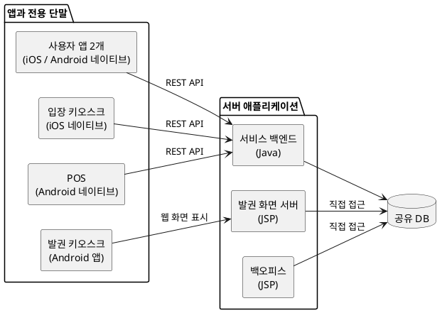

# AI 코딩을 대하는 개발자의 자세

## 목차

들어가며 — 어셈블리어에서 AI 코딩까지

1. 출시 4주 전, 거의 완성됐다는 프로젝트

   - 실제로 실행해 보니 드러난 상태
   - AI로 기존 시스템을 분석하다
   - 출시 범위와 새로 만들 범위를 정하다

2. AI가 개발 방식을 바꾸다

   - 백오피스를 다시 만들다
   - 백엔드 개발자에게 백오피스까지 맡기다
   - 동작하는 앱을 보며 요구사항을 정하다

3. 나도 AI의 완료 보고를 믿기 시작했다

   - 잘할수록 더 큰 일을 맡기게 됐다
   - 잠을 줄이며 AI에게 일을 시키다
   - 번듯한 화면 뒤에 숨어 있던 오류

4. 개발팀을 AI와 다시 꾸리다

   - 3월, 기존 서비스를 출시하다
   - AI에게 맡기고 검토하지 않은 개발자
   - 한 사람에게 네 개의 앱을 맡기다
   - 개발 환경과 범위를 정리하고 1인 개발로 전환하다

5. 대표가 한 달 동안 만든 프로젝트를 가져왔다

   - 비개발자가 한 달 만에 만든 서비스
   - 기술 선택을 둘러싼 갈등
   - 함께 개발하며 드러난 장점과 한계
   - 대표는 점점 AI를 더 신뢰했다

6. 다섯 달 뒤, 다시 거의 완성된 프로젝트

   - 9월 초, 프로젝트 전체를 검토하다
   - 안전장치는 있었지만 모든 경로를 지키지는 못했다
   - 잘못된 코드를 잡지 못하는 테스트
   - 처음 마주했던 상태로 돌아오다

맺으며 — 팀원이 AI로 바뀌었을 때, 개발자는 무엇을 해야 하는가

## 들어가며 — 어셈블리어에서 AI 코딩까지

C를 본격적으로 공부하기 시작한 것은 1995년 무렵이었다. 당시에는 “프로그래밍을 제대로 알려면 어셈블리어를 알아야 한다”는 말을 종종 들었다. 실제로 C 코드 사이에 어셈블리어가 섞여 있는 소스도 심심찮게 볼 수 있었다.

그래서 어셈블리어를 잔뜩 설명해 놓은 책에도 도전했다. 당시 고등학생이었던 나는 GW-BASIC 정도밖에 몰랐다. 어셈블리어가 어려워서 이해하지 못했다기보다, 더하기 같은 단순한 연산 하나에도 값을 레지스터로 옮기고 결과를 다시 저장하는 여러 동작을 일일이 지시해야 한다는 방식이 불합리하게 느껴졌다. 결국 책을 끝까지 읽지 못했다. 그때 도전했던 책은 30년이 지난 지금도 구석 어딘가에 잠들어 있다.

어셈블리어를 알았다면 하드웨어의 동작과 C 코드가 기계에서 실행되는 방식을 더 깊이 이해할 수 있었을 것이다. 성능이 중요하거나 하드웨어를 세밀하게 제어해야 하는 상황에도 도움이 됐을 것이다.

하지만 어셈블리어로 범용 애플리케이션을 개발하기에는 생산성이 너무 낮았고 이식성과 유지보수에도 불리했다. C와 컴파일러가 발전하면서 개발자는 모든 명령을 직접 작성하지 않고도 더 많은 일을 빠르게 구현할 수 있게 됐다. 어셈블리어는 사라지지 않았지만, 대부분의 개발자가 매일 직접 다루는 작업에서는 한 단계 아래로 내려갔다.

그 뒤에도 컴파일러가 만든 코드를 믿지 못하거나 제대로 된 프로그램은 어셈블리어로 직접 작성해야 한다고 생각하는 개발자들이 있었다. 특정 영역에서는 타당한 태도였지만, 모든 애플리케이션을 그렇게 개발하기에는 생산성 차이가 너무 컸다.

30여 년이 지난 지금, AI 코딩을 둘러싼 반응에서 비슷한 기시감을 느낀다. AI가 작성한 코드는 믿기 어렵고 직접 작성해야만 제대로 이해할 수 있다는 이유로 AI 도입을 주저하거나 제한적으로 사용하는 개발자들이 있다. 이런 우려에는 근거가 있다. AI는 그럴듯하지만 잘못된 코드를 만들 수 있다.

물론 컴파일러와 AI는 전혀 다르게 동작한다. 컴파일러는 형식 언어로 작성된 소스를 정해진 규칙에 따라 변환하지만, AI는 자연어 요구와 프로젝트 맥락을 바탕으로 결과를 생성한다. 그 결과가 개발자의 의도를 보존한다는 보장은 없으므로 별도의 검증이 필요하다. 테스트가 통과했다는 이유만으로 요구사항을 충족했다고 단정해서도 안 된다.

둘이 닮은 점은 작동 방식이나 신뢰성이 아니다. 개발자가 모든 구현 세부를 직접 작성하지 않고도 더 넓은 문제를 다룰 수 있게 한다는 점이다.

여기서 말하는 AI 에이전트는 채팅창에서 코드 조각만 답해 주는 도구가 아니다. 프로젝트 저장소를 탐색하고 파일을 수정하며, 명령을 실행해 빌드와 테스트 결과까지 확인한다. 새로운 기술을 조사하고 요구사항을 정리하며, 설계안과 코드, 테스트, 문서까지 작성한다.

나 역시 2025년 말까지는 코딩을 직접 주도하고 AI에는 검토와 보완을 주로 맡겼다. AI가 작성한 코드를 내가 직접 작성한 코드만큼 신뢰하기 어려웠기 때문이다. 그러나 2026년 초부터 AI 에이전트를 실제 프로젝트에 본격적으로 적용하면서 생각이 달라졌다. AI에게 구현의 상당 부분을 맡기고 내가 요구사항과 방향을 정한 뒤 결과를 검증하는 방식으로도 개발을 진행할 수 있었다. 무엇보다 직접 모든 코드를 작성할 때보다 동시에 다룰 수 있는 문제의 범위가 크게 넓어졌다.

AI에는 여전히 분명한 한계가 있다. 잘못된 전제를 바탕으로 멀쩡해 보이는 코드를 만들거나 프로젝트 전체의 맥락을 놓칠 수 있고, 결과를 검증하는 데도 비용이 든다. 그럼에도 실제 프로젝트에서 체감한 생산성 향상은 이런 한계와 검증 비용을 감수할 가치가 있을 만큼 컸다. AI 코딩은 이제 취향만으로 받아들이거나 거부할 수 있는 선택지가 아니다. 생산성 때문에 외면하기 어려운 흐름이 됐다.

그렇다면 개발자는 AI와 어떻게 일해야 할까? 무엇을 맡기고 무엇을 직접 판단해야 할까? AI가 만든 결과를 어떻게 검증하고, 그 결과에 대해서는 누가 책임져야 할까?

이 글에서는 2026년 1월부터 9월 초까지 AI 에이전트와 프로젝트를 진행하며 겪은 일을 시간순으로 살펴본다. 기존 서비스를 수습하며 AI의 도움을 받았고, 이후에는 비개발자가 AI로 시작한 새 프로젝트를 함께 다루게 됐다. 다음 글에서는 그 경험을 바탕으로 AI의 특성과 개발자의 역할, 위임과 검증 방법, 앞으로의 성장 방향을 정리한다.

## 1. 출시 4주 전, 거의 완성됐다는 프로젝트

### 실제로 실행해 보니 드러난 상태

2026년 1월, 나는 전시·행사 현장에서 사용할 티켓 서비스를 개발하던 팀에 합류했다. 정식 운영까지 남은 기간은 처음에는 4주였고, 대표는 거의 다 됐다고 했다.

나는 “거의 완성됐다”는 말을 들으면 왠지 모를 좌절감을 느낀다. 프로젝트가 제대로 진행되고 있다면 “결제 기능이 남았다”거나 “회원 관리 기능을 구현 중이다”처럼 현재 상태와 남은 일을 구체적으로 말하기 마련이다. 구체적인 설명 없이 “거의 다 됐다”는 말만 돌아온다면, 내 경험으로는 아무것도 제대로 끝나지 않았다는 뜻에 가깝다.

주니어와 시니어의 큰 차이 중 하나는 완성도를 판단하는 기준이다. 몇 차례 서비스를 출시하고 운영해 보면 정상적인 흐름이 한 번 동작하는 것과 실제로 운영할 수 있는 것은 다르다는 사실을 알게 된다. 생각할 수 있는 모든 상황을 면밀하게 검토하고 구현해도 출시 후 한동안은 실제 환경에서 드러난 문제를 고치느라 바쁘다. “되긴 된다”는 수준은 완성에 가까운 상태가 아니라 겨우 시연할 수 있는 상태다. 그 상태로 출시하면 그날 바로 서비스를 내려야 할 수도 있다.

대표가 말한 “거의 다 된” 상태가 어느 정도인지 확인하기 위해 조마조마한 마음으로 제품을 하나씩 실행해 봤다.

그러자 “이건 아직 안 되고”, “저건 더 해야 하고”, “그건 문제가 있다”는 설명이 계속 이어졌다. 된다는 말보다 아직 안 된다는 말을 더 많이 들었다.

기존 개발팀은 팀장 한 명과 팀원 두 명으로 구성돼 있었고, 그 인원으로 다음 제품을 동시에 개발하고 있었다.

제품마다 다른 기술을 사용한 것 자체가 문제는 아니었다. 문제는 세 명뿐인 팀이 이 모든 기술과 제품을 동시에 완성하고 곧 운영해야 한다는 점이었다. 사용자 앱의 같은 기능을 iOS와 Android에서 각각 구현해야 했고, 전용 단말도 두 플랫폼으로 나뉘어 있었다. 서비스 백엔드와 발권 화면 서버, 백오피스는 하나의 데이터베이스에 각각 직접 접근했다. 한 기능을 변경해도 여러 애플리케이션과 데이터 흐름을 함께 확인해야 했다.

인수인계와 출시도 동시에 진행해야 했다. 기존 팀장은 퇴사를 앞두고 있었고, 남은 두 개발자는 백엔드와 여러 모바일 앱, 키오스크를 나눠 맡고 있었다. 각자 구현해야 할 기능만으로도 여유가 없었기 때문에 전체 사용자 흐름을 연결하고 실제 운영 조건을 점검하는 일은 뒤로 밀려 있었다.

프로젝트에는 이미 많은 화면과 API가 있었다. 그러나 기능이 많다는 것과 서비스가 완성됐다는 것은 달랐다. 회원 가입부터 티켓 구매와 발권, 현장 입장, 매출 확인까지 사용자가 실제로 거치는 흐름을 따라가 보면 중간중간 연결되지 않는 부분이 나타났다. 키오스크와 POS도 개별 기능은 동작했지만 현장에 그대로 설치해 계속 운영할 수 있는 상태는 아니었다.

대표는 프로젝트가 마무리 단계에 있다고 생각했다. 내가 보기에는 여러 시제품이 한곳에 모여 있고, 이제부터 하나의 서비스로 연결해야 하는 상태에 가까웠다. 이미 만든 것을 모두 버리고 다시 시작할 수도 없었고, 남은 4주 동안 기존 구조의 모든 문제를 고칠 수도 없었다.

대표가 개발자를 불신하고 있다는 것은 처음부터 알고 있었다. 그래서 출근 첫날에는 굳이 롱패딩을 깔고 사무실에서 자는 모습을 보여 줬다. 어떻게든 신뢰를 얻고 싶어서였다.

### AI로 기존 시스템을 분석하다

프로젝트에 합류한 날 밤부터 AI 에이전트로 기존 시스템을 조사했다. 새 코드를 작성하게 하기 전에 지금 무엇이 만들어져 있는지부터 알아야 했다.

먼저 구현된 REST API를 목록으로 만들고 기능별로 분류하게 했다. 각 API가 어떤 역할을 하는지 설명하게 하고, 이름만으로 이해하기 어려운 요청 인자가 나오면 관련 코드를 따라가며 실제 용도를 확인하게 했다. 데이터베이스 테이블과 API, 이를 호출하는 애플리케이션을 연결해 보면서 서비스에 구현된 기능과 빠진 흐름을 정리했다.

그렇게 하루 동안 프로젝트의 큰 지도를 만들었다. 내가 파일을 하나씩 열어 같은 작업을 했다면 적어도 일주일은 걸렸을 것이라고 생각한다. AI는 많은 코드를 짧은 시간에 읽고 반복되는 조사 결과를 일정한 형식으로 정리하는 데 특히 유용했다.

물론 그 지도가 모두 정확하지는 않았다. 이후 개발하면서 다시 확인하니, 구현돼 있다고 정리한 API 가운데 개발하다 중단된 것도 있었고 이름을 보고 추정한 용도가 실제 동작과 다른 경우도 있었다. 하루 만에 시스템을 완전히 이해한 것은 아니었다. 어디부터 살펴봐야 할지 모르는 상태를 빠르게 벗어날 수 있었다는 쪽이 정확하다.

조사 결과 백엔드에는 예상보다 많은 기능이 구현돼 있었다. 다만 데이터베이스와 API의 이름만으로는 역할과 연결 관계를 이해하기 어려웠고, 비슷한 데이터도 API마다 다르게 처리됐다. 일부 요청에는 별도의 암호화·복호화 과정이 있었지만 적용 기준이 일정하지 않았다. 개별 API가 동작하더라도 다른 애플리케이션과 연결하거나 오류의 원인을 추적하기 어려운 구조였다.

### 출시 범위와 새로 만들 범위를 정하다

현재 시스템을 파악했다고 해서 무엇을 남기고 무엇을 다시 만들지가 저절로 정해지지는 않았다. 코드에는 현장의 운영 방식과 출시 일정, 앞으로 바뀔 사업의 우선순위가 모두 들어 있지 않았다. 대표와 분석 결과를 함께 보면서 기존 시스템에서 마무리할 부분과 별도로 만들어야 할 부분을 나눴다.

대화를 시작하면 당장 필요한 기능과 언젠가 필요할 기능이 자연스럽게 섞였다. 당시에는 개인 간 티켓 거래와 사용자 앱도 중요하게 논의됐지만, 모든 기능을 4주 안에 완성할 수는 없었다. 우선 현장에서 티켓을 판매하고 발권하며 입장을 처리하고 매출을 확인하는 흐름부터 끝까지 연결하기로 했다.

AI는 요구사항을 목록으로 만들고 빠진 질문을 찾으며 범위별 계획을 비교하는 데도 도움을 줬다. 이미 많은 기능을 만들어 놓았는데 왜 별도의 개발이 필요한지 설명할 때도 분석 자료를 활용했다. 내가 기존 개발에 뒤늦게 합류해 몇 가지 기능을 보완하는 것만으로는 운영 준비를 마치기 어렵다는 점에 대표도 동의했다.

기존 팀은 첫 출시를 준비하고, 나는 전체 일정과 범위를 관리하면서 이후 기존 시스템을 대체할 백엔드와 백오피스, 사용자 앱을 별도로 준비하기로 했다. 같은 서비스를 두 갈래로 개발하는 선택에는 비용이 들었지만, 당장 현장을 열기 위한 작업과 이후에도 운영할 구조를 만드는 작업을 분리할 필요가 있었다.

## 2. AI가 개발 방식을 바꾸다

### 백오피스를 다시 만들다

가장 먼저 손댄 것은 백오피스였다. 전체 구성 요소 가운데 완성도가 가장 낮았고, 화면과 서버 로직이 뒤섞인 JSP 코드에 기능을 계속 추가하기도 부담스러웠다. 서비스 백엔드와 백오피스가 같은 DB를 각각 직접 다루는 구조도 정리할 필요가 있었다. 더 많은 기능이 쌓이기 전에 Next.js로 다시 만들기로 했다.

내가 마지막으로 백오피스를 직접 개발한 것은 2년 전이었다. 그때도 Next.js를 사용했다. 개발 시간을 줄이려고 React UI 라이브러리인 MUI 기반의 유료 템플릿을 구입했고, 템플릿의 구조를 익힌 뒤 필요한 화면에 맞게 고쳐 썼다. 당시에는 그렇게 하는 것이 꽤 효율적이었다.

이번에는 AI에게 필요한 메뉴를 알려주고 REST API의 요청과 응답을 정리한 문서를 제공했다. AI는 그 자료를 바탕으로 백오피스의 기본 구조와 주요 화면을 빠르게 만들었다. 급박한 일정이라 화면의 시각적 완성도까지 신경 쓸 여유는 없었는데, 결과물은 별도의 유료 템플릿이 필요 없을 만큼 번듯했다.

이전에는 화면을 빠르게 만들기 위해 템플릿을 찾고, 구입하고, 사용법을 익히는 데 시간을 썼다. 이제는 필요한 기능을 설명하면 곧바로 내 요구사항에 맞는 화면이 나왔다. 과거에 시간을 아껴 줬던 준비 과정조차 번거롭게 느껴졌다.

기존 프로젝트를 분석할 때도 AI의 도움을 크게 받았지만, 직접 무언가를 만들기 시작하자 변화가 훨씬 선명하게 느껴졌다. 혼자서도 꽤 많은 일을 할 수 있겠다는 기대가 생겼다.

### 백엔드 개발자에게 백오피스까지 맡기다

백오피스 개발은 순조로웠다. 백엔드 API를 연동하기 전까지는.

백엔드를 맡은 개발자는 경력 3년 차였다. 그동안 전달한 요구사항을 곧잘 구현했기 때문에 백오피스에 필요한 API도 무리 없이 만들 것이라고 생각했다. 그러나 구현됐다는 API를 호출하면 동작하지 않았고, 수정했다는 말을 듣고 다시 확인하면 다른 오류나 누락이 나왔다. 하나의 API를 연동하는 과정에서 같은 일이 세 차례 반복됐다.

백오피스의 기능은 대부분 API에서 가져온 데이터를 운영자가 확인하고 수정하는 것이었다. API와 화면을 따로 개발한 뒤 연결하면서 요구사항을 다시 설명하고, 수정 결과를 기다리고, 다시 확인하는 데 시간이 계속 들었다. 서로 밀접하게 연결된 일을 나눠 맡는 것이 이 상황에서는 비효율적으로 느껴졌다.

그래서 백엔드 개발자에게 백오피스까지 함께 맡겼다. 그는 처음에는 프론트엔드를 하고 싶지 않다고 했다. 백엔드 전문 개발자가 되고 싶다는 것이었다. 나도 그 마음은 이해했다. 어설프게 여러 기술을 아는 것보다 하나라도 제대로 아는 편이 낫다고 생각해 왔기 때문이다.

불과 1년 전이었다면 나 역시 경력 3년 차 개발자에게 백엔드와 백오피스를 함께 맡기지 않았을 것이다. 백엔드만으로도 배울 것과 처리할 일이 많았고, 프론트엔드까지 직접 익혀 구현하려면 부담이 컸을 것이다. 그러나 이번 백오피스를 AI로 만들어 보니 그 부담을 이전과 똑같이 계산할 수는 없었다.

API를 만드는 사람이 그 데이터를 사용하는 화면까지 다루면 연동 과정에서 오가는 설명과 재확인을 줄일 수 있다고 봤다. 이 백오피스에는 복잡한 화면 기술보다 API와 업무 흐름을 이해하는 것이 더 중요했다. 그도 두 애플리케이션을 함께 맡는 편이 효율적이라는 데는 동의했고, 백오피스 개발을 넘겨받았다.

### 동작하는 앱을 보며 요구사항을 정하다

백오피스를 넘기면서 나는 새 백엔드와 사용자 앱을 개발할 시간을 확보했다. 기존 팀이 첫 출시를 준비하는 동안, 이후 기존 시스템을 대체할 제품을 만드는 일이었다.

사용자 앱은 Flutter로 만들기로 했다. React Native를 사용한 경험은 있었지만 Flutter는 처음이었다. 일정이 급한 상황에서 처음 사용하는 기술을 선택하는 것이었는데도 생각보다 부담이 작았다. 백오피스를 만들며 경험한 AI의 능력이라면 낯선 프레임워크의 사용법과 구현도 상당 부분 맡길 수 있을 것이라고 기대했다.

막상 시작하고 보니 고민은 다른 곳에 있었다. 디자이너가 만든 Figma 파일을 AI에게 주고 그대로 구현하게 했는데, 결과가 디자인과 일치하지도 않았고 제대로 동작하지도 않았다. PDF나 SVG로 바꿔 전달해 봐도 크게 다르지 않았다.

나도 Figma를 능숙하게 다루지는 못했다. 기존 시안에는 고쳐야 할 부분이 많았는데, 수정하려면 먼저 도구부터 익혀야 했다. 시간도 없는데 지금 Figma를 공부하는 것이 맞는지 고민스러웠다.

몇 시간을 이것저것 시도하다가 문득 생각이 바뀌었다. 앱에 필요한 기능을 설명해서 동작하는 초안을 만들게 하면 어떨까? 직접 구현하는 데 시간이 오래 걸릴 때는 디자인을 먼저 정교하게 다듬는 편이 효율적이었다. 그러나 AI가 초안을 빠르게 만들 수 있다면 그 결과를 보면서 고쳐 나갈 수도 있을 것 같았다.

실제로 필요한 기능을 몇 문장으로 설명하자 기대 이상의 초안이 나왔다. 화면이 번듯한 데다 실제로 동작하기까지 했다. 대표에게 보여주고 무엇을 고치면 좋을지 이야기한 뒤, 그 자리에서 AI에게 수정을 맡겨 바뀐 화면을 다시 확인할 수 있었다.

이전에는 대표가 생각을 설명하면 디자이너가 시안을 만들고, 개발자가 구현하다가 버튼이 없거나 동작이 모호한 부분을 발견하면 다시 대표에게 물어야 했다. 기획과 디자인이 바뀌면 구현도 고쳤다. 이제는 대표와 내가 같은 앱을 직접 사용해 보며 이야기할 수 있었다. 몇 문장으로 시작한 결과물이 다음 요구사항을 구체적으로 이야기할 재료가 됐다.

백오피스에 이어 사용자 앱에서도 만드는 방식이 달라졌다. 결과를 얻는 데 걸리는 시간이 짧아지니, 무언가를 충분히 설명하고 전달하기 전에 일단 만들어서 함께 확인할 수 있었다.

## 3. 나도 AI의 완료 보고를 믿기 시작했다

### 잘할수록 더 큰 일을 맡기게 됐다

사용자 앱과 함께 만들던 새 백엔드의 시작도 순조로웠다. 백엔드는 이전에 만들어 둔 NestJS 기반의 시드 프로젝트에서 시작했다. 사용자와 인증 같은 기본 서비스뿐 아니라 통합 테스트와 일부 단위 테스트도 갖춰져 있었다. AI는 기존 서비스를 새 프로젝트에 맞게 바꾸고 테스트도 함께 수정했다.

처음 AI 코딩을 해보면 개떡같이 말해도 찰떡같이 알아듣는 AI가 그렇게 신기하고 기특할 수 없다. 별 기대가 없을 때는 “설마 이것까지 하겠어?” 하는 심정으로 조심스럽게 일을 맡긴다. 그런데 곧잘 해내면 “이게 되네?” 하면서 욕심이 생긴다. 나도 점점 더 추상적이고 큰 목표를 던지기 시작했다.

일정은 촉박했고, AI는 지금까지 기대 이상으로 일해 줬다. 큰 작업을 두세 개 연속으로 맡기는 동안 결과를 자세히 확인하는 일을 미뤘다. 일단 동작하는 데다 이전 작업도 잘해 왔으니, 검토하느라 AI의 작업을 멈추는 것이 오히려 비효율적으로 느껴졌다.

### 잠을 줄이며 AI에게 일을 시키다

당시에는 잠을 자다가 두세 시간마다 깨서 다음 작업을 지시하기도 했다. AI가 쉬지 않고 일할 수 있다는 장점을 최대한 활용하고 싶었다. 완료 보고를 확인하고 다음 일을 맡긴 뒤 다시 잠드는 식이었다.

AI가 작업을 끝내고 기다리는 시간이 아까웠다. 그런데 정작 나는 새로 만들어진 코드를 읽고 앱을 실행해 볼 시간이 부족했다. 다음 일을 지시하는 횟수는 늘었지만, 앞서 맡긴 일이 제대로 끝났는지 확인하는 간격은 길어졌다.

### 번듯한 화면 뒤에 숨어 있던 오류

그렇게 밤새 일을 시키고 멀쩡한 정신으로 찬찬히 살펴보면 문제가 보였다. 내가 요청하지 않은 기능이 추가돼 있었고 정작 있어야 할 기능은 빠져 있었다. 보안 관련 방어 로직과 제약을 과도하게 넣어 작은 변화에도 기능 전체가 중단되는 경우도 있었다.

한 번은 카드번호를 검색에 사용할 방법은 남겨두지 않은 채 모두 마스킹해서 저장하고, 카드번호로 결제 기록을 검색하는 UI는 번듯하게 만들어 놓았다. 화면만 보면 완성된 기능처럼 보였다. 그러나 저장된 값으로는 애초에 검색할 수 없는 구조였다.

그런데 AI에게 전체 기능을 테스트하라고 해도 몇 번이고 정상이라고 보고했다. 내가 요청한 기능이 실제로 동작하는지 확인하는 일까지 그 보고로 대신하고 있었다.

문제를 해결하는 과정에서도 비슷한 일이 있었다. 정상적인 방법으로 해결되지 않으면 근본 원인을 찾기보다 조건을 우회하거나 검증을 느슨하게 만든 뒤 해결했다고 보고하기도 했다. AI는 잘못된 방향으로도 놀라울 만큼 열정적으로 삽질했다.

그 방향으로 계속 일을 맡긴 사람은 나였다. 구현이 빠르다는 이유로 확인을 뒤로 미뤘고, 그동안 엉뚱한 결과도 함께 쌓였다. AI가 일하는 시간을 최대한 늘리려고 애쓰면서, 내가 그 결과를 따라가며 살펴볼 수 있는지는 생각하지 못했다.

## 4. 개발팀을 AI와 다시 꾸리다

### 3월, 기존 서비스를 출시하다

기존 서비스를 가까스로 출시한 것은 3월 초였다. 내가 합류했을 때 들었던 4주라는 일정은 이미 지난 뒤였다. 현장 운영은 기존 시스템으로 시작했고, 별도로 만들던 새 백엔드와 사용자 앱은 아직 개발 중이었다.

그동안 새 시스템 개발에만 집중할 수도 없었다. 기존 프로젝트에서는 대표가 요구한 내용을 팀원들이 각자 해석해 구현하고, 대표가 결과를 보고 원하던 것과 다르다고 말하는 일이 반복됐다. 대표와 개발팀이 서로 다른 지역에 있어 수시로 함께 화면을 보며 협의하기도 어려웠다.

요구사항과 작업 결과를 한곳에 모으려고 GitHub Projects를 사용해 보기도 했다. 대표가 할 일을 등록하고, 개발자는 해당 작업을 진행한 뒤 결과와 공유할 내용을 댓글로 남기도록 했다. 그렇게 하면 적어도 누구의 어떤 요청으로 무엇을 만들고 있는지는 함께 확인할 수 있을 것 같았다.

하지만 제대로 돌아간 것은 하루 정도였다. 대표는 이전처럼 여러 채널로 요구사항을 전달했고, 개발자들은 작업 결과를 작업 항목에 남기지 않았다. 도구를 마련했다고 일하는 방식까지 저절로 바뀌지는 않았다. 결국 내가 작업 하나하나에 관여하며 요구사항과 결과를 이어 줘야 했고, 새 백엔드를 개발할 시간은 점점 줄었다.

AI 덕분에 내가 직접 만드는 속도는 빨라졌다. 그런데 팀 전체가 같은 것을 만들고 있는지 확인하는 일에는 여전히 많은 시간이 들었다. 첫 출시는 넘겼지만, 개발팀이 일하는 방식까지 안정된 것은 아니었다.

### AI에게 맡기고 검토하지 않은 개발자

앞서 백오피스 API를 연동할 때 겪은 문제가 일회성 오류였으면 좋았을 것이다. 그러나 이후에도 구현됐다는 기능을 확인하면 오류가 나왔고, 고친 기능을 다시 확인하는 일이 반복됐다.

작업 방식을 확인하면서 백엔드 개발자에게 AI가 만든 코드를 직접 검토했는지 물었다. 돌아온 답은 충격적이었다. 구현 결과를 검토하지 않았을 뿐 아니라 AI가 설계한 API조차 확인하지 않았다고 했다. 내가 전달한 요구사항을 AI에게 입력하고, AI가 완료했다고 하면 그 말을 나에게 전달하고 있었다.

백엔드와 백오피스를 한 사람이 맡으면 전달 비용이 줄 것이라고 기대했다. 그러나 두 영역을 맡겼다는 사실만으로 그 사이의 흐름을 확인하는 사람이 생기는 것은 아니었다. 결과를 검토하지 않는다면 두 애플리케이션을 맡아도 AI에게 넘기는 작업만 두 개가 될 뿐이었다.

기존 기능이 반복해서 깨지고 매출 통계가 계속 맞지 않아 더 살펴보니, 하나의 애플리케이션에 AI 에이전트를 서너 개씩 동시에 투입하고 있었다. 작업 범위를 분리하고 변경 결과를 검토해 통합하는 방식은 없었다. 여러 에이전트가 같은 애플리케이션을 바꾸는 동안, 이미 되던 기능이 여전히 되는지 확인하는 일도 빠져 있었다.

나는 요구사항의 배경과 의도, 구현 방향과 주의사항을 설명하는 데 시간을 썼다. 하지만 그 설명이 개발자의 판단과 검증으로 이어지지 않았다. 잘못된 결과를 다른 개발자가 연동하다가 발견하면 다시 설명하고 수정해야 했다. AI가 코드를 작성하는 시간보다 사람이 같은 일을 되풀이하는 시간이 더 아까웠다.

이후 키오스크와 연동하는 과정에서도 같은 API를 여러 차례 다시 만드는 일이 있었다. 일정이 급박해 매번 깊이 개입하지는 못했다. 그러다 그가 한 말이 결정적이었다.

> “큰 회사에서도 기획자들이 몇 명이 붙어서 검증해도 완벽하기 어려운데, 이 작은 회사에서 어떻게 팀장님 기준에 맞출 수 있겠어요?”

내가 요구한 것은 버그가 하나도 없는 프로그램이 아니었다. 구현을 완료했다고 보고하기 전에 요구사항을 다시 확인하고, API가 실제로 동작하는지 테스트하라는 것이었다. 오류가 발생할 수 있다는 사실과 확인하지 않은 결과를 완료했다고 전달하는 것은 다른 문제였다.

경험이 부족하면 무엇을 확인해야 할지 놓칠 수 있다. 나 역시 AI의 완료 보고를 믿고 검증을 뒤로 미뤘다가 실패했다. 그래서 이 문제를 단순히 경력이 짧아서 생긴 일이라고 보지는 않았다. 내가 받아들이기 어려웠던 것은 오류 자체보다 자신이 완료했다고 보고한 결과를 검증하는 일까지 과도한 요구로 여기는 태도였다.

그와는 일을 계속하기 어렵다고 판단했다. 그 말을 들은 다음 날 해고를 통보했다. 4월 초였다.

### 한 사람에게 네 개의 앱을 맡기다

한편 3월 초에는 iOS 개발자의 계약도 끝났다. 그가 맡던 iOS 키오스크와 사용자 앱을 새로 채용한 Android 개발자에게 맡기려고 했다. 이미 담당하던 Android 키오스크와 사용자 앱을 포함하면 네 개의 애플리케이션이었다.

처음 이야기를 꺼냈을 때 그는 강하게 거부했다. 두 개도 해야 하는데 네 개를 어떻게 맡느냐는 것이었다. 예상했던 반응이었다. 플랫폼별 기술을 익히고 코드를 직접 작성하는 방식으로 계산하면 결코 가벼운 요구가 아니었다.

그러나 내가 백오피스와 Flutter 앱을 만들며 경험한 업무량은 이전과 달랐다. iOS와 Android라는 플랫폼의 차이는 있었지만 구현할 기능은 상당 부분 같았다. 공통 요구사항을 정리한 뒤 플랫폼별 구현을 AI에게 맡기면, 사람이 모든 구현을 처음부터 반복해야 하는 부담은 줄일 수 있다고 봤다.

물론 빌드와 배포, 권한 처리, 하드웨어 연동까지 같아지는 것은 아니었다. 각 플랫폼에서 결과를 확인하는 일도 남았다. 내가 설명하려던 것은 네 앱이 한 앱과 똑같이 쉽다는 뜻이 아니라, 앱의 개수만으로 예전과 같은 업무량을 계산하기 어려워졌다는 점이었다.

그 차이를 설명하자 그도 내 판단을 받아들였고 업무를 맡았다. 그 밖에도 AI를 활용하는 방식에 적응하도록 몇 차례 요구했다. 지금은 그때 나눴던 구체적인 이야기가 모두 기억나지는 않는다. 다만 새로운 도구 하나를 배우는 정도의 변화는 아니었고, 기존의 판단 기준을 바꾸는 데 시간이 필요하다는 것은 당시에도 알고 있었다.

이미 여러 차례 시행착오를 겪은 작은 스타트업에는 그 시간을 충분히 기다릴 여유가 없었다. 그는 수습 평가를 앞두고 퇴사 의사를 밝혔다.

### 개발 환경과 범위를 정리하고 1인 개발로 전환하다

Android 개발자가 퇴사하겠다고 했을 때, 솔직히 차라리 잘됐다는 생각도 들었다. 사람에게 업무의 맥락과 의도를 설명하고, 진행 상황을 조율하고, 어긋난 결과를 다시 수정하는 비용이 당시에는 너무 컸다. 조언과 피드백에 쓰는 시간까지 생각하면 내가 직접 AI에게 일을 맡기고 결과를 확인하는 편이 더 효율적일 것 같았다.

나는 대표에게 퇴사자의 공백을 채우지 않고 1인 개발 체제로 운영하자고 제안했다. 그때는 몰랐지만 대표는 개발팀이 무너져 사업을 접어야 하는 것은 아닌지 고민했다고 나중에 말했다. 나는 생각이 달랐다. 우수한 팀장인 나와 성실한 팀원인 AI 에이전트들이 있으니 개발팀은 아직 건재하다고 생각했다.

물론 농담처럼 말할 수는 있어도 넘겨받을 일은 만만하지 않았다. 백엔드와 백오피스, JSP 화면 서버, 네이티브 사용자 앱과 키오스크, POS까지 저장소가 여덟 개 정도였다. 여기에 별도로 진행하던 이벤트 프로젝트와 Flutter 사용자 앱도 있었다.

2001년에 실무를 시작한 뒤 25년이 지났지만 Java 백엔드를 개발한 경험은 없었다. 예전에 JSP 업로드 컴포넌트를 만든 적은 있었지만 그것을 백엔드 개발 경험이라고 하기는 어려웠다. iOS에는 익숙했지만 Android 프로젝트 경험은 한 번뿐이었다. 새로운 기술 하나에 적응하는 일과 익숙하지 않은 기술 여러 개를 동시에 맡는 일은 부담이 달랐다.

그런데 이번에는 예전에 낯선 기술 하나를 배워야 했을 때보다 마음이 가벼웠다. Next.js 백오피스와 처음 쓰는 Flutter로 앱을 만들면서 AI가 구현을 얼마나 도와줄 수 있는지 경험했기 때문이다. 모든 문법과 프레임워크 사용법을 먼저 익혀야만 일을 시작할 수 있는 것은 아니었다.

가장 먼저 개발 환경을 정리했다. 넘겨받은 저장소들을 웹과 Android 작업을 중심으로 두 개의 모노레포로 묶었다. 관련 코드를 함께 모아 두니 AI가 API를 바꾸면서 호출하는 쪽까지 살펴보게 하거나, 여러 애플리케이션에 걸친 흐름을 조사하게 하기가 수월했다.

한곳에 모두 넣고 싶은 마음도 있었지만, 당시 웹 작업은 VS Code를 중심으로 진행했고 Android 앱은 Android Studio를 사용해 빌드하고 확인했다. 작업 환경의 차이를 고려해 두 묶음으로 나눴다. 내가 계속 진행하던 별도 프로젝트와 Flutter 앱은 그대로 뒀다.

일주일 정도 지나 새 환경에 익숙해지자, 적어도 당시 범위에서는 혼자 개발하는 편이 더 생산적이라고 느꼈다. 요구사항을 이해한 내가 AI에게 바로 작업을 맡기고 결과를 확인할 수 있었다. 사람 사이를 오가며 같은 배경을 설명하고 수정 결과를 기다리는 일이 줄었다.

다만 AI를 쓰는 한 사람이 기존 팀의 모든 일을 그대로 대신한 것은 아니었다. iOS와 Android 네이티브로 만들던 사용자 앱은 개발을 중단했다. 현장에 꼭 필요한 POS, 발권 키오스크, 입장 키오스크, 백오피스, 백엔드의 다섯 영역으로 범위를 줄였고, 4월 말에는 그 범위에서 기존 서비스를 안정화할 수 있었다. 처음 합류했을 때 떠안았던 레거시를 수습한 것이었다.

4월에는 기존 전시 현장 외에 별도 행사도 있었다. 준비 과정에서 큰 위기를 겪었지만, 나는 그 위기도 잘 극복했다고 생각했다.

AI의 도움은 컸다. 동시에 개발 환경을 정리했고, 당장 하지 않을 일을 덜어냈으며, 요구사항을 판단하고 구현 결과를 확인하는 경로도 짧아졌다. 이런 변화가 함께 있었기에 1인 개발로 전환할 수 있었다.

위기를 넘기고 나자 대표는 AI 에이전트를 ‘클 이사’와 ‘코 부장’이라고 부르기 시작했다. 당분간 개발자를 추가로 채용하지 않아도 되겠다는 것이 나와 대표의 판단이었다.

그러나 내가 레거시를 수습하는 동안, 대표는 이미 다른 프로젝트를 시작하고 있었다.

## 5. 대표가 한 달 동안 만든 프로젝트를 가져왔다

### 비개발자가 한 달 만에 만든 서비스

레거시를 안정화하고 드디어 품질 개선에 힘을 쏟을 여유가 생겼다고 기뻐하려던 때였다. 대표가 부드럽게 웃으며 말을 몇 번 돌렸다.

싸늘했다. 가슴에 비수가 꽂히는 것 같았다. 분명 아쉬운 부탁을 꺼내려는 분위기였다.

대표는 4월 초부터 AI로 별도의 서비스를 만들고 있었다. 내가 기존 개발팀의 일을 넘겨받고 레거시를 정리하는 동안, 대표도 한 달가량 개발을 진행한 것이다. AI가 추천한 기술을 따라 Supabase를 백엔드로 사용하고, Next.js로 백오피스를 만들어 Vercel에 배포했다.

요구는 그 서비스에 키오스크를 붙이고, 만들던 백엔드와 백오피스까지 내가 마무리해 달라는 것이었다. 초기 기술 선택부터 함께 협의한 프로젝트가 아니었다. 대표가 AI와 정한 방향을 내가 이어받아 완성해야 하는 상황이었다.

개발 경험이 없던 사람이 자신의 사업에 필요한 서비스를 직접 만들었다는 점은 분명 놀라웠다. 앞서 대표와 내가 동작하는 앱을 보면서 요구사항을 정했던 것에서 한 걸음 더 나아간 셈이었다. 이제 대표는 개발자에게 설명하고 결과를 기다리지 않아도 자기 생각을 구현해 볼 수 있었다.

하지만 나는 막 하나의 프로젝트를 수습한 참이었다. 이번에는 대표가 한 달 동안 만든 새 프로젝트가 눈앞에 놓였다.

### 기술 선택을 둘러싼 갈등

대표는 키오스크와 사용자 앱을 React Native로 만들려고 했다. 중요하게 여긴 조건 중 하나는 자유롭게 배포하고 싶다는 것이었다.

나는 사용자 앱과 키오스크를 같은 기준으로 선택하기 어렵다고 봤다. 사용자 앱은 iOS와 Android를 모두 지원해야 했지만, 새로 만들려던 키오스크는 Android 단일 기기에서만 동작했다. 제한된 메모리와 저가의 CPU를 사용하면서 프린터와 스캐너 같은 하드웨어에 연결되고, 현장에서 오랫동안 실행돼야 하는 장치였다.

내 판단으로는 이 키오스크를 Android 네이티브로 만드는 편이 구조와 하드웨어 연동을 단순하게 가져가기 좋았다. 두 플랫폼을 지원할 필요도 없는데 중간 계층을 추가해 얻는 이점이 무엇인지부터 따져 보고 싶었다.

자유롭게 배포한다는 말도 더 구체적으로 확인해야 했다. 어떤 변경을 어떤 방식으로 배포하려는지, 화면뿐 아니라 하드웨어 연동 부분을 바꿀 때도 기대한 방식이 가능한지 살펴봐야 했다. 프레임워크 이름 하나를 정했다고 그런 조건이 모두 해결되는 것은 아니었다.

나는 이런 이유를 설명했다. 하지만 대표는 이미 AI의 제안을 따라 결과물을 만든 경험이 있었다. 내 설명보다 그 성공 경험의 설득력이 더 컸다. 함께 선택지를 비교하기 전에, 이미 옳다고 믿게 된 선택을 다시 검토하자는 이야기부터 시작해야 했다.

처음 이야기가 나온 날에는 그 요구를 받아들일 수 없었다. 대표는 포기하지 않았고 다음 주에 다시 같은 문제를 꺼냈다. 나는 퇴사까지 생각했다. 지금 다시 떠올려도 울컥하는 장면이다.

내가 팀을 이끈다고 생각할 때의 역할은 요구사항과 제약을 이해하고, 기술적 방향을 정하고, 결과를 확인하는 것이었다. 그런데 이 상황에서는 내가 AI에게 일을 맡기는 사람이 아니라 대표가 AI와 내린 결정을 구현하는 사람이 된 것처럼 느껴졌다.

### 함께 개발하며 드러난 장점과 한계

시작부터 의견이 부딪혔지만, 이후 나도 대표가 시작한 프로젝트를 함께 다루게 됐다. 앞에서 수습한 레거시와는 별개의 프로젝트였다. 대표가 AI로 만든 온라인 서비스에 단말을 연결하고 기능을 확장하는 과정에서, 비개발자의 AI 코딩이 어디까지 가능한지와 무엇이 남는지를 더 구체적으로 보게 됐다.

장점은 명확했다. 업무를 아는 사람이 자기 생각을 직접 구현할 수 있었다. 나에게 전달되는 것도 말로만 설명한 아이디어가 아니라 동작하는 결과물이었다. 이미 만들어진 화면을 함께 살펴보면 무엇을 의도했는지, 다음에 무엇을 바꾸고 싶은지 구체적으로 이야기할 수 있었다.

AI는 코드를 작성하는 시간만 줄인 것이 아니었다. 비개발자가 개발자에게 설명하고 구현 결과를 기다려야 했던 과정도 줄였다. 대표가 직접 기능을 만드는 모습을 보고 있으면, 예전처럼 모든 요구사항을 개발자에게 넘기는 방식으로만 일할 필요는 없겠다는 생각이 들었다.

다만 대표가 원하는 기능을 빠르게 만드는 것과, 그 기능을 기존 데이터와 외부 시스템에 연결해 운영하는 것은 다른 일이었다.

결제 연동에서는 카드 승인이 성공한 뒤 서버에서 생성된 주문이 앱의 어느 요청에서 나온 결과인지 확인해야 했다. 그런데 성공 응답에 요청을 식별할 `clientRequestId`가 빠져 있었다. AI는 그 빈자리를 승인 정보와 금액, 카드 표시 정보와 거래번호를 비교하는 코드로 메웠다.

여러 값을 꼼꼼하게 확인하는 방어 코드처럼 보였지만, 그중에는 표시 형식이 바뀔 수 있는 값도 있었다. 같은 결제 결과라도 표시 방식이 다르면 앱은 검증 실패로 판단하고 이미 승인된 결제를 취소할 수 있었다. 필요한 것은 비교 조건을 더 늘리는 일이 아니라 요청과 결과의 연결 관계를 API에 명확히 표현하는 일이었다. 양쪽 코드가 있어도 그 사이의 약속이 빠져 있었다.

실제 키오스크에서는 또 다른 한계를 겪었다. AI가 사용할 수 있는 환경에는 에뮬레이터만 있었다. 코드를 수정하고 기본 동작을 확인할 수는 있었지만, 실제 단말기의 하드웨어가 제대로 동작하는지는 직접 볼 수 없었다.

수정본이 나올 때마다 내가 빌드 결과물을 단말기로 옮겨 설치하고 실행했다. 문제가 있으면 다시 AI에게 설명했다. AI가 수정하면 또 옮기고 설치하고 실행했다. 결국 이틀 동안 작업하고도 끝내지 못했다. 코드를 빨리 고치는 능력만으로는 실제 기기에서 확인하고 피드백을 돌려주는 시간을 줄일 수 없었다.

데이터베이스에서는 문제가 조금씩 쌓였다. 5월 말, 온라인 판매 중심의 구조를 POS와 키오스크 등 여러 단말을 지원하도록 확장했다. AI가 제안한 계획은 기존 컬럼을 바로 지우지 않고 새 컬럼과 테이블을 추가한 뒤, 한동안 기존 값과 새 값을 함께 기록하고 마지막에 이전 구조를 정리하는 것이었다.

운영 중인 데이터를 바꾸는 일이었으므로 처음에는 합리적인 계획이었다. 그러나 새 모델을 추가한 뒤에도 예전 표현이 남았다. 6월에 POS 백엔드의 방향이 바뀌고 나서는 실제로 사용하지 않게 된 판매 모델까지 스키마에 남아 있었다.

7월에는 여러 판매 기록을 조회할 때 합쳐 하나의 결제 목록으로 보여주고 있었다. 화면은 하나였지만 그 아래의 모델은 여러 개였다. 영수증을 다시 출력하거나 환불과 정산을 처리할 때마다 각 기록의 식별자와 상태를 구분해야 했다. 여러 애플리케이션이 같은 DB를 사용하면서 변경 이력도 여러 저장소와 폴더에 흩어졌다.

계획에는 마지막에 기존 구조를 제거한다고 적혀 있었다. 하지만 누가 언제 정리하고 무엇을 확인한 뒤 없앨지가 실제로 진행할 작업으로 구체화되지 않았다. 단말 연동과 새 기능을 우선하다 보니 정리는 계속 뒤로 밀렸다. 나도 개별 기능의 문제를 따라가면서, 그 기능들이 남긴 구조를 전체적으로 정리하는 일을 충분히 챙기지 못했다.

### 대표는 점점 AI를 더 신뢰했다

이런 문제들을 다루는 동안에도 대표는 AI와 개발을 계속했다. 처음 가져왔던 한 달짜리 결과물에 기능이 더해졌다. 직접 구현해 낸 것이 쌓일수록 대표의 자신감도 커졌고, 내 기술적 설명보다 AI의 제안을 더 신뢰하는 경향은 강해졌다.

처음의 기술 선택을 둘러싼 갈등으로 끝난 일이 아니었다. 내가 무슨 말을 해도 대표는 AI에게 물어봤다. 그리고 AI의 답변을 그대로 복사해서 나에게 던져 줬다.

AI의 답변은 대체로 길고 장황했다. 그 안에는 개발자인 내가 보기에는 말도 안 되는 주장도 있었다. 하지만 말이 안 된다고 생각하는 것과 상대가 납득하도록 설명하는 것은 다른 일이었다. 나는 그 긴 글을 읽고, 무엇이 왜 틀렸는지 하나씩 반박해야 했다.

기술적인 문제를 이야기하려고 시작한 대화가 어느새 AI의 답변을 반박하는 일이 되어 있었다. 그러고 있으면 내가 지금 뭘 하고 있는 건가 싶었다. AI 덕분에 개발할 때의 일은 줄었는데, 대표와 이야기할 때는 AI가 만들어 낸 말을 읽고 반박하는 일이 더해지고 있었다. 대표는 그런 개발자의 심정을 이해하지 못했다.

대표가 직접 개발하는 것을 그만두게 하고 싶은 것은 아니었다. 자신의 업무를 아는 사람이 AI와 직접 결과물을 만들어 내는 가능성은 분명했다. 내가 받아들이기 어려웠던 것은 그 가능성을 인정하는 일과 기술적 검토를 요구하는 일이 서로 반대되는 주장처럼 되는 상황이었다.

나는 AI로 레거시를 수습하며 큰 도움을 받았다. 대표 역시 AI로 처음 서비스를 만드는 데 성공했다. 두 사람 모두 AI의 능력을 경험했는데, 무엇을 믿고 어디까지 다시 확인해야 하는지를 두고는 합의하기가 어려워졌다.

그렇게 개발은 계속됐고, 9월 초에 이르러 지난 다섯 달의 결과물을 전체적으로 다시 보게 됐다.

## 6. 다섯 달 뒤, 다시 거의 완성된 프로젝트

### 9월 초, 프로젝트 전체를 검토하다

대표가 AI로 개발을 시작한 것은 4월 초였다. 9월 초에는 다섯 달이 지난 상태였다. 한 달 만에 가져왔던 초안이 아니라, 그 뒤로도 계속 기능을 더하고 수정해 온 프로젝트의 결과를 볼 시점이었다.

[9월 4일의 전체 검토 기록](./PROJECT_REVIEW_2026-09-04.md)에서는 코드와 데이터베이스 스키마, 테스트와 배포 설정을 함께 살펴봤다. 이제 API와 파트너·관리자 콘솔, 예매 화면과 운영 기능까지 갖춰져 있었다. 기본 단위 테스트만 1,300개 넘게 통과했고, 발권과 재고 잠금, 환불 요청 원장, 정산 승인 같은 안전장치도 있었다.

아무런 검증 없이 기능만 붙인 프로젝트라고 하면 부정확하다. 계산과 집계, 페이지네이션처럼 실제 동작을 확인하는 좋은 테스트도 있었다. 반대로 모든 검사가 통과한 것은 아니었다. 자동 실행에서 빠진 테스트 파일이 있었고, 실패해도 예외로 허용되는 검사도 있었다.

이 검토에서 운영 서버나 실제 결제 API를 상대로 장애를 일으켜 본 것은 아니다. 기존 데이터와 분리된 DB에서 SQL을 실행하거나, 실제 서비스에 외부 응답을 대체해 특정 상황을 재현했다. 코드와 설정만 확인한 항목도 있었다. 아래에서 말하는 문제는 그런 검토에서 확인한 결함과 위험이지, 실제 고객 피해가 발생했다는 이야기는 아니다.

그 범위의 검토만으로도, 기능과 테스트가 늘어나는 동안 미처 연결하지 못한 부분들이 드러났다.

### 안전장치는 있었지만 모든 경로를 지키지는 못했다

권한 검사부터 그랬다. API에는 접근을 막는 장치가 있었고 테이블에도 접근 정책이 있었다. 그런데 직접 호출할 수 있는 일부 DB 함수에는 호출자가 해당 파트너 소속인지 확인하는 조건이 빠져 있었다.

분리된 테스트 DB에서는 일반 로그인 사용자 권한으로 다른 파트너의 테스트 매출을 조회하고 영업 마감 잠금을 생성할 수 있었다. 한쪽 진입점의 권한 검사가 다른 진입점까지 지켜 주지는 못했다. 권한 검사가 있다는 사실과 모든 경로에서 권한이 지켜진다는 사실은 달랐다.

결제에는 실패했을 때 취소를 요청하는 코드도 있었다. 그러나 앱의 일부 발권 경로에서는 카드 승인 뒤 발권이 실패하면 취소 요청을 보내 놓고, 그 취소가 실제로 성공했는지는 확인하지 않았다. 취소가 실패해도 주문 기록을 삭제하고 환불됐다는 응답을 보낼 수 있는 구조였다.

별도의 환불 재조정 원장은 있었지만 이 실패를 그곳에 기록하지 않았다. 취소 함수와 환불 원장이 각각 존재해도, 문제가 생긴 결제를 끝까지 추적하고 복구하는 흐름은 연결되지 않았다. 이 부분은 실제 결제를 취소해 본 결과가 아니라 코드와 호출 경로를 확인한 결과였다.

배포에서도 비슷한 문제가 나왔다. 일부 서비스를 선택해 배포하는 경로에는 기동 실패 시 이전 버전으로 돌아가는 처리가 있었다. 기존 롤백 테스트도 아홉 개가 모두 통과했다. 그런데 전체 배포의 기동 실패 경로를 로컬에서 재현하니 복구 함수가 호출되지 않은 채 종료했다.

검토 결과를 따라가다 보면 같은 말을 반복하게 됐다. 권한 검사도 있고, 취소 처리도 있고, 복구 함수도 있었다. 다만 정작 그것이 필요한 경로에서 빠져 있었다.

### 잘못된 코드를 잡지 못하는 테스트

더 당황스러웠던 것은 이런 문제를 기존 테스트가 어디까지 발견할 수 있는지 확인한 결과였다.

관리자 매출 조회의 권한 검사 호출을 주석으로 바꾼 임시 복사본에서도 관련 테스트 21개가 모두 통과했다. 권한 없는 사용자가 거절되는지를 확인하는 테스트가 아니었다. 소스 코드에 권한 검사 함수의 이름이 있는지를 찾았고, 주석에 남아 있는 이름도 실제 호출로 인정했다.

제품 코드의 전화번호 검증을 비활성화해도 관련 테스트가 통과하는 경우도 있었다. 테스트가 제품의 함수를 실행하지 않고, 테스트 파일 안에 복사해 둔 검증 규칙만 검사하고 있었기 때문이다. 실제 기능을 망가뜨려도 테스트 안의 복사본은 그대로 정상 동작했다.

이런 검사는 코드에 특정 구조가 남아 있는지 확인하는 데는 도움이 될 수 있었다. 하지만 권한 없는 요청이 실제로 거절되는지, 잘못된 입력이 실제 기능에서 차단되는지를 대신 증명하지는 못했다.

테스트 수가 많다는 사실만으로 이 차이를 알아보기는 어려웠다. 파일 이름에 권한이나 결제라고 적혀 있고 실행 결과도 통과라면, 그 기능을 확인했다고 생각하기 쉬웠다. 그러나 무엇을 일부러 망가뜨렸을 때 실패하는지를 보자 테스트가 놓치는 범위가 드러났다.

앞서 카드번호 검색 화면을 만들어 놓고도 실제로는 검색할 수 없었던 일이 떠올랐다. 그때는 AI가 정상이라고 보고했다는 이유로 확인을 미뤘다. 이번에는 테스트라는 형식이 갖춰져 있었지만, 그 결과를 믿으려면 테스트가 실제로 무엇을 확인하는지까지 살펴봐야 했다.

### 처음 마주했던 상태로 돌아오다

전체 검토 결과를 보면서 묘하게 익숙한 기분이 들었다. 1월에 처음 합류해 “거의 다 됐다”는 서비스를 하나씩 실행해 봤을 때와 닮아 있었다.

그때도 화면과 API는 있었다. 개별 기능을 보여주면 동작했다. 하지만 티켓을 사고 발권하고 입장하며 매출을 확인하는 흐름을 따라가면 중간중간 연결되지 않는 부분이 나왔다.

이번에는 기능이 더 많았고 테스트와 운영 도구까지 갖춰져 있었다. 그런데 결제가 승인된 뒤 다음 단계가 실패하면 어떻게 복구하는지, 다른 경로로 접근해도 권한이 지켜지는지, 배포가 실패했을 때 실제로 되돌아가는지를 확인하자 다시 빈틈이 나타났다.

되긴 되는데, 정작 믿고 맡길 수 있는 것은 무엇인지 하나씩 다시 확인해야 했다.

아무것도 동작하지 않는다는 뜻은 아니다. 이미 만들어진 기능과 유효한 테스트의 가치는 있었다. 문제는 그 성과를 모아 하나의 서비스로 운영할 수 있다고 판단하기 어려웠다는 점이다. 정상적인 흐름을 한 번 시연하는 것과, 실패와 예외까지 포함해 계속 운영하는 것 사이의 간격이 남아 있었다.

대표가 열심히 하지 않은 것도 아니었다. 개발 경험이 없던 사람이 AI와 다섯 달 동안 기능과 테스트, 운영 장치를 만들어 왔다. 나도 그 프로젝트를 함께 다뤘다. 그럼에도 개별 작업을 마치는 동안 시스템 전체의 연결과 검증을 충분히 챙기지 못했다.

수습했던 레거시가 그대로 되돌아온 것은 아니었다. 다른 기술로 새로 만든 프로젝트였고, 만드는 사람과 구현 속도도 달라졌다. 그런데 “거의 완성됐다”는 결과물에서 실제로 운영할 수 있는 부분을 다시 구분하고 수습해야 하는 상황은 되풀이되고 있었다.

## 맺으며 — 팀원이 AI로 바뀌었을 때, 개발자는 무엇을 해야 하는가

AI 덕분에 나는 익숙하지 않은 기술로 만든 레거시를 수습하고, 개발 환경과 범위를 정리해 혼자 개발을 이어 갈 수 있었다. 대표는 개발 경험 없이도 자신의 사업에 필요한 서비스를 직접 만들기 시작했다. 두 경험 모두 AI가 없었다면 훨씬 어려웠을 것이다.

하지만 그 뒤에도 완성도를 판단하는 문제는 남았다. 기존 팀에서는 AI의 완료 보고를 검토 없이 전달하는 일이 반복됐고, 나도 AI가 잘할수록 더 큰 일을 맡기며 확인을 뒤로 미뤘다. 대표는 직접 만들어 낸 결과가 쌓일수록 AI의 제안을 더 신뢰했다.

겉으로 드러나는 모습은 달랐지만, 눈앞의 성공이 다음 결과까지 믿을 이유가 되는 점은 닮아 있었다. 그 사이에 구현된 기능과 실제로 검증된 기능의 차이가 쌓였다. 9월의 전체 검토는 그 차이가 시스템 곳곳에 남아 있다는 것을 보여줬다.

다만 대표와의 관계를 AI로 얻은 성공 경험만으로 설명할 수는 없다. 나는 첫날부터 신뢰를 얻으려 했고, 레거시를 수습하고 4월의 별도 행사 준비에서 겪은 위기도 잘 넘겼다고 생각했다. 그럼에도 대표는 끝까지 나보다 AI를 신뢰했다.

돌이켜보면, 내가 겪은 대표는 유난히 사람에 대한 불신이 깊은 사람이었다. 이 사례에는 AI의 특성뿐 아니라 그런 개인적 성향과 우리 사이의 관계도 겹쳐 있다. 그런 점에서 다소 극단적인 사례라고 생각한다. 이를 비개발자가 AI로 개발할 때 보이는 일반적인 모습으로 받아들이지는 않았으면 한다.

이 경험을 돌아보면 AI가 코드를 얼마나 잘 쓰는지만으로는 설명되지 않는 부분이 많다. 요구사항을 어떻게 정했고, 서로 다른 기능을 어떻게 연결했으며, 무엇을 확인한 뒤 완료했다고 판단했는지가 결과를 갈랐다. 코드를 작성하는 사람이 줄어도 그 일들은 남았다.

그렇다면 개발자는 직접 구현하는 부담이 줄어든 만큼 무엇을 더 알아야 할까? 경력이 짧은 개발자는 어떤 경험을 쌓아야 할까? 자신의 업무를 잘 아는 비개발자가 직접 만드는 가능성을 살리면서, 기술 전문가와 함께 같은 미완성을 반복하지 않으려면 어떻게 일해야 할까?

다음 글에서는 이 사례들을 바탕으로 AI 코딩의 장점과 한계, 개발자의 성장 방향, 비개발자와의 협업, AI와 효율적으로 일하는 방법을 정리하려고 한다.
