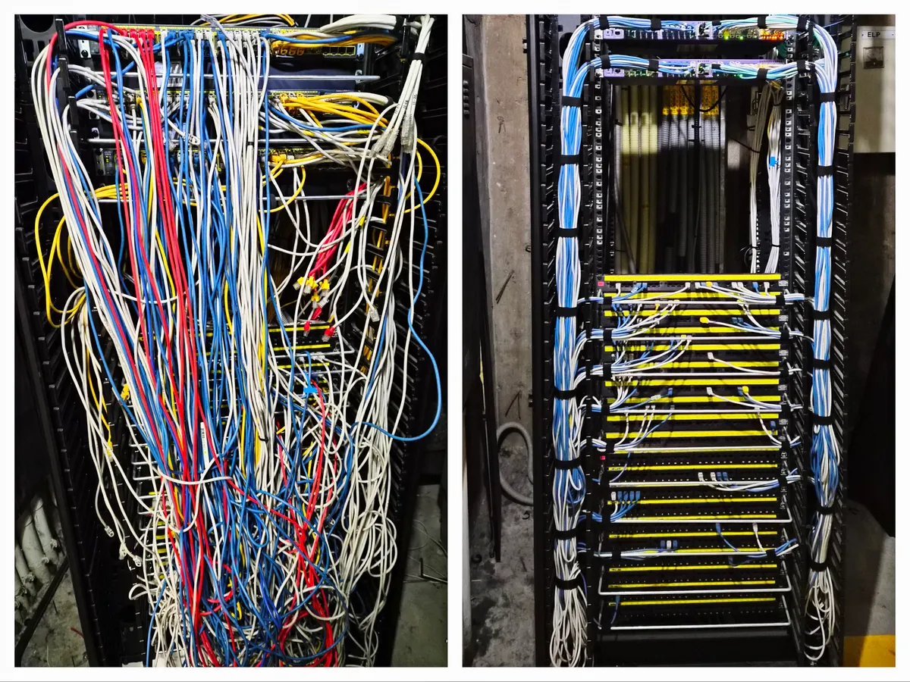

# AI가 바꾼 개발 환경 — 유튜브 구성안

원고: [AI가 바꾼 개발 환경: 8개월의 경험담](../ai_coding_part1.md)

---

## AI가 바꾼 개발 환경 - 비개발자 대표와 함께한 지옥의 8개월

**화면 내용**

제목과 개발 작업 화면. ‘레거시 수습 → AI와 단독 개발 → 대표가 개발 주도’라는 8개월의 흐름.

**대사**

이번에는 AI 코딩이 개발 환경을 어떻게 바꿔 놓았는지, 제가 지난 8개월 동안 겪은 일을 바탕으로 이야기해 보겠습니다.

처음에는 레거시를 수습하러 들어갔습니다. 그러다 AI와 함께 혼자 여러 애플리케이션을 개발하게 됐고, 나중에는 대표가 AI로 개발을 주도하는 프로젝트에서 일하게 됐습니다.

그 사이에 누가 무슨 일을 맡는지, 누가 결정을 내리는지, 개발자인 제가 무슨 역할을 하는지가 계속 바뀌었습니다.

---

## 들어가며 - 직접 코딩과 AI 코딩

**화면 내용**

직접 코딩과 AI 코딩의 비교도. 코드 작성·수정과 요구사항 설명·AI 구현·결과 검토의 차이.

> 직접 코딩: 사람이 코드 작성·수정
> AI 코딩: 요구사항 설명 → AI 구현 → 결과 검토

**대사**

먼저 용어부터 정리하겠습니다. 여기서는 코딩 방식을 두 가지로 나눠서 이야기하려고 합니다.

개발자가 코드를 직접 쓰고 고치면서 구현하는 건 ‘직접 코딩’이라고 부르겠습니다. 요구사항을 설명해서 AI에게 코드 작성을 맡기고, 나온 결과를 검토하는 건 ‘AI 코딩’입니다.

이번 1편에서는 저를 포함해서 프로젝트에 참여한 사람들이 어떤 입장이었는지, AI 코딩을 하면서 무슨 일을 겪었는지 돌아보려고 합니다. 구체적인 기술 사례와 문제를 어떻게 풀어야 했는지는 2편에서 다루겠습니다.

---

## 1.1 개발팀에 합류하다 - 8년 동안 출시하지 못한 서비스

**화면 내용**

전시·행사 현장의 티켓 구매, 발권, 입장 장면.

> 8년 동안 출시하지 못했다
> 납품까지 남은 시간, 4주

**대사**

제가 합류한 곳은 전시나 행사에 쓰는 티켓 서비스를 만드는 팀이었습니다. 대표는 개발팀장을 채용하기 전에도 외주 업체나 프리랜서에게 개발을 맡겼다고 했습니다. 그런데 어느 쪽도 출시까지 이어지지는 못했습니다. 그렇게 8년 동안 돈을 쓰고도 서비스를 내놓지 못한 상태였습니다.

제가 들어갔을 때는 미술관에 납품하고 정식으로 운영하기까지 4주가 남아 있었습니다. 이미 납품을 몇 번 미뤘기 때문에, 이번에도 못 맞추면 중요한 계약을 잃을 상황이었습니다.

대표를 처음 만난 날부터 압박을 많이 받고 있다는 게 느껴졌습니다. 개발팀장뿐 아니라 개발자들 전반을 잘 믿지 못하는 상태였습니다.

---

## 1.2 개발팀에 합류하다 - 거의 다 됐다는 말

**화면 내용**

완공을 앞두고 천장에서 물이 새는 집의 이미지.

> “거의 다 됐다”
> 실행하자 기본 기능부터 오류

**대사**

대표는 개발이 거의 다 됐다고 했습니다.

저는 ‘거의 다 됐다’는 말을 들으면 이상하게 힘이 빠집니다. 거의 다 됐다는데, 정작 회의에 들어가면 뭐가 됐고 뭐가 안 됐는지부터 파악하고 있습니다.

그래서 기존 시스템, 여기서 레거시라고 부르는 시스템을 직접 실행해 봤습니다. 역시나 인증 같은 기본 기능부터 바로 오류가 났습니다.

하긴 했습니다. 그런데 제대로 하지는 않은 겁니다. 집을 거의 다 지었다는데 천장에서 물이 새는 것 같은 상태였습니다.

---

## 1.2 개발팀에 합류하다 - 부실공사 같았던 프로젝트

**화면 내용**

인터뷰나 사람이 나오는 장면을 제외하고, 누수·균열·마감 하자만 모은 무음 영상.

> 하긴 했지만, 제대로 하지는 않은 상태

출처: [주택 하자 영상](https://www.youtube.com/watch?v=_HjdVs9gjX4&t=164s)

**대사**

거의 다 지었다는 집에서 이런 문제가 나오면, 마무리만 조금 하면 된다고 보기는 어렵지 않겠습니까.

제가 합류했던 프로젝트가 딱 이런 상태에 가까웠습니다.

---

## 1.2 개발팀에 합류하다 - 개발자 3명, 앱과 서버 8개

**화면 내용**

원고의 시스템 구성도. 사용자 앱·단말 5개, 서버 3개, 공유 DB의 연결 관계.

> 개발자 3명
> 앱·서버 8개
> DB를 포함한 저장소 9개

**대사**

이 화면에 있는 앱과 서버 8개를 팀장 한 명, 팀원 두 명이 전부 개발하고 있었습니다.

처음에는 저장소가 하나로 묶여 있지도 않았습니다. DB까지 포함하면 저장소만 9개였습니다.

사람 수와 남은 시간을 생각하면 기술이 너무 많이 나뉘어 있었습니다. 사용자 앱의 같은 기능을 iOS와 Android에서 따로 만들어야 했고, 현장에 놓는 전용 단말도 두 플랫폼으로 나뉘어 있었습니다.

서비스 백엔드, 발권 화면 서버, 백오피스는 같은 DB에 각각 직접 접근하고 있었습니다. 그러니 기능 하나를 바꿔도 여러 앱과 데이터 흐름을 같이 확인해야 했습니다. 세 사람이 서로 다른 기술로 만든 제품들을 한꺼번에 완성하고 운영해야 하는 상황이었습니다.

---

## 1.2 개발팀에 합류하다 - 시제품을 서비스로 연결해야 했다

**화면 내용**

사용자 앱·키오스크·POS 화면과 ‘구매 → 발권 → 입장 → 매출 확인’의 이용 흐름.

> 여러 시제품 → 하나의 운영 서비스

**대사**

출시 준비를 하면서 인수인계도 받아야 했습니다. 팀장은 퇴사를 앞두고 있었고, 나머지 두 팀원이 백엔드와 모바일 앱, 키오스크를 나눠 맡고 있었습니다.

화면과 API는 이미 많이 만들어져 있었습니다. 동작하는 기능도 있었습니다. 그런데 사용자가 처음부터 끝까지 서비스를 이용할 수 있게 연결돼 있지는 않았습니다. 키오스크나 POS도 현장에 바로 가져다 놓고 쓸 완성품이라기보다는 시제품에 가까웠습니다.

대표는 이제 마무리만 하면 된다고 생각했습니다. 제가 보기에는 이 시제품들을 연결해서 하나의 서비스로 만드는 일이 남아 있었습니다.

그렇다고 다 버리고 새로 시작할 수는 없었습니다. 남은 4주 안에 기존 구조의 문제를 전부 고칠 수도 없었습니다.

---

## 1.3 개발팀에 합류하다 - 프로젝트 소개는 누가 해야 하나

**화면 내용**

프로젝트 소개를 거절당한 대화와 ‘그러면 프로젝트 소개는 누가 해야 한단 말인가?’라는 반문.

> 그러면 프로젝트 소개는 누가 해야 한단 말인가?

**대사**

대표는 팀장이 AI 코딩을 안 하는 것도 불만이라고 했습니다. 팀장이 AI가 만든 코드를 믿지 못하고, 그런 건 제대로 된 개발도 아니라고 생각한다는 겁니다.

당시는 Opus 4.5가 막 나왔을 때였습니다. 그래서 AI 코딩을 걱정하는 마음 자체는 저도 이해할 수 있었습니다.

출근 첫날, 그 팀장에게 프로젝트 소개를 부탁했습니다. 그런데 개발자는 그런 일을 하는 사람이 아니라는 답이 돌아왔습니다.

그러면 프로젝트 소개는 누가 해야 한다는 겁니까?

그 태도를 보니까 프로젝트가 왜 이런 상태인지 짐작이 갔습니다. 다른 설명을 몇 번 더 부탁했는데도 그런 건 대표에게 물어보라고 했습니다. 더 이야기하기는 어렵겠다 싶어서 대화를 접었습니다.

---

## 1.3 개발팀에 합류하다 - 대표는 내 역량도 의심했다

**화면 내용**

‘팀장과 대표의 회의 → 대표가 나를 호출’하는 대화 순서도.

> Java를 할 수 있느냐는 질문

**대사**

그때 대표는 잠깐 자리를 비웠다가 돌아왔습니다. 우리가 말도 없이 각자 책상에 앉아 있으니까 의아해했습니다.

팀장은 대표가 들어오자마자 같이 회의실로 갔습니다. 조금 있다가 팀장이 나왔고, 이번에는 대표가 저를 회의실로 불렀습니다.

팀장이 저를 굉장히 안 좋게 이야기했다는 겁니다. Java도 모르는 개발자니까 잘 생각해야 한다고 했다는 겁니다. 그러면서 대표가 저한테 정말 문제는 없는지, Java는 할 수 있는지 물었습니다.

별로 대답하고 싶지 않았습니다. 조금 전까지는 팀장을 안 좋게 이야기하더니, 이번에는 그 사람 말을 듣고 제 역량을 의심하니까 답답했습니다. 누구도 쉽게 믿지 못하는데, 누구 말을 믿어야 할지 판단할 기준도 없어 보였습니다.

---

## 1.3 개발팀에 합류하다 - 의인불용 용인불의

**화면 내용**

‘疑人不用 用人不疑’와 그 뜻을 적은 문장 화면.

> 疑人不用 用人不疑
> 의심스러우면 쓰지 말고, 쓰려면 의심하지 말라

**대사**

그래서 제가 의인불용, 용인불의라는 말을 했습니다. 사람이 의심스러우면 쓰지 말고, 쓰기로 했으면 의심하지 말라는 뜻입니다. 말 한마디에 이렇게 흔들리면 앞으로 어떻게 같이 일하겠느냐고도 했습니다.

그런데도 대표는 불안했는지 Java를 할 수 있느냐고 다시 물었습니다.

지금 익숙하지 않은 기술도 금방 적응할 수 있다고 답했습니다. 그동안 어떤 기술로 무슨 일을 했는지는 이력서에 나와 있지 않느냐고도 했습니다.

이 프로젝트를 수습하려면 일단 서로 믿고 일할 수 있어야겠다는 생각이 들었습니다.

---

## 2.1 AI가 개발 방식을 바꾸다 - AI에게 기존 시스템을 분석시키다

**화면 내용**

AI 에이전트의 저장소 분석 화면과 결과 문서. 자료가 없으면 ‘저장소 → API 목록 → DB·앱 연결 관계’ 도식.

> 새 코드를 만들기 전에
> 무엇이 만들어져 있는가

**대사**

합류한 날 밤부터 AI 에이전트로 기존 시스템을 조사했습니다.

여기서 말하는 에이전트는 저장소를 돌아다니면서 코드를 읽고, 파일을 고치고, 빌드와 테스트까지 하는 도구입니다. 새 코드를 만들기 전에 지금 뭐가 만들어져 있는지부터 알아야 했습니다.

우선 구현된 REST API를 전부 목록으로 만들고 기능별로 나눠 달라고 했습니다. 각각 무슨 역할인지 분석하게 하고, 요청 인자가 이해되지 않으면 관련 코드를 따라가면서 어디에 쓰는 건지 확인하게 했습니다.

DB 테이블과 API, 그 API를 호출하는 앱을 연결해서 보니까 어떤 기능이 있고 어떤 흐름이 빠져 있는지 정리할 수 있었습니다.

시스템이 전반적으로 어떻게 돌아가는지 파악하는 데 하루가 걸렸습니다. 제가 파일을 하나씩 열어서 같은 일을 했다면 꼬박 일주일 정도는 걸렸을 겁니다.

---

## 2.1 AI가 개발 방식을 바꾸다 - 분석은 빨랐지만 확인은 필요했다

**화면 내용**

API 목록과 DB 스키마 일부. API·앱 사이의 연결과 암호화·복호화가 끼어드는 구조.

> API 이름만으로는 알 수 없는 실제 동작

**대사**

물론 AI의 분석이 다 맞았던 건 아닙니다. 나중에 개발하면서 다시 보니까, 구현돼 있다고 정리한 API 중에 실제로는 만들다가 중단된 것도 있었습니다. 이름만 보고 API의 용도를 잘못 짚은 경우도 있었습니다.

백엔드에 기능이 많이 구현돼 있는 건 맞았습니다. 그런데 DB 스키마나 API 이름만 봐서는 역할과 연결 관계를 알기가 어려웠습니다. 비슷한 데이터도 API마다 다르게 처리하고 있었습니다.

어떤 요청은 따로 암호화하고 복호화하는 과정도 거쳤는데, 그 기준이 일정하지 않았습니다. API 하나가 돌아간다고 끝나는 문제가 아니었습니다. 다른 앱과 연결하거나 오류가 난 이유를 찾기가 어려운 구조였습니다.

---

## 2.1 AI가 개발 방식을 바꾸다 - 필수 기능을 쳐내고 쳐내다

**화면 내용**

‘당장 필요한 기능’과 ‘언젠가 필요한 기능’으로 나눈 요구사항 목록. 개인 간 티켓 거래가 예시.

> 필수라고 정의한 기능들을
> 쳐내고 쳐내서

**대사**

시스템 분석을 어느 정도 마치고 나서는 최소 요구사항을 정하기 시작했습니다.

그런데 대표에게 꼭 필요한 기능을 물어보면, 당장 필요한 것과 언젠가 필요할 것이 뒤섞여 나왔습니다. 예를 들어 개인 간 티켓 거래는 필수 기능이라고 했습니다. 그런데 8개월이 지난 지금은 흔적조차 찾을 수 없습니다.

시간은 한정돼 있었습니다. 필수라고 하는 기능들을 쳐내고, 또 쳐냈습니다. 그렇게 해야 4주 안에 겨우 구현할 수 있는 수준이 됐습니다.

---

## 2.2 AI가 개발 방식을 바꾸다 - 백오피스를 AI로 다시 만들다

**화면 내용**

백오피스의 메뉴·목록·수정 화면. 기존 JSP와 새 Next.js 화면을 비교하거나 ‘메뉴와 API 문서 → AI → 백오피스’ 도식.

> 요구사항만 명확하면
> 순식간에 코드로 구현했다

**대사**

가장 먼저 손댄 건 기존 시스템의 백오피스였습니다. JSP로 만들고 있었는데, 기능 구현도 아직 끝나지 않은 상태였습니다. 화면은 제가 Next.js로 다시 만들고, 백엔드 API는 팀원이 새로 만들기로 했습니다.

제가 직접 코딩해서 백오피스를 만든 건 2년 전이 마지막이었습니다. 그때도 Next.js를 썼습니다. 시간을 아끼려고 MUI라는 React UI 라이브러리 기반의 유료 템플릿을 샀습니다. 그 구조를 익혀서 필요한 화면에 맞게 고쳐 썼는데, 당시에는 그게 꽤 효율적인 방법이었습니다.

이번에는 AI에게 필요한 메뉴를 알려주고, REST API의 요청과 응답을 정리한 문서를 줬습니다. 그랬더니 백오피스의 기본 구조와 주요 화면을 금방 만들었습니다.

일정이 급해서 화면을 얼마나 보기 좋게 만드느냐까지 신경 쓸 여유는 없었습니다. 그런데 결과물이 별도의 유료 템플릿을 살 필요가 없을 만큼 번듯했습니다.

요구사항만 명확하면 AI가 순식간에 코드로 만들어 주는 겁니다.

---

## 2.3 AI가 개발 방식을 바꾸다 - API를 붙이자 반복된 오류

**화면 내용**

‘완료 보고 → API 호출 → 오류 → 수정 요청’이 세 번 반복되는 흐름도와 API 오류 화면.

> AI의 완료 보고를
> 그대로 전달하고 있었다

**대사**

백오피스 개발은 순조로웠습니다. 문제는 백엔드 API를 붙일 때부터였습니다.

백엔드를 맡은 개발자는 경력 3년 차였습니다. 그동안 요구한 내용을 곧잘 구현한다고 생각했기 때문에, 이번 API도 무리 없이 만들 줄 알았습니다.

그런데 다 됐다는 API를 호출하면 동작하지 않았습니다. 고쳤다고 해서 다시 보면 다른 오류가 나오거나 필요한 게 빠져 있었습니다. API 하나를 붙이는데 이런 일이 세 번 반복됐습니다.

그래서 AI가 설계한 API를 직접 검토했느냐고 물었습니다. 설계도 안 봤고, 테스트도 안 했다는 겁니다.

제가 전달한 요구사항을 AI에게 넣고, AI가 완료했다고 하면 그 말을 저한테 전달하고 있었던 겁니다.

---

## 2.3 AI가 개발 방식을 바꾸다 - API와 화면을 한 사람에게 맡기다

**화면 내용**

UI와 API를 따로 맡았을 때의 수정 왕복과 한 사람이 함께 맡았을 때의 업무 흐름 비교.

> 화면과 API를 함께 맡는 편이 효율적이었다

**대사**

이 백오피스는 기능이 복잡하지 않았습니다. 대부분 API에서 받은 데이터를 화면에 보여주고 값을 수정하는 정도였습니다.

화면과 API를 따로 맡겨 놓으니 요구사항을 다시 설명하고, 수정 결과를 기다리고, 또 확인해야 했습니다. 그럴 바에는 한 사람이 둘 다 맡는 게 낫겠다는 생각이 들었습니다.

그래서 백엔드 개발자에게 백오피스까지 맡기기로 했습니다. 처음에는 프론트엔드를 하고 싶지 않다고 했습니다. 백엔드 전문 개발자가 되고 싶다는 겁니다.

그 마음은 저도 이해했습니다. 어설프게 여러 기술을 아는 것보다는 하나라도 제대로 아는 게 낫다고 생각하기 때문입니다.

그런데 이번에 AI로 백오피스를 만들어 보니 화면 구현까지 맡길 수 있겠다는 생각이 들었습니다. 그 개발자도 API와 화면을 함께 맡는 게 효율적이라는 데는 동의했고, 백오피스 개발을 넘겨받았습니다.

---

## 2.4 AI가 개발 방식을 바꾸다 - 3월, 출시 뒤 전체 재개발을 시작하다

**화면 내용**

3월 출시 이후의 업무 분담도. 대표·팀원은 legacy 유지보수, 나는 marksman·pointman 재개발.

> 3월 초: 기존 서비스 출시
> 이후: 전체 재개발 시작

**대사**

3월 초에 기존 서비스를 가까스로 출시했습니다. 처음 들었던 4주는 이미 지난 뒤였습니다.

급한 위기를 넘기고 나서 남은 작업과 유지보수는 대표와 팀원들에게 맡겼습니다. 저는 기존 시스템 전체를 다시 만들기 시작했습니다.

---

## 2.5 AI가 개발 방식을 바꾸다 - Figma 대신 동작하는 초안

**화면 내용**

Figma 시안과 구현된 앱 화면. ‘시안 전달’과 ‘필요한 기능을 말로 설명’하는 두 구현 방식 비교.

> 시안을 고칠 것인가
> 동작하는 초안을 만들 것인가

자료: [사용자 앱의 Figma 시안 캡처](../../assets/ai-coding-part1/figma-user-app-design.png).

**대사**

새 사용자 앱인 pointman은 Flutter로 만들기로 했습니다. 처음 쓰는 기술이었지만 크게 부담스럽지는 않았습니다. 백오피스를 AI로 만들어 봤으니까, Flutter도 할 수 있겠다는 생각이 들었습니다.

처음에는 디자이너가 만든 Figma 파일을 AI에게 주고 그대로 구현하라고 했습니다. 그런데 디자인과도 다르고, 동작도 제대로 안 됐습니다. 시안을 PDF나 SVG로 바꿔서 줘 봐도 별 차이가 없었습니다.

시안 자체에도 고칠 부분이 많았습니다. 제가 직접 고치려고 해도 Figma를 능숙하게 다루지 못해서 쉽지 않았습니다. 그렇다고 그때 Figma를 공부할 시간은 없었습니다.

한 시간쯤 이것저것 해보다가 생각을 바꿨습니다. 백오피스 만들 때처럼, 필요한 기능을 말로 설명해서 일단 돌아가는 초안을 만들면 되지 않을까 싶었습니다.

실제로 몇 문장으로 설명했더니 기대 이상의 결과가 나왔습니다. 화면도 번듯하고, 실제로 동작도 했습니다.

---

## 2.5 AI가 개발 방식을 바꾸다 - 같은 앱을 보며 요구사항을 정하다

**화면 내용**

‘대표 → 디자이너 → 개발자 → 다시 질문’과 ‘대표·개발자가 동작하는 앱을 함께 보며 수정’하는 흐름 비교.

> 같은 앱을 보고
> 그 자리에서 고친다

**대사**

전에는 대표가 설명하면 디자이너가 시안을 만들고, 개발자는 그걸 구현했습니다. 만들다 보니 버튼이 빠져 있거나 어떻게 동작해야 할지 애매하면 다시 대표에게 물었습니다. 그러면 시안도 바꾸고 코드도 고쳤습니다.

이제는 대표와 제가 동작하는 앱을 같이 보면서 무엇을 고칠지 정할 수 있었습니다. 그 자리에서 AI에게 수정을 맡기고 결과까지 확인할 수 있게 된 겁니다.

---

## 3. AI에게 큰 작업을 맡기며 검증을 소홀히 하다 - 출력 200%의 희망회로

**화면 내용**

NestJS 시드 프로젝트와 AI가 수정한 기능·테스트 화면. ‘설마 이것까지? → 이게 되네? → 출력 200%의 희망회로’.

**대사**

새 사용자 앱과 함께 만들던 백엔드, marksman도 순조로웠습니다. 예전에 만들어 둔 NestJS 시드 프로젝트를 줬더니 사용자나 인증 같은 기본 기능을 새 프로젝트에 맞게 바꾸고, 기존 테스트도 같이 수정했습니다.

처음에는 AI가 만든 API를 직접 검증했습니다. fallback이나 편법으로 문제를 덮은 건 없는지, 검증 방법은 맞는지도 확인했습니다.

그런데 개떡같이 말해도 찰떡같이 알아듣는 게 그렇게 신기하고 기특할 수가 없었습니다. 처음에는 ‘설마 이것까지 하겠어?’ 하면서 조심스럽게 맡깁니다. 그러다 결과를 보면 ‘이게 되네?’ 하는 겁니다.

그렇게 기대가 커지면서 한 번에 맡기는 일도 점점 커졌습니다. 나중에는 큰 작업을 두세 개 연속으로 맡기면서도 중간 결과를 확인하지 않게 됐습니다.

이번에도 알아서 잘해 줄 거라는, 출력 200%의 희망회로를 돌리고 있었던 겁니다.

---

## 3. AI에게 큰 작업을 맡기며 검증을 소홀히 하다 - 잘못된 방향으로도 열정적이었다

**화면 내용**

요청하지 않은 기능, 빠진 필수 기능, 과도한 제약을 보여주는 사례 도식.

> AI는 잘못된 방향으로도
> 열정적으로 삽질했다

**대사**

그런데 몇 시간 뒤에 결과물을 열어 보면 문제가 한둘이 아니었습니다. 시키지도 않은 기능을 추가해 놓고, 정작 필요한 기능은 빼놓기도 했습니다.

보안을 강화하겠다면서 제약을 지나치게 넣는 경우도 있었습니다. 사소한 예외만 생겨도 시스템이 멈춰 버리는 겁니다.

고치라고 하면 또 다른 문제가 생겼습니다. 정상적으로 해결이 안 되면 꼼수를 쓰거나 너무 멀리 우회해 놓고 해결했다고 보고했습니다.

AI는 잘못된 방향으로도 놀라울 만큼 열정적으로 삽질했습니다.

---

## 3. AI에게 큰 작업을 맡기며 검증을 소홀히 하다 - 검색 화면은 있는데 검색할 수 없다

**화면 내용**

카드번호 검색 UI와 마스킹해 저장한 데이터의 비교. 검색에 필요한 원래 번호가 없다는 구조.

> 화면은 완성
> 저장된 값으로는 검색 불가

**대사**

한 번은 카드번호로 결제 기록을 검색하는 화면을 만들어 놨습니다. 화면은 번듯했습니다.

그런데 정작 DB에는 카드번호를 전부 마스킹해서 저장한 겁니다. 원래 번호가 없는데 무슨 수로 카드번호를 검색하겠습니까.

이런 상태인데도 전체 기능을 테스트하라고 하면 몇 번이고 정상이라고 보고했습니다.

---

## 4.1 AI와 함께 1인 개발로 전환하다 - GitHub Projects로 작업을 모으다

**화면 내용**

GitHub Projects의 Todo·In progress·Done 작업 보드와 작업 결과 댓글.

> 요구사항과 작업 결과를 한곳에
> 이 방식은 하루 정도였다

**대사**

제가 새 백엔드와 사용자 앱을 만드는 동안에도 팀원들의 추가 개발과 버그 대응은 지지부진했습니다.

대표가 요구한 내용을 각자 해석해서 구현하면, 대표는 그걸 보고 원하던 게 아니라고 했습니다. 대표와 개발팀이 서로 다른 지역에 있으니 수시로 같은 화면을 보면서 이야기하기도 어려웠습니다.

그래서 요구사항과 작업 결과를 한곳에 모아 보려고 GitHub Projects를 써봤습니다. 대표가 할 일을 등록하고, 개발자가 그 일을 마치면 결과와 공유할 내용을 댓글로 남기는 방식이었습니다.

이렇게 일한 건 하루 정도였습니다. 대표는 다시 여러 채널로 요구사항을 전달했고, 개발자들도 작업 항목에 결과를 남기지 않았습니다.

결국 제가 작업 하나하나에 끼어들어 조율해야 했습니다. 요구한 내용과 구현한 결과를 맞추는 데 시간을 쓰다 보니, 제가 새 백엔드를 개발할 시간은 점점 줄었습니다.

---

## 4.2 AI와 함께 1인 개발로 전환하다 - 한 사람에게 네 개의 앱을 맡기다

**화면 내용**

Android 키오스크·사용자 앱과 iOS 키오스크·사용자 앱, 총 네 개의 담당 앱 목록.

> 두 개에서 네 개로
> 직접 코딩 때와 달라진 업무량

**대사**

3월에 서비스를 출시하고 얼마 지나지 않아 iOS 개발자의 계약이 끝났습니다. 그 사람이 맡던 iOS 키오스크와 사용자 앱을 새로 채용한 Android 개발자에게 맡기려고 했습니다.

이미 Android 키오스크와 사용자 앱을 맡고 있었으니, 두 개가 더해져서 네 개가 되는 겁니다.

처음에는 강하게 거부했습니다. 지금도 두 개나 하고 있는데 네 개를 어떻게 맡느냐는 얘기였습니다. 예상한 반응이었습니다. 플랫폼마다 기술을 익혀서 직접 코딩한다고 생각하면 가벼운 요구가 아닙니다.

그런데 제가 AI로 백오피스와 Flutter 앱을 만들어 보니, 예전과 같은 기준으로 계산할 일은 아니었습니다. iOS와 Android라는 차이는 있지만 구현할 기능은 상당 부분 같았습니다.

공통 요구사항을 정리하고 플랫폼별 구현을 AI에게 맡기면, 사람이 같은 기능을 처음부터 다시 만드는 부담은 줄일 수 있다고 봤습니다.

---

## 4.2 AI와 함께 1인 개발로 전환하다 - 조언과 경고 사이

**화면 내용**

‘AI 코딩에 빨리 적응해야 한다’는 조언과 수습 평가를 앞둔 퇴사 의사를 담은 문장 화면.

> 나는 조언이라고 생각했다

**대사**

AI로 개발 환경이 어떻게 달라졌는지 설명하자 그 개발자도 제 판단을 받아들였고, 업무를 맡았습니다. 그 후에도 AI 코딩에 빨리 적응해야 한다고 몇 차례 조언했습니다.

저는 조언이라고 생각했습니다. 그런데 그 사람에게는 경고로 들렸을지도 모르겠습니다. 결국 수습 평가를 앞두고 퇴사하겠다고 했습니다.

더 부드럽게 말해야 한다는 건 알고 있었습니다. 다만 회사 자금이 거의 바닥난 상황이었습니다. 누군가 업무에 적응할 때까지 오래 기다릴 여유가 없었습니다.

---

## 4.3 AI와 함께 1인 개발로 전환하다 - 계속 맞지 않는 매출 통계

**화면 내용**

백오피스 매출 통계와 상세 내역. 실제 자료가 없으면 합계 불일치를 설명하는 도식.

> 서버는 다 됐다는데
> 매출 통계는 계속 맞지 않았다

**대사**

앞에서 API를 붙일 때 문제를 일으켰던 백엔드 개발자는 여전했습니다. 다 됐다는 기능을 확인하면 오류가 나고, 수정을 요청한 뒤 다시 확인하는 일이 반복됐습니다.

처음에는 저도 문제가 그렇게 심각한 줄 몰랐습니다. 출시한 서비스의 유지보수는 대표와 팀원들에게 맡기고, 저는 새 시스템을 만드는 데 집중하고 있었기 때문입니다.

서버는 다 됐다고 하는데 Android 개발자는 기능 하나를 만드는 데도 어려움을 겪는 것처럼 보였습니다. 업무가 낯설어서 그렇겠거니 했습니다. 직접 코딩하던 때의 기준으로 보면 속도가 나쁜 것도 아니었습니다.

그런데 백오피스 매출 통계가 계속 맞지 않았습니다. 대표의 불만도 쌓였고, 더는 두고 볼 수 없는 상황이 됐습니다. 그래서 직접 원인을 살펴봤습니다.

---

## 4.3 AI와 함께 1인 개발로 전환하다 - 여러 에이전트, 없는 검증

**화면 내용**

여러 AI 에이전트가 같은 애플리케이션을 수정하는 도식. 작업 분리·통합 검토가 없고, 운영 DB에서 테스트하는 상태.

> 범위 구분 없음
> 통합 검토 없음
> 운영 DB에서 테스트

**대사**

보니까 백엔드 개발자가 하나의 애플리케이션에 에이전트를 서너 개씩 동시에 투입하고 있었습니다.

작업 범위를 나누지도 않았고, 바뀐 내용을 검토해서 합치는 과정도 없었습니다. 원래 되던 기능이 여전히 되는지 확인하지도 않았습니다.

가장 충격적이었던 건 운영 DB에서 여전히 테스트하고 있었다는 겁니다. 이미 실제 고객이 쓰는 서비스였습니다. 자동 백업도 없었고, 테스트 데이터는 사용자에게 그대로 보이고 있었습니다.

AI가 일을 끝내면 검증하지 않는 건 물론이고, 어떻게 검증할 건지 AI에게 묻지도 않았습니다.

매출 통계가 계속 안 맞으면 최소한 검증 계획이라도 요구해야 합니다. 그리고 그 계획이 맞는지는 봐야 합니다. 정말 최소한으로 잡아도 그 정도는 해야 하는 것 아닙니까.

---

## 4.3 AI와 함께 1인 개발로 전환하다 - 무책임 한도 초과

**화면 내용**

백엔드 개발자의 발언과 ‘내가 요구한 것은 최소한의 책임감이었다’라는 문장.

> 내가 요구한 것은
> 최소한의 책임감이었다

**대사**

지난번 백오피스 API를 붙일 때 충분히 주의를 줬다고 생각했습니다. 그런데 다시 살펴보니 달라진 게 없었습니다. 여전히 일말의 책임감도 찾아보기 어려웠습니다.

제 표정도 어두워지고 말도 건조해졌습니다. 그걸 눈치챘는지, 그 개발자가 이렇게 말했습니다.

“큰 회사에서도 기획자들이 몇 명이 붙어서 검증해도 완벽하기 어려운데, 이 작은 회사에서 어떻게 팀장님 기준에 맞출 수 있겠어요?”

제가 요구한 건 완벽한 프로그램이 아니었습니다. 최소한의 책임감이었습니다.

사실 한 달 전에도 받아들이기 어려운 태도 때문에 해고를 통보한 적이 있었습니다. 그때는 본인이 잘못을 인정했습니다. 취업 시장이 어렵다는 것도 알고 있었기 때문에 차마 강행하지 못했습니다.

그때는 제가 참으면 어떻게든 감당할 수 있는 문제였습니다. 그런데 이번에는 그 무책임 때문에 회사와 다른 구성원들까지 피해를 보고 있었습니다.

그 말을 들은 다음 날 해고를 통보했습니다.

---

## 4.3 AI와 함께 1인 개발로 전환하다 - 일을 맡겨도 수습은 다른 사람의 몫

**화면 내용**

일을 맡긴 뒤에도 확인과 수습이 다른 사람에게 돌아오는 업무 흐름도.

> 일을 맡겨도
> 확인과 수습은 다른 사람들의 몫

**대사**

요즘 주니어의 업무 태도 때문에 가급적 채용을 피하고 싶다는 얘기를 자주 듣습니다. 이 일을 겪고 나니까 그 말이 이해됐습니다. 일을 맡겨도 확인하고 수습하는 건 계속 다른 사람들의 몫이었던 겁니다.

물론 모든 주니어가 그렇다는 얘기는 아닙니다. 몇 달 전 잠깐 근무한 회사에서 만난 주니어와는 지금도 연락하고 있습니다. 어른스럽고, 무슨 일을 맡겨도 믿음이 가는 친구입니다.

다만 최근 6개월 동안 제가 만난 주니어 10명 중에서 자신 있게 추천할 수 있는 사람은 두 명 정도였습니다.

---

## 4.4 AI와 함께 1인 개발로 전환하다 - 당분간 채용을 중단하자

**화면 내용**

대표와 팀원 사이의 조율에 쓰던 시간과 내가 AI에게 직접 작업을 맡기는 방식의 비교.

> 사람 사이의 조율에 쏟던 시간
> 내가 직접 AI와 작업한다면

**대사**

Android 개발자가 퇴사하겠다고 했을 때, 저는 차라리 잘됐다는 생각이 들었습니다.

당시에는 대표와 팀원 사이에서 왜 이 일을 해야 하는지 설명하고, 진행 상황을 맞추고, 어긋난 결과를 다시 고치는 데 너무 많은 시간이 들었습니다. 다들 상황에 불만이 있으니 조언이나 상담에도 시간을 써야 했습니다.

그 시간까지 따지면 제가 AI에게 바로 일을 맡기고 확인하는 편이 더 효율적일 것 같았습니다. Android 개발자도 제가 혼자 AI 코딩을 하는 게 낫겠다는 데 동의했습니다.

그래서 대표에게 당분간 채용을 중단하고 혼자 개발하는 게 낫겠다고 제안했습니다. 나중에 들은 얘기인데, 당시 대표는 개발팀이 무너져서 사업을 접어야 하나 걱정했다고 합니다.

저는 생각이 달랐습니다. 팀원들이 실제로 해내던 일과 그 과정에 제가 쏟던 시간을 따져 보면, 혼자 개발하는 게 최선이었습니다.

---

## 4.4 AI와 함께 1인 개발로 전환하다 - 혼자 맡은 애플리케이션 9개

**화면 내용**

남겨 둔 애플리케이션 9개의 역할과 프로젝트명 목록. 새 개발, 인수한 웹, 현장 단말로 구분.

> 필수적으로 남긴 애플리케이션 9개

**대사**

4월 초에는 팀원들의 일을 전부 넘겨받아서 혼자 개발하게 됐습니다. 맡아야 할 애플리케이션이 이만큼 남아 있었습니다.

먼저 새로 만들던 marksman 백엔드와 pointman 사용자 앱이 있었습니다. 부산에서 3일 동안 진행하는 행사에 쓸 백오피스와 티켓 시스템, events도 만들어야 했습니다.

팀원이 만들던 legacy 백엔드와 partner-console 백오피스도 넘겨받았습니다.

현장 단말도 있었습니다. Android 발권 키오스크인 ticketing, 그 키오스크의 화면을 제공하는 JSP 서버인 kiosk-server, Android POS인 pos-app, iOS 입장 키오스크인 checkin까지 맡았습니다.

기존에 만들던 iOS와 Android 사용자 앱은 개발을 중단했습니다. 당장 필요한 것만 남겼는데도 9개였습니다.

직접 코딩해야 했다면 감당하기 어려웠을 겁니다. 그런데 팀원들도 저도 직접 코딩을 안 한 지 이미 몇 달이 지난 상태였습니다. AI 코딩이라면 혼자서도 감당할 수 있겠다는 생각이 들었습니다.

Java나 Android가 익숙한 건 아니었지만 크게 부담스럽지는 않았습니다. 말로 지시하고 결과를 검증하는 방식은 같았습니다. 기본 개념을 이해하고, 모르는 세부 사항은 AI에게 물으면 됐습니다.

---

## 4.4 AI와 함께 1인 개발로 전환하다 - 개발 환경을 정리한 3일

**화면 내용**

여러 저장소를 웹용·Android용 모노레포 두 개로 묶은 구성도. VS Code와 Android Studio 작업 화면.

> 저장소를 모으니
> AI에게 일을 맡기기 쉬워졌다

**대사**

개발 환경부터 정리했습니다. 여기에 3일 정도 썼습니다. 넘겨받은 저장소들을 웹용과 Android용 모노레포 두 개로 묶었습니다. 관련 코드가 한곳에 있으니 AI에게 일을 맡기기가 편해졌습니다.

마음 같아서는 전부 하나로 묶고 싶었습니다. 그런데 당시에는 웹 작업은 VS Code에서 하고, Android 앱은 Android Studio에서 빌드하고 확인했습니다. 그 차이에 맞춰 저장소도 두 개로 나눈 겁니다.

지금 돌아보면 굳이 나눌 필요는 없었습니다. 제가 하는 일은 에이전트에게 지시하고 결과를 확인하는 것이었습니다. 그 작업에 전용 IDE가 꼭 필요한 건 아니었습니다.

---

## 4.4 AI와 함께 1인 개발로 전환하다 - 서로 다른 프로젝트에 에이전트 하나씩

**화면 내용**

네 프로젝트에 에이전트를 하나씩 배치하고 내가 결과를 검증하는 도식. 여러 에이전트가 작업 중인 실제 개발 화면.

> 프로젝트별 작업 분리
> 결과는 내가 검증
> 당시 나의 한계는 4개

**대사**

환경을 정리하고 나니 생산성이 올라가는 게 느껴졌습니다. 해야 할 일은 제가 잘 알고 있었습니다. 그래서 서로 다른 네 프로젝트에 에이전트를 하나씩 배치하고 동시에 작업을 맡겼습니다.

앞에서 팀원도 여러 에이전트를 동시에 돌렸는데, 저도 똑같이 한 것 아니냐고 생각하실 수 있습니다. 차이는 작업 범위와 검증에 있었습니다. 팀원은 같은 애플리케이션을 여러 에이전트가 바꾸게 했고, 저는 프로젝트별로 작업을 나눴습니다. 결과도 제가 직접 검증했습니다.

프로젝트나 사람에 따라 다르겠지만, 당시 제게는 네 개가 거의 한계였습니다. 한 에이전트의 결과를 확인하고 나면 다른 에이전트가 이미 검증을 기다리고 있었습니다.

---

## 4.4 AI와 함께 1인 개발로 전환하다 - 4월 말, 레거시를 수습하다

**화면 내용**

4월 말 legacy 수습과 부산 행사 서비스(events) 출시 화면. ‘클 이사·코 부장’이라는 호칭.

> legacy 수습 + events 출시
> 클 이사 · 코 부장

**대사**

해야 할 일이 명확했고 사람들과 조율할 일도 없었습니다. AI 코딩에 집중할 수 있었던 이유입니다.

그렇게 4월 말까지 기존 시스템, legacy의 필수 요구사항을 처리하고 최소한의 안정성을 확보했습니다. 부산 행사를 위한 새 서비스인 events도 만들어서 출시했습니다. 처음에는 간단할 줄 알았던 서비스입니다.

대표도 AI 코딩의 결과에 만족했습니다. 언제부턴가 AI 에이전트를 ‘클 이사’와 ‘코 부장’으로 모시고 있었습니다.

특별한 사고만 없었으면 더 일찍 끝냈을 겁니다. 그런데 AI와는 무관한 황당한 사고가 터졌습니다. 대표는 손을 떨었고, 저는 경찰을 불러야 했습니다. 그 일은 기회가 되면 따로 이야기하겠습니다.

---

## 5.1 대표가 개발을 주도하다 - 5월, 다시 만들려던 시스템

**화면 내용**

중단했던 marksman·pointman 개발 일정과 우선순위가 정해지지 않은 행사·티켓 요구사항 목록.

> 무엇을 먼저 만들지
> 어디까지 미리 대비할지

**대사**

5월 초가 되니 시급한 레거시 문제는 어느 정도 수습됐습니다. 한 달 동안 중단했던 marksman 백엔드와 pointman 앱을 다시 개발할 수 있게 된 겁니다.

그런데 새로 만드는 일인데도 레거시를 수습하던 4월보다 부담이 더 컸습니다. 행사와 티켓의 종류는 너무 다양했습니다. 대표는 서비스에 관해서 많은 얘기를 했지만, 정작 어떤 방향으로 가려는지, 무엇부터 만들어야 하는지는 알 수 없었습니다.

DB를 어디까지 확장할 수 있게 설계해야 할지도 막막했습니다. 나중에 필요할지 모를 것을 전부 고려하면 설계와 구현만 쓸데없이 복잡해질 수 있습니다. 어디까지 미리 대비할지 대표와 정해야 했습니다.

그런데 그걸 수시로 의논하기도 어려웠습니다. 저는 서울 사무실에 있었고, 대표는 주로 대전에 있거나 외부 미팅을 다녔습니다. 서울 사무실에는 일주일에 하루 정도 왔습니다.

연락할 수단이야 많습니다. 그래도 바로 옆에서 상대가 어떤 상황인지 보면서 이야기하는 것과는 차이가 있었습니다.

---

## 5.1 대표가 개발을 주도하다 - 대표가 한 달 동안 만든 시스템

**화면 내용**

내가 legacy·events를 작업한 한 달과 대표가 superman을 만든 한 달을 나란히 표시한 일정표. Next.js·Supabase·Vercel 구성.

> 한 달 동안, 대표도 AI로 개발하고 있었다
> superman

**대사**

그런 고민을 하던 때였습니다. 평소에는 당당하던 대표가 그날은 조심스럽게 웃으면서 말을 몇 번 돌렸습니다.

싸늘했습니다. 분명 저한테 좋지 않은 얘기를 하려는 분위기였습니다.

알고 보니 대표도 AI로 자기가 생각하는 서비스를 만들고 있었습니다. 그게 superman입니다. 제가 레거시를 수습하고 다른 행사에 쓸 서비스를 만드는 동안, 대표도 한 달 정도 개발한 겁니다.

AI가 추천한 기술을 따라 Supabase를 백엔드로 쓰고, Next.js로 백오피스를 만들어서 Vercel에 배포했습니다.

대표는 백오피스도 되고 매출 통계도 되고, 백엔드까지 다 됐다고 했습니다. 이제 현장에서 쓸 키오스크만 제가 붙이면 된다는 얘기였습니다.

개발 경험이 없는 사람이 한 달 만에 그만큼의 화면과 기능을 만든 건 놀라웠습니다. 그렇다고 그 결과물을 그대로 믿을 수는 없었습니다. 더군다나 Supabase는 이름만 들어 봤지, 무엇을 하는 서비스인지도 모르던 상태였습니다.

---

## 5.1 대표가 개발을 주도하다 - 한마디 상의도 없었다

**화면 내용**

사전 협의 없이 한 달 동안 진행된 개발 일정. 집필 중 대표에게 전화해서 들은 이유를 담은 인용문.

> 결정 과정에는 참여하지 못했다
> 이어서 개발하는 일은 내 몫이었다

**대사**

무엇보다 한 달 동안 저한테 한마디도 하지 않고 진행했다는 게 화가 났습니다. 제가 반대할까 봐 그랬던 건지, 아니면 굳이 말할 필요가 없다고 생각했던 건지 알 수가 없었습니다.

원고를 쓰다가 대표에게 전화해서 이유를 물었습니다. 그때는 개발자들을 믿지 못해서 그랬다고 했습니다. 자세한 해명은 다음 기회에 하겠다고 했습니다.

그런데 그게 저한테 아무 말도 안 한 것과 무슨 상관인지, 저는 여전히 이해가 안 됩니다.

처음 기술을 고를 때부터 저와 협의한 일이 아니었습니다. 결정할 때 저는 없었는데, 대표가 AI와 정한 방향대로 이어서 개발하는 건 제 일이 된 겁니다.

---

## 5.1 대표가 개발을 주도하다 - 다 됐다는 시스템을 열어 보니

**화면 내용**

superman의 메뉴와 이벤트 등록 화면. 당시 자료가 없으면 거의 맞춘 것처럼 보이는 큐브 이미지.

> 여러 기능이 있었다
> 운영할 만큼 완성되지는 않았다

**대사**

대표가 다 됐다고 한 시스템을 실행해 보니, 제가 처음 합류했을 때 봤던 레거시가 떠올랐습니다.

기능은 여러 가지 있었습니다. 화면도 얼핏 보면 그럴듯했습니다. 그런데 기능이 제대로 분류돼 있지 않아서 필요한 메뉴를 찾기 어려웠습니다. 가장 기본적인 이벤트 등록도 대표와 같이 확인하는 중에 여러 오류가 나왔습니다.

대표는 사소한 문제니까 자기가 해결하겠다고 했습니다. 제가 보기에는 코드 몇 군데 고쳐서 끝낼 부실공사가 아니었습니다.

개발은 대표가 주도했지만, 그 결과에 대한 책임은 제가 지게 될 게 뻔했습니다. 대표는 아니라고 했습니다. 하지만 저 역시 대표를 믿지 않았습니다.

---

## 5.2 대표가 개발을 주도하다 - 기술 선택의 가치도 달라졌다

**화면 내용**

Next.js·Supabase 구성과 Next.js·MongoDB 구성의 비교. 코드 작성량, 유지할 기술 구성, 서버 운영 비용.

> 코드 작성을 줄이는 편의
> 유지할 구성과 서버 운영 비용

**대사**

사전 협의가 없었다는 이유만으로 화가 난 건 아니었습니다. 제가 비효율적이라고 판단한 기술 구성 위에서 개발을 이어 가야 한다는 게 더 큰 문제였습니다.

대표는 AI가 추천한 Next.js와 Supabase 조합이 옳다고 믿었을지도 모릅니다. Supabase는 DB나 인증, API 같은 백엔드 기능을 제공해서 직접 코딩할 일을 줄여 주는 서비스입니다.

그런데 대표는 어차피 AI에게 코딩을 맡길 사람이었습니다. 필요한 코드를 AI가 짧은 시간과 몇천 원의 토큰 비용으로 만들어 준다면, 코드를 덜 써도 된다는 편의를 이전과 똑같이 평가할 수는 없습니다.

앞으로 어떤 기술들을 유지해야 하는지, 서버 운영비는 얼마나 드는지도 같이 봐야 합니다.

이 시스템에서는 필요한 서버 기능을 Next.js에 모으고 MongoDB를 쓰는 편이 구성을 단순하게 만들고 서버 운영비도 줄일 수 있다고 봤습니다.

---

## 5.2 대표가 개발을 주도하다 - 간단한 응답에도 1초

**화면 내용**

‘사용자 앱 → Vercel → Supabase’ 호출 경로. 전체 응답 약 1초, Vercel–Supabase 구간 약 500ms.

> 전체 응답 약 1초
> Vercel → Supabase 호출 약 500ms

**대사**

불과 몇 달이 지난 지금, 사용자 앱에서 간단한 데이터를 요청해도 응답을 받는 데 1초 정도 걸리고 있습니다.

원인을 자세히 조사한 건 아닙니다. 다만 성능을 측정해 보니 Vercel에서 Supabase를 호출하고 응답을 받는 데만 500밀리초, 그러니까 0.5초 정도가 걸렸습니다.

결국 이 문제 때문에 Supabase를 걷어내고 있습니다.

---

## 5.2 대표가 개발을 주도하다 - AI에게 빠진 조건은 무엇이었나

**화면 내용**

키오스크와 사용자 앱의 요구사항 비교. 메모리·CPU·프린터·스캐너와 iOS·Android 동작 일관성.

> 쉬운 배포만으로
> 기술을 선택할 수 있을까

**대사**

백엔드만 문제가 아니었습니다. 대표는 키오스크와 사용자 앱을 모두 React Native로 만들려고 했습니다. 쉬운 배포를 중요한 조건으로 내세웠으니, AI도 그 조건에 맞춰 추천했을 겁니다.

그런데 키오스크는 우선순위가 다릅니다. 메모리가 적고 CPU가 느린 기기에서도 잘 돌아가야 합니다. 프린터나 스캐너 같은 장치도 안정적으로 지원해야 합니다.

이 키오스크는 Android만 지원하면 됐습니다. 굳이 React Native의 실행 환경을 추가해서 메모리를 더 쓰고, 하드웨어를 연결하는 과정까지 복잡하게 만들 이유가 없다고 봤습니다.

사용자 앱은 iOS와 Android를 둘 다 지원해야 했습니다. 하나의 코드가 두 OS에서 일관되게 동작하는지가 중요했습니다. 그런데 제가 React Native를 쓸 때는 OS에 따라 동작이 달라지는 경우를 겪었습니다. 이런 조건을 놓고 보면 제 기준에서 React Native는 탈락이었습니다.

대표는 기술을 고를 때 필요한 조건을 전부 파악하지 못한 상태였습니다. 자기가 아는 요구만 AI에게 말했고, AI는 빠진 조건을 짚어 주지 않은 채 거기에 맞춰 추천한 겁니다.

---

## 5.2 대표가 개발을 주도하다 - AI의 답변과 경쟁하는 개발자

**화면 내용**

개발자의 의견과 AI의 답변을 듣고 대표가 기술 결정을 내리는 관계도.

> 양쪽의 근거를 듣고
> 최종 판단은 대표가 한다

**대사**

이런 이유를 대표에게 설명했습니다. 그런데 대표는 제 판단보다 AI의 제안을 더 믿었습니다.

제가 무슨 말을 하면 다시 AI에게 물었습니다. 그러고는 답을 비교했습니다. 양쪽의 논리적 근거를 들어 보고, 최종 판단은 자기가 하겠다는 겁니다.

처음 만났을 때 의인불용, 용인불의라는 말을 했는데 달라진 게 없었습니다. AI의 답변과 경쟁하면서 대표를 설득해야 하는 상황은 저도 처음 겪었습니다.

---

## 5.2 대표가 개발을 주도하다 - 동아일보의 삼성전자 내부 비판

**화면 내용**

동아일보 딥다이브 「20년 반도체맨이 말하는 삼성전자 위기론」 기사 캡처. 내부 보고서를 초등학생도 이해할 수 있게 쓰라는 지시를 다룬 부분.

> 기술적 판단과 의사결정권
> 동아일보 딥다이브 · 2024.10.18

출처: [동아일보 딥다이브 — 20년 반도체맨이 말하는 삼성전자 위기론](https://stibee.com/api/v1.0/emails/share/OfXIP-Gm1JSC7-0jDdf0nbQSQeFwMfU)

**대사**

전문가들의 근거를 들어 보고 최종 판단은 자기가 하겠다는 경영자가 적지는 않습니다.

동아일보 딥다이브에도 비슷한 문제를 다룬 기사가 있었습니다. 2024년 10월에 삼성전자에서 20년 정도 일한 익명 엔지니어를 인터뷰한 기사입니다. 정현호 부회장에게 올리는 보고서를 초등학생도 알아들을 수 있게 써야 한다는 내부 비판이 나왔습니다.

경영 판단을 앞세워 현장의 기술적인 우려를 밀어내고, 기술 경쟁력이 흔들리는 동안 엔지니어들까지 떠난다는 얘기는 여러 현장에서 들립니다.

제가 이 기사를 떠올린 것도 그 때문입니다. 기술적인 문제를 설명하는 사람과 최종 결정을 내리는 사람 사이에 간극이 있다는 겁니다.

---

## 5.2 대표가 개발을 주도하다 - 불신은 어디에서 시작됐을까

**화면 내용**

처음의 개발팀장·대표 관계와 이후의 대표·나 관계를 비교한 그림. 반복되는 불신.

> 처음의 불신은
> 새로운 협업에서도 이어졌다

**대사**

이후에도 대표는 저를 믿지 않은 채 중요한 기술적 결정을 직접 내렸습니다. 개발자끼리라면 굳이 설명할 필요도 없는 자잘한 문제까지 하나하나 이해시켜야 했습니다. 그렇게 설명하고 설득하는 제 모습이 구차하게 느껴졌습니다. 퇴사하겠다는 말이 목구멍까지 올라와 간질였지만, 겨우 다시 삼켰습니다.

대표가 이렇게 흑화한 데는 개발자의 오만한 태도가 큰 몫을 했습니다. 앞에서 전 개발팀장 이야기를 길게 한 이유도 여기에 있습니다. 대표가 왜 개발자를 이렇게 불신하게 됐는지, 그 배경을 이야기하고 싶었습니다.

---

## 5.3 대표가 개발을 주도하다 - 대표에게도 이유는 있었다

**화면 내용**

회사 자금, 세일즈에 보여줄 서비스, 개발 완료 시점에 관한 대표의 요구. superman 시연 화면.

> 회사는 당장 보여줄 것이 필요했다

**대사**

처음 이 이야기가 나온 날에는 받아들일 수 없었습니다. 그런데 대표는 포기하지 않고 다음 주에 다시 같은 이야기를 꺼냈습니다.

대표는 제가 만들던 백엔드인 marksman과 사용자 앱인 pointman이 언제 완성될지 알 수 없다고 했습니다. 회사 자금은 말라 가는데, 세일즈를 하려고 해도 당장 보여 줄 게 없다는 겁니다.

틀린 말은 아니었습니다. 완성도는 부족했지만, 대표가 한 달 동안 만든 superman은 얼핏 보면 기능이 꽤 많은 서비스였습니다. 적어도 어떤 서비스를 만들려는 건지는 보여 줄 수 있었습니다.

저도 대표가 무엇을 원하는지 파악하기 어려워서 고민하던 참이었습니다. 그런데 이렇게 직접 만들어 오니 원하는 게 뭔지 눈으로 볼 수 있었습니다. 요구사항을 파악하는 부담은 덜 수 있었던 겁니다.

---

## 5.3 대표가 개발을 주도하다 - 요구사항을 아는 사람이 직접 만든다

**화면 내용**

‘대표의 설명 → 개발자 구현’과 ‘대표 → AI → 동작하는 초안’의 비교. marksman·pointman에서 superman으로의 전환.

> 도메인을 아는 사람이
> 직접 동작하는 초안을 만든다

**대사**

사람 사이의 갈등을 빼고 보면 방법 자체는 효율적이었습니다. 그 사업과 요구사항을 가장 잘 아는 사람이 AI로 직접 화면을 만들고 기능을 구현할 수 있게 된 겁니다.

앞에서 저는 Figma로 시안을 만드는 과정을 건너뛰었습니다. 대표도 마찬가지였습니다. 개발자에게 설명하고 구현을 기다리는 과정을 건너뛸 수 있었던 겁니다.

정말 마음에 안 드는 상황이었지만, 이런 이유로 대표의 요구를 받아들였습니다. 다만 갈등이 여기서 끝날 것 같지는 않았습니다. 프로젝트는 더 힘들어지고, 대표를 설득하는 일도 점점 어려워지겠다는 생각이 들었습니다.

제가 따로 만들던 NestJS 백엔드인 marksman과 Flutter 앱인 pointman은 모두 폐기했습니다. 그때부터는 대표가 가져온 superman을 개발했고, 개발도 대표가 주도했습니다.

---

## 5.3 대표가 개발을 주도하다 - 개발은 여기서 내가 통제하겠네

**화면 내용**

드라마 《하얀거탑》의 참관실 장면을 바탕으로 직접 만든 10초 영상. 오른쪽 위에 `mannercode`가 표시된 버전이며, 영상에 포함된 소리를 사용한다.

자료: [직접 만든 영상](../../assets/ai-coding-part1/grok-video-58178a05-0934-4955-8c0e-e25f58ee072f.mp4). 참고한 장면: [MBC 《하얀거탑》 공식 영상](https://www.youtube.com/watch?v=ke-jgZMIU6A&t=170s).

**대사**

개발 주도권을 둘러싼 갈등을 이 장면에 빗대어 보겠습니다. 드라마 하얀거탑의 대사를 ‘개발은 여기서 내가 통제하겠네’로 바꿔서 제가 만든 영상입니다.

다만 이 장면의 교수에게는 그 분야의 경험과 인정받는 전문성이 있었습니다. 저는 개발 경험이 없는 대표가 AI와 정한 기술과 작업 방향을 따라가야 했습니다. 그 점에서 거부감이 컸습니다.

---

## 5.4 대표가 개발을 주도하다 - 4주가 필요했지만 2주를 요구했다

**화면 내용**

데이터 이관과 POS·입장·발권 앱 개발에 필요하다고 본 4주와 대표가 요구한 2주의 일정 비교.

> 필요하다고 본 시간 4주
> 요구받은 일정 2주

**대사**

대표는 미술관에서 운영하던 기존 시스템, legacy를 자신이 만든 superman으로 교체하고 싶어 했습니다. 그러려면 기존 데이터를 옮기고, POS와 입장·발권용 Android 앱도 새로 만들어야 했습니다.

기존 시스템은 DB 스키마가 워낙 복잡하고 꼬여 있었습니다. 데이터부터 옮기기 쉽지 않을 것 같았습니다. 앱은 AI가 만들더라도 API 설계와 구현한 결과를 검증해야 했습니다. 여기에만 3주는 필요하다고 봤습니다.

그래서 데이터 이관까지 포함해 4주가 필요하다고 했습니다. 그런데 대표는 제 의견을 전혀 고려하지 않고 2주 안에 끝내라고 했습니다.

AI에게 시키면 2주 안에도 만들 수는 있다고 설명했습니다. 하지만 검증할 시간이 부족해서 사고가 날 가능성이 높다고 했습니다. 이 정도 완성도로 내놓으면 미술관에서 불만이 나올 거라고도 했습니다. 대표는 괜찮을 거라고 했습니다.

대표는 최종 책임자입니다. 위험을 설명했는데도 괜찮다고 하니 그 일정에 맞춰 진행하기로 했습니다. 그래도 문제가 생기면 책임은 제게 돌아올 게 뻔했습니다.

---

## 5.4 대표가 개발을 주도하다 - 데이터 이관과 새 시스템 배포

**화면 내용**

‘기존 DB → JSON 추출 → 정합성 검증 → 새 DB → 합계 대조’ 순서도. 대표가 만든 POS HTML과 구현한 앱 화면.

> 추출 → 검증 → 이관 → 대조

**대사**

데이터 이관은 단계를 나눠서 AI에게 맡겼습니다. 먼저 필요한 데이터를 JSON으로 뽑고, 그 데이터가 맞는지 검증하게 했습니다. 새 DB 구조에 맞춰 옮긴 뒤에는 기존 DB와 새 DB의 합계 등이 일치하는지도 확인하게 했습니다.

앱 구현도 AI에게 맡겼습니다. POS는 UI가 복잡해서 대표에게 원하는 화면을 HTML로 만들어 달라고 했습니다. 그걸 AI에게 주고 그대로 구현하라고 했습니다.

개발을 마친 뒤에는 대표와 함께 검증하고 미술관에 배포했습니다. 대표는 UI가 좀 엉성하긴 하지만 이 정도면 됐다고 판단했습니다.

---

## 5.4 대표가 개발을 주도하다 - 반나절 만에 기존 시스템으로 돌아갔다

**화면 내용**

‘배포 → 다음 날 아침 항의 → 반나절 만에 legacy로 복귀’하는 일정표.

> superman → legacy
> 반나절 만의 복귀

**대사**

그런데 바로 다음 날 아침부터 미술관에서 전화가 왔습니다. POS에 필요한 기능이 없고, 기존 서비스에서 되던 기능도 빠져 있다며 강하게 항의했습니다. 결국 반나절 만에 superman을 내리고 기존 시스템인 legacy로 되돌렸습니다.

이렇게 되돌리게 된 건 온전히 제 잘못이 됐습니다. 20년 넘게 개발한 사람이 만들었는데 왜 이런 문제가 생기느냐는 비난을 들어야 했습니다.

일정을 서두른 게 근본적인 문제였다는 말은 대표에게 하지 않았습니다. 구차하게 핑계를 대고 싶지 않았습니다.

대표도 예전과 지금의 기준이 섞여 있다고 받아들였습니다. 예전에는 개발자가 개발을 주도했습니다. 지금은 대표 본인이 AI로 개발을 주도하고 있지만, 개발자를 바라보는 기준은 여전히 예전과 같았던 겁니다.

---

## 5.5 대표가 개발을 주도하다 - 안타깝게도 대표는 해고가 안 된다

**화면 내용**

‘기능 추가 → AI 완료 보고 → 다음 기능 추가’의 반복과 빠져 있는 검증 단계.

> 안타깝게도
> 대표는 해고가 안 된다

**대사**

대표가 AI로 미친 듯이 기능을 구현하면 저는 거기에 보조를 맞춰야 했습니다. 레거시를 수습할 때는 할 일이 명확해서 AI 코딩에만 집중할 수 있었습니다. 이제는 그게 어려워졌습니다. 일의 효율도, 의욕도 급격히 떨어졌습니다.

대표는 이제 더는 개발할 게 없다고 했습니다. 그런데 얼마 안 가 또 기능을 추가하고 있었습니다. AI가 완료했다고 하면 결과를 검증하지도 않고 다 됐다고 판단했습니다.

제가 백엔드 개발자를 해고했던 이유가 바로 이런 태도였습니다. 안타깝게도 대표는 해고가 안 됩니다.

이쯤 되니 확신이 들었습니다. 대표는 개발자를 믿지 않았습니다. 협업할 능력이 있는지는 몰라도, 적어도 협업할 생각은 없었습니다.

---

## 5.5 대표가 개발을 주도하다 - 엔트로피란 무엇인가

**화면 내용**

랜케이블이 엉킨 서버 랙(왼쪽)과 배선이 정돈된 서버 랙(오른쪽)을 비교한 사진을 크게 보여준다.

> 변화를 방치하면 무질서가 쌓인다
> 질서를 유지하려면 에너지가 필요하다

**대사**

여러분, 엔트로피라고 아십니까?

엔트로피는 흔히 ‘무질서의 정도’라고 설명합니다. 저는 이 개념을 시스템의 변화에 빗대어 생각합니다.

서버 랙에 랜케이블 하나를 더 꽂는 건 간단합니다. 그런데 기존 배선을 정리하지 않고 필요한 선만 계속 덧붙이면, 나중에는 왼쪽 사진처럼 어느 선이 어디로 가는지 찾기부터 어려워집니다. 오른쪽 사진처럼 정리하려면 연결을 하나씩 확인하는 데 시간과 노력을 들여야 합니다.

변화가 쌓이는 동안 구조를 정리하지 않으면 시스템은 점점 무질서해집니다. 질서를 유지하려면 계속 에너지를 들여야 합니다.

소프트웨어도 기능 하나를 추가하면 기존 기능이나 데이터와의 관계가 달라집니다. 그때마다 연결을 확인하고 구조를 정리해야 합니다. 이 일을 미루고 기능만 계속 붙이면, 나중에는 작은 수정조차 어려워집니다.

AI 덕분에 변화를 만드는 속도는 빨라졌습니다. 그 변화를 검토하고 정리하는 일이 따라가지 못하면 무질서도 더 빠르게 쌓일 수 있습니다. 제가 시스템의 엔트로피가 늘었다고 표현한 건 이런 의미입니다.

---

## 5.5 대표가 개발을 주도하다 - 시스템의 엔트로피

**화면 내용**

기능이 추가될수록 연결이 얽혀 가는 시스템 도식.

> 기능은 빠르게 늘고
> 고치기는 점점 어려워졌다

**대사**

저는 고액의 연봉을 받으면서도 능력을 발휘하지 못했습니다. 개발은 빠르게 진행됐지만, 시스템의 엔트로피도 그만큼 빠르게 늘고 있었습니다.

저는 대화로 상황을 바꾸기 어렵다고 판단하면 문제가 드러날 때까지 기다리는 편입니다. 검증 없이 기능만 계속 붙이면 머지않아 감당하기 어려운 문제가 한꺼번에 터질 거라고 봤습니다.

대표가 직접 그 문제를 겪기 전에는, 제가 무슨 말을 해도 역효과만 날 거라고 생각했습니다.

---

## 맺으며 - 신뢰와 협업

**화면 내용**

‘맺으며’ 제목과 개발팀 합류, AI와 단독 개발, 대표 주도 개발로 이어진 8개월의 흐름.

> 구현이 빨라져도
> 협업은 저절로 나아지지 않는다

**대사**

지난 8개월을 돌아보면, AI 코딩은 구현뿐 아니라 일하는 방식과 사람 사이의 관계까지 빠르게 바꿔 놓았습니다.

처음 만난 개발팀장과 대표 사이에서도, 대표와 저 사이에서도 신뢰를 쌓는 데 실패했습니다. 서로의 판단을 조율하지 못하니 각자의 능력도 제대로 살리지 못했습니다. 구현이 빨라진다고 협업까지 나아지는 건 아니었습니다.

그 불신의 시작에는 일부 개발자의 오만한 태도가 있었습니다. 예전에는 필요한 기술을 가진 개발자를 대체하기 어려웠습니다. 그러니 상대방이 맞춰 주는 일이 많았습니다.

그런데 이제는 코드 작성을 AI에게 상당 부분 맡길 수 있습니다. 코드를 빨리 짠다는 이유만으로 협업하기 어려운 개발자를 고집할 필요가 없어진 겁니다.

개발자는 사업에 무엇이 필요한지 이해해야 합니다. 대표도 개발자의 기술적 판단과 검증 결과를 결정에 반영해야 합니다. 어느 한쪽만 노력해서는 같이 일하기 어렵습니다.

---

## 맺으며 - 개발자에게 필요한 태도

**화면 내용**

‘거의 다 됐다’와 ‘다 됐다’는 보고에 던져야 할 질문들.

> 왜 이런 구조인가
> 이 데이터로 가능한가
> 무엇을 근거로 정상인가

**대사**

그렇다고 기술의 가치가 사라진 건 아닙니다.

처음 합류했을 때는 ‘거의 다 됐다’고 했습니다. 대표가 만든 시스템을 넘겨받을 때는 ‘다 됐다’고 했습니다. 그런데 직접 실행해 보면 기본 기능부터 문제가 나왔습니다.

개발자에게 필요한 건 세세한 부분까지 ‘왜’를 묻고 논리적으로 따지는 능력입니다. 근거를 확인할 때까지 파고드는 집요함도 필요합니다.

왜 이런 구조여야 하는지, 이 데이터로 요구한 기능을 만들 수 있는지, 무엇을 근거로 정상이라고 하는지 물어야 합니다. 그리고 실제로 동작하는지 확인해야 합니다.

---

## 맺으며 - 빠른 시도와 집요한 검증

**화면 내용**

대표의 빠른 시도와 엔지니어의 집요한 검증이 함께 작동하는 협업 구조.

> 무엇을 만들고
> 무엇을 완료로 인정할 것인가

**대사**

대표는 여러 아이디어를 빠르게 시도하면서 가능성을 확인하려고 합니다. 엔지니어는 하나의 문제를 깊이 파고들어서 제대로 해결하려고 합니다.

이 두 성향이 실제로 쓸 수 있는 서비스를 함께 만들려면, 무엇을 만들지부터 같이 판단해야 합니다. 어디까지 돼야 완료라고 할 것인지도 합의해야 합니다.

AI 덕분에 구현은 빨라졌습니다. 그만큼 서로 다른 두 성향이 긴밀하게 협력하도록 만드는 일이 더 중요해졌습니다.

2편에서는 구체적인 기술 사례를 보면서 문제의 원인과 해결 방법을 정리해 보겠습니다.
